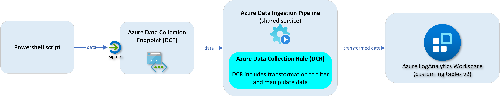
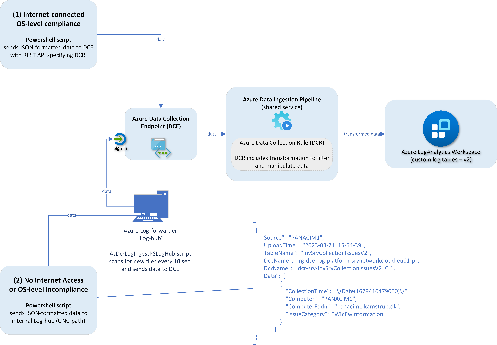
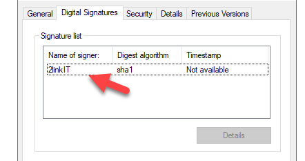
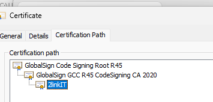

# Introduction
I am really happy to announce my **Powershell module**, **AzLogDcrIngestPS**

This module can ease the steps, if you want to send any data to **Azure LogAnalytics custom logs (v2)** - using the new features of **Azure Log Ingestion Pipeline**, **Azure Data Colection Rules & Log Ingestion API**. 


Cool features of **AzLogDcrIngestPS** are:
* create/update the DCRs and tables automatically - based on the source object schema
* validate the schema for naming convention issues. If exist found, it will mitigate the issues
* update schema of DCRs and tables, if the structure of the source object changes
* auto-fix if something goes wrong with a DCR or table
* can remove data from the source object, if there are colums of data you don't want to send
* can convert source objects based on CIM or PS objects into PSCustomObjects/array
* can add relevant information to each record like UserLoggedOn, Computer, CollectionTime

The 25 functions will help you with:
*  **data manipulation** before sending data in (7 functions)
*  **table / dcr / schema / transformation management** (13 functions)
*  **data upload** using Azure Log Ingestion Pipeline / Log Ingestion API (4 functions)
*  **support/security** (1 function)

## See the functions in action


I have built a cool showcase - [ClientInspector (v2)](https://github.com/KnudsenMorten/ClientInspectorV2), **free for the community**, where you can see how you can use the funtions from the **AzLogDcrIngestPS** module.

[ClientInspector](https://github.com/KnudsenMorten/ClientInspectorV2) can bring back data from your clients using **Azure Log Ingestion Pipeline**, **Azure Data Collection Rules**, **Azure LogAnalytics**; view them with **Azure Monitor & Azure Dashboards** - and get "drift-alerts" using **Microsoft Sentinel**. it includes tons of great information and dashboards to see if you are in control with your clients - or something is drifting from desired state.

## Videos
[Video 3m 19s - Running ClientInspector using commandline (normal mode)](https://youtu.be/4kA4BE0zJ9g)  
[Video 1m 40s - Automatic creation of 2 tables & DCRs (verbose mode)](https://youtu.be/rIUNs3yT-eI)  
[Video 1m 37s - Automatic creation of 2 tables & DCRs (normal mode)](https://youtu.be/khQMDcON6r8)  
[Video 1m 34s - See schema of DCR and table)](https://youtu.be/NDSNhvpa4Gs)  
[Video 2m 19s - Data manipulation](https://youtu.be/OZWj7xZHLI8)  
[Video 1m 58s - Kusto queries against data](https://youtu.be/_GlI0h7ZOsg)  
[Video 3m 01s - Dashboards](https://youtu.be/0MKPgzvDNRk)  
[Video 0m 48s - Sample usage of data - lookup against Lenovo warranty db](https://youtu.be/3ZDyTwiLU0w)  
[Video 7m 25s - Deployment via ClientInspector DeploymentKit](https://youtu.be/_RNlSqRcetg) 

## Download latest version
You can download latest version of AzLogDcrIngestPS here - or from Powershell Gallery:

[Download AzLogDcringestPS module from this Github repositry](https://raw.githubusercontent.com/KnudsenMorten/AzLogDcrIngestPS/main/AzLogDcrIngestPS.psm1)  
[Download AzLogDcringestPS from Powershell Gallery](https://www.powershellgallery.com/packages/AzLogDcrIngestPS)

## Quick links for more information

[Background for building this Powershell module](#background-for-building-this-powershell-module)  
[Deep-dive about Azure Data Collection Rules (DCRs)](#deep-dive-about-azure-data-collection-rules-dcrs)  
[Deep-dive about Log Ingestion API](#deep-dive-about-log-ingestion-api)  
[Architecture, Schema & Networking](#architecture-schema--networking)  
[Security](#security)  
[Source data - what data can I use ?](#source-data---what-data-can-i-use-)  
[Example of how to use the functions](https://github.com/KnudsenMorten/AzLogDcrIngestPS#example-of-how-to-use-the-functions)  
[How can I modify the schema of LogAnalytics table & Data Collection Rule, when the source object schema changes ?](#how-can-i-modify-the-schema-of-loganalytics-table--data-collection-rule-when-the-source-object-schema-changes-)  
[How to enable verbose-mode & get more help ?](#how-to-enable-verbose-mode--get-more-help-)  
[Integration of AzLogDcrIngest in your scripts](https://github.com/KnudsenMorten/AzLogDcrIngestPS#integration-of-azlogdcringest-in-your-scripts)  
[Function synopsis](#function-synopsis)  
[Detailed - Data Manipulation](#category-data-manipulation)  
[Detailed - Table/DCR/Schema/Transformation management](#category-tabledcrschematransformation-management-1)  
[Detailed - Data Out (upload to Azure LogAnalytics)](#category-data-out-upload-to-azure-loganalytics-1) 
[Detailed - Support functions (security)](#category-support-functions-security-1)  
[Contact me](#contact)  

## Credits & Thank You
Lastly, I would like to give big credits to a few people, who I have worked together with on building AzLogDcrIngestPS Powershell module and my daily work with the Azure log & viewing capabilities:

|Name|Role|
|:---|:---|
|Ivan Varnitski|Program Manager - Azure Pipeline|
|Evgeny Ternovsky|Program Manager - Azure Pipeline|
|Nick Kiest|Program Manager - Azure Data Collection Rules|
|Oren Salzberg|Program Manager - Azure LogAnalytics|
|Guy Wild|Technical Writer - Azure LogAnalytics|
|John Gardner|Program Manager - Azure Workbooks|
|Shikha Jain|Program Manager - Azure Workbooks|
|Shayoni Seth|Program Manager - Azure Monitor Agent|
|Jeff Wolford|Program Manager - Azure Monitor Agent|
|Xema Pathak|Program Manager - Azure VMInsight (integration to Azure Monitor Agent)|


<br>

<details>
  <summary><h1>Background for building this Powershell module</h1></summary>
  
For the last 5 years, I have been using the Log Analytics Data Collector API - also referred to 'Azure Monitor HTTP Data Collector API' - or my short name for it "MMA-method"


> Don't let yourself be confused, when you are searching the internet for 'Azure Monitor HTTP Data Collector' and it comes up saying it is in **public preview**. It is <ins>still the legacy API</ins> which will be **replaced** by Log Ingestion API and DCRs.

> Product team quotes: “Data Collector API was never officially released or considered "complete”. We are going to update Data Collector API documentation as part of its deprecation cycle”

I have been using the API with my Powershell scripts to upload 'tons' of custom data into Azure LogAnalytics. On top, I provided 35 Azure dashboards, that gives me (and my customers) great insight to the health and security of their environment.


Moving forward, Microsoft has introduced the concept of **Azure Data Collection Rules (DCRs)**, which I am a big fan of.

The reasons for that are:
* possibility to remove data before being sent into LogAnalytics (remove "noice" data/cost optimization, GDPR/compliance)
* possibility to add data before being sent into LogAnalytics
* possibility to merge data before being sent into LogAnalytics
* data quality is better for array data, as array data is converted into dynamic - whereas the old MMA-method would convert array data into strings
* support to send to other destinations
* support for file based logs collection (txt-logs, Windows Firewall logs)
* advanced support for advanced collection of performance data (including new collection type like SQL performance counters)
* support for SNMP traps logs collection
* security is based on Azure AD RBAC
* naming of data columns are prettier, as they contain the actual name - and not for example ComputerName_s indicating it is a string valu

If I should mention some challenges, then they are:
* complexity is higher, because you have 1-2 more "middle-tiers" involved (DCR, DCE)
* table/DCR/schema must be defined before sending data (this is why I build the powershell function AzLogDcrIngestPS)

The overall goals for **AzLogDcrIngestPS** are to **automate** all the steps - and **ensure data schema alignment to requirement**.

If you are interested in learning more about Azure Data Collection Rules and the different options, I urge you to read the next sections.
</details>


<details>
  <summary><h2>Deep-dive about Azure Data Collection Rules (DCRs)</h2></summary>

## Understanding Data Collection Rules - Data-In (source data)
As shown on the picture, a core change is the new middletier, **Azure Data ingestion pipeline** - or in short '**Azure Pipeline**'

<br>


<br>

Microsoft supports data from the following **sources (data-in)**:

|Collection source|Technologies required|Flow|
|:----------------|:--------------------|:---|
|(legacy)<br>Performance<br>Eventlog<br>Syslog|MMA (legacy)|1. MMA<br>2. Azure LogAnalytics|
|(legacy)<br>API|HTTP Data Collection API (legacy)|1. REST API endpoint<br>2. Azure LogAnalytics|
|Performance<br>Eventlog<br>Syslog|AMA<br>DCR<br>|1. AMA<br>2. DCR ingestion pipeline<br>3. Azure LogAnalytics|
|Text log<br>IIS logs<br>Windows Firewall logs (preview)|AMA<br>DCR<br>DCE<br>|1. AMA<br>2. DCE<br>3. DCR ingestion pipeline<br>4. Azure LogAnalytics|
|SNMP traps|Linux with SNMP trap receiver<br>AMA<br>DCR (syslog file)<br><br>-or-<br>A<br>AMA<br>DCR (syslog stream)|1. AMA<br>2. DCR ingestion pipeline<br>3. Azure LogAnalytics|
|Change Tracking (legacy)|Change Tracking Extension (FIM)<br>DCR<br>|1. FIM<br>2. DCR ingestion pipeline<br>3. Azure LogAnalytics|
|REST Log Ingestion API|REST endpoint<br>DCR<br>DCE<br>|1. REST endpoint<br>2. DCE<br>3. DCR ingestion pipeline<br>4. Azure LogAnalytics|
|Platform Metrics/Telemetry (standard) Azure PaaS|DCR (build-in, non-manageable)<br>|1. Azure Resource<br>2. DCR ingestion pipeline<br>3. Azure Monitor Metrics|
|Custom Metrics/Telemetry (custom app)|Windows (1):<br>AMA<br>DCR<br><br>-or-<br><br>Windows (2):<br>Azure Diagnostics extension<br><br>-or-<br><br>API:<br>Azure Monitor REST API<br><br>-or-<br><br>Linux: Linux InfluxData Telegraf agent (Linux)<br>Azure Monitor output plugin|Windows (1):<br>1. AMA<br>2. DCR ingestion pipeline<br>3. Azure LogAnalytics<br><br>Windows (2):<br>1. Azure Diagnostics<br>2. Azure LogAnalytics<br><br>API:<br>1. REST endpoint<br>2. DCE<br>3. DCR ingestion pipeline<br>4. Azure LogAnalytics<br><br>Linux:<br>1. Linux InfluxData<br>2. Azure Monitor output plugin<br>3. Azure LogAnalytics|
|Platform logs (diagnostics per resource)<br>AllMetrics<br>Resource logs (allLogs, audit)|Azure Policy (diagnostics)<br>DCR<br>|1. Azure Resource<br>2. DCR ingestion pipeline<br>3. Azure LogAnalytics|
|Activity logs (audit per subscription)|Azure Policy (diagnostics)<br>DCR<br>|1. Azure Resource<br>2. DCR ingestion pipeline<br>3. Azure LogAnalytics|

<br>

## Understanding Data Collection Rules - Data-Transformation
Currently, Microsoft supports doing transformation using 3 methods:

|Collection source|Transformation (where) |How|Purpose / limitatations |
|:----------------|:----------------------|:--|:-----------------------|
(legacy)<br>Performance<br>Eventlog<br>Syslog|DCR-pipeline|Workspace transformation DCR|Only one transformation per table
All sources sending in using AMA|DCR-pipeline|AMA transformation DCR|All DCRs do unions, so be aware of double data. Governance is important
|REST API using Log ingestion API|DCR-pipeline|Log Ingestion transformation DCR|

<br>

### Transformation with Azure Monitor Agent (AMA) & Azure Data Collection Rules (DCR)


<br>

### Transformation with Azure DCR-pipeline (Log Ingestion API) & Azure Data Collection Rule (DCR)


<br>

### Transformation with Azure LogAnalytics Workspace Data Collection Rule (DCR)


<br>

### Why is data transformation important ?
As shown below, you can do great things with the concept of **data transformation**:

|Category | Details |
|:--------|:--------|
| Remove sensitive data|You may have a data source that sends information you don’t want stored for privacy or compliancy reasons<br/><br/>**Filter sensitive information**. Filter out entire rows or just particular columns that contain sensitive information<br/><br/>**Obfuscate sensitive information**. For example, you might replace digits with a common character in an IP address or telephone number.|
|Enrich data with additional or calculated information|Use a transformation to add information to data that provides business context or simplifies querying the data later.<br/><br/>**Add a column with additional information**. For example, you might add a column identifying whether an IP address in another column is internal or external.<br/><br/>**Add business specific information**. For example, you might add a column indicating a company division based on location information in other columns.|
|Reduce data costs|Since you’re charged ingestion cost for any data sent to a Log Analytics workspace, you want to filter out any data that you don’t require to reduce your costs.<br/><br/>**Remove entire rows**. For example, you might have a diagnostic setting to collect resource logs from a particular resource but not require all of the log entries that it generates. Create a transformation that filters out records that match a certain criteria.<br/><br/>**Remove a column from each row**. For example, your data may include columns with data that’s redundant or has minimal value. Create a transformation that filters out columns that aren’t required.<br/><br/>**Parse important data from a column**. You may have a table with valuable data buried in a particular column. Use a transformation to parse the valuable data into a new column and remove the original.<br/><br/>Examples of where data-transformation is useful:<br/><br/>We want to remove specific security-events from a server, which are making lots of ”noise” in our logs due to a misconfiguration or error and it is impossible to fix it.<br/><br/>We want to remove security events, which we might show with a high amount, but we want to filter it out like kerberos computer-logon traffic.|

<br>

### Examples of transformations, based on Kusto syntax
Start by testing the query in Azure LogAnalytics. When the query is working, you will change the tablename to **source** - as shown below

| Kusto Query|Purpose|Transformation syntax for DCR 'transformKql' command|
|:-----------|:------|:---------------------------------------------------|
|SecurityEvent \| where (EventID != 12345)|Remove events with EventID 12345 in SecurityEvent table|source \| where (EventID != 12345)|
|SecurityEvent \| where (EventID != 8002) and (EventID != 5058) and (EventID != 4662)|Remove events with EventId 4662,5058,8002 in SecurityEvent table|source \| where (EventID != 8002) and (EventID != 5058) and (EventID != 4662)|
|Event \| where ( (EventID != 10016 and EventLog == “Application”)  )|Remove events with EventID 10016, if source is Application log|source \| where ( (EventID != 10016 and EventLog == “Application”)  )|
|Inventory_CL \| extend TimeGenerated = now()|Add new column TimeGenerated with the actual time (now), when data is coming in|source \| extend TimeGenerated = now()|

If you are interested in learning more, please check out this topic on my blog - [How to do data transformation with Azure LogAnalytics – to enrich information, optimize cost, remove sensitive data?](https://mortenknudsen.net/?p=73)

## Understanding Data Collection Rules - Data-Out (destinations)
The concept of Data Collection Rules also includes the ability to send the data to multiple destinations.

Currently, DCRs support the following destinations:

|Collection source|Technologies required|Supported Targets|
|:----------------|:--------------------|:----------------|
|Performance<br>Eventlog<br>Syslog|AMA<br>DCR|Azure LogAnalytics standard table|
|Text log<br>IIS logs<br>Windows Firewall logs (preview)|AMA<br>DCR<br>DCE|Azure LogAnalytics custom log table|
|SNMP traps|Linux with SNMP trap receiver<br>AMA<br>DCR (syslog file)<br><br>-or-<br>A<br>AMA<br>DCR (syslog stream)|Azure LogAnalytics custom log table|
|Change Tracking (legacy)|Change Tracking Extension (FIM)<br>DCR|Azure LogAnalytics standard table|
|REST Log Ingestion API|REST endpoint<br>DCR<br>DCE<br>|Azure LogAnalytics standard table (CommonSecurityLog, SecurityEvents, Syslog, WindowsEvents)<br>Azure LogAnalytics custom table|
|Platform Metrics/Telemetry (standard) Azure PaaS|DCR (build-in, non-manageable)|Azure Monitor Metrics|
|Custom Metrics/Telemetry (custom app)|Windows (1):<br>AMA<br>DCR<br><br>-or-<br><br>Windows (2):<br>Azure Diagnostics extension<br><br>-or-<br><br>API:<br>Azure Monitor REST API<br><br>-or-<br><br>Linux: Linux InfluxData Telegraf agent (Linux)<br>Azure Monitor output plugin|Azure Monitor Metrics|
|Platform logs (diagnostics per resource)<br>AllMetrics<br>Resource logs (allLogs, audit)|Azure Policy (diagnostics)<br>DCR<br>|Azure LogAnalytics standard table|
|Activity logs (audit per subscription)|Azure Policy (diagnostics)<br>DCR|Azure LogAnalytics standard table|

You should expect to see more 'destinations' in the future, DCRs can send data to. 
I am really excited about the future :smile:
</details>

<details>
  <summary><h2>Deep-dive about Log Ingestion API</h2></summary>

The following section of information comes from [Microsoft Learn](https://learn.microsoft.com/en-us/azure/azure-monitor/logs/logs-ingestion-api-overview)

The Log Ingestion API replaces the legacy method called Log Analytics Data Collector API (or Azure Monitor HTTP Data Collector API or my short name for it "MMA-method")

> Don't let yourself be confused, when you are searching the internet for 'Azure Monitor HTTP Data Collector' and it comes up saying it is in **public preview**. It is <ins>still the legacy API</ins> which will be **replaced** by Log Ingestion API.

> Product team quotes: “Data Collector API was never officially released or considered "complete”. We are going to update Data Collector API documentation as part of its deprecation cycle”

The Logs Ingestion API in Azure Monitor lets you send data to a Log Analytics workspace from any REST API client. 

By using this API, you can send data from almost any source to supported Azure tables or to custom tables that you create. 

You can even extend the schema of Azure tables with custom columns.

The Logs Ingestion API was previously referred to as the custom logs API.

## Dataflow
The endpoint application sends data to a data collection endpoint (DCE), which is a unique connection point for your subscription. 

The payload of your API call includes the source data formatted in JSON. 

The call:

1. Specifies a data collection rule (DCR) that understands the format of the source data.
2. Potentially filters and transforms it for the target table.
3. Directs it to a specific table in a specific workspace.

You can modify the target table and workspace by modifying the DCR without any change to the REST API call or source data.


### Migration
To migrate solutions from the Data Collector API, see [Migrate from Data Collector API and custom fields-enabled tables to DCR-based custom logs](https://learn.microsoft.com/en-us/azure/azure-monitor/logs/custom-logs-migrate).

## Supported tables

### Custom tables
The Logs Ingestion API can send data to any custom table that you create and to certain Azure tables in your Log Analytics workspace. The target table must exist before you can send data to it. Custom tables must have the _CL suffix.

### Azure tables
The Logs Ingestion API can send data to the following Azure tables. Other tables may be added to this list as support for them is implemented.

* CommonSecurityLog
* SecurityEvents
* Syslog
* WindowsEvents

#### Naming conventions
Column names must start with a letter and can consist of up to 45 alphanumeric characters and the characters _ and -. 

The following are reserved column names: Type, TenantId, resource, resourceid, resourcename, resourcetype, subscriptionid, tenanted. 

Custom columns you add to an Azure table must have the suffix _CF.

### Authentication
Authentication for the Logs Ingestion API is performed at the DCE, which uses standard Azure Resource Manager authentication. 

A common strategy is to use an application ID and application secret.

### Data collection rule
Data collection rules define data collected by Azure Monitor and specify how and where that data should be sent or stored. The REST API call must specify a DCR to use. A single DCE can support multiple DCRs, so you can specify a different DCR for different sources and target tables.

The DCR must understand the structure of the input data and the structure of the target table. If the two don't match, it can use a transformation to convert the source data to match the target table. You can also use the transformation to filter source data and perform any other calculations or conversions.

### Send data
To send data to Azure Monitor with the Logs Ingestion API, make a POST call to the DCE over HTTP.


#### Endpoint URI
The endpoint URI uses the following format, where the Data Collection Endpoint and DCR Immutable ID identify the DCE and DCR. 

Stream Name refers to the stream in the DCR that should handle the custom data.

```
{Data Collection Endpoint URI}/dataCollectionRules/{DCR Immutable ID}/streams/{Stream Name}?api-version=2021-11-01-preview
```

### Headers
|Header | Required | Value | Description|
|:------|:------   |:------|:------     |
|Authorization|Yes|Bearer (bearer token obtained through the client credentials flow)||
|Content-Type|Yes|application/json||
Content-Encoding|No|gzip|Use the gzip compression scheme for performance optimization.|
|x-ms-client-request-id|No|String-formatted GUID|Request ID that can be used by Microsoft for any troubleshooting purposes.|

### Body
The body of the call includes the custom data to be sent to Azure Monitor. 

The shape of the data must be a JSON object or array with a structure that matches the format expected by the stream in the DCR. 

Additionally, it is important to ensure that the request body is properly encoded in UTF-8 to prevent any issues with data transmission.

### Sample call
For sample data and an API call using the Logs Ingestion API

## Tutorials
[Send data to Azure Monitor Logs by using a REST API (Azure portal)](https://learn.microsoft.com/en-us/azure/azure-monitor/logs/tutorial-logs-ingestion-portal)

[Send data to Azure Monitor Logs using REST API (Resource Manager templates)](https://learn.microsoft.com/en-us/azure/azure-monitor/logs/tutorial-logs-ingestion-api)

</details>

<br>

# Architecture, Schema & Networking
Your Powershell script will be uploading data into **custom logs (v2)** in **Azure LogAnalytics workspace** - using **Log ingestion API**, **Azure Data Collection Rules (DCR)** and **Azure Data Collection Endpoints (DCE)**. Script will be using the functions in AzLogDcrIngestPS.



## Schema
Both the DCR and LogAnalytics table has a schema, which needs to match the schema of the source object. This is handled by using functions in AzLogDcrIngestPS module.

[Video 1m 40s - Automatic creation of 2 tables & DCRs (verbose mode)](https://youtu.be/rIUNs3yT-eI)  
[Video 1m 37s - Automatic creation of 2 tables & DCRs (normal mode)](https://youtu.be/khQMDcON6r8)  
[Video 1m 34s - See schema of DCR and table)](https://youtu.be/NDSNhvpa4Gs)  

AzLogDcrIngestPS supports 2 modes for managing the schema: **Merge** and **Overwrite**

### SchemaMode = Merge  (default)
If you set SchemaMode = Merge, then new properties from the source object will be added (merged) into the current schema of the log analytics. DCR will import the schema from log analytics table to ensure they are identically.

Default mode is Merge, if you don't define the variable SchemaMode on the functions: 
CheckCreateUpdate-TableDr-Structure
CreateUpdate-AzLogAnalyticsCustomLogTableDcr
CreateUpdate-AzDataCollectionRuleLogIngestCustomLog

### SchemaMode = Overwrite
If you set SchemaMode = Overwrite, then the schema in DCR and table will be overwritten (updated) - based on the source object schema. 


## Networking
You have 3 options for connectivity to Azure for data upload: 

|Upload method|Connectivity Details|OS compliance|
|:------------|:-------------------|:------------|
|Public access|REST endpoint sends to DCE via public IP of DCE|Endpoint supports TLS 1.2|
|Private access|REST endpoint sends to DCE via private link of DCE|Endpoint supports TLS 1.2|
|Log-hub|REST endpoint sends data via [log-hub](https://github.com/KnudsenMorten/AzLogDcrIngestPSLogHub) - a concept I have built.|Endpoint doesn't support TLS 1.2.<br> Azure will not accept connectivity from these devices directly|

### Internet-connected endpoints - OS-level compliance


You need to allow the following endpoints in your firewall:
|Endpoint|Purpose|Port|Direction|Bypass HTTPS Inspection|
|:-------|:------|:----|:-------|:----------------------|
|global.handler.control.monitor.azure.com|Access control service|Port 443|Outbound|Yes|
|dce logs ingestion uri<br><br>sample<br>https://dce-log-platform-management-client-demo-p-iur0.westeurope-1.ingest.monitor.azure.com|Ingest logs data|Port 443|Outbound|Yes|

<br>

### No Internet access or OS-level incompliance fx. running TLS 1.0/1.1
[Check out the log-hub concept using this link](https://github.com/KnudsenMorten/AzLogDcrIngestPSLogHub)



<br>

# Security
## Code signing
Both the **ClientInspector.ps1-file** and the **AzLogDcrIngestPS module (AzLogDcrIngest.psm1)** are signed with my code signing certificate (2LINKIT - my company). This way you can run it, if you require scripts to be signed. Of course you can also choose to sign it with your own internal code signing certificate.



Please [download the public key certificate](https://github.com/KnudsenMorten/AzLogDcrIngestPS/raw/main/Trusted_Publisher_Certificate/2LINKIT-TrustedPublisher.cer) and put it into your 'trusted publisher' container to trust the publisher (2LINKIT - my company). You can deploy this using Intune or Group Policy.

  
  
  


### Intune deployment doesn't require trusted publisher to be in place
By default Intune will do a BYPASS when running a remediation scripts.

## Azure app for log ingestion & table/dcr schema management
You can choose to have one app for both log ingestion and table/DCR schema management, if you want to keep it . Alternative you can choose to have 2 Azure apps (recommended) to separate the log ingestion process with the table/DCR schema management process.

## One Azure app for both log ingestion and table/schema management
If you want to keep it simple, you can choose to go with a single Azure app that is used for both log ingestion and table/schema management.

You need to set permissions according to these settings:

| Target                                                  | Delegation To                    | Azure RBAC Permission        | Comment                                                                   | 
|:-------------                                           |:-----                            |:-----                        |:-----                                                                     |
| Azure Resource Group for Azure Data Collection Rules    | Azure app used for log ingestion | Monitoring Publisher Metrics | used to send in data                                                      |
| Azure Resource Group for Azure Data Endpoint            | Azure app used for log ingestion | Reader                       | needed to retrieve information about DCE - used as part of uploading data |
| Azure Resource Group for Azure Data Collection Rules    | Azure app used for log ingestion | Contributor                  | needed to send in data                                                    |
| Azure Resource Group for Azure Data Collection Endpoint | Azure app used for log ingestion | Contributor                  | needed to create/update DCEs (if needed after deployment)                 |
| Azure LogAnalytics Workspace                            | Azure app used for log ingestion | Contributor                  | needed to create/update Azure LogAnaltyics custom log tables              |

## Two Azure apps to separate log ingestion and table/DCR schema management
If you want to separate the log ingestion process with the table/DCR schema management process, you can do this by having one more Azure app, which is used for table/dcr/schema management.

You need to set permissions according to these settings:

| Target                                                  | Delegation To                           | Azure RBAC Permission        | Comment                                                                   | 
|:-------------                                           |:-----                                   |:-----                        |:-----                                                                     |
| Azure Resource Group for Azure Data Collection Rules    | Azure app used for log ingestion        | Monitoring Publisher Metrics | used to send in data                                                      |
| Azure Resource Group for Azure Data Endpoint            | Azure app used for log ingestion        | Reader<br><br>When you run this script, it will configure the log ingestion account with Contributor permissions, if you run with default config. This configuration must be adjusted, so the logestion app will only need Reader permissions.| needed to retrieve information about DCE - used as part of uploading data |
| Azure Resource Group for Azure Data Collection Rules    | Azure app used for table/DCR management | Contributor                  | needed to send in data                                                    |
| Azure Resource Group for Azure Data Collection Endpoint | Azure app used for table/DCR management | Contributor                  | needed to create/update DCEs and also needed to create/update an DCR with referrences to a DCE |
| Azure LogAnalytics Workspace                            | Azure app used for table/DCR management | Contributor                  | needed to create/update Azure LogAnaltyics custom log tables              |

<br>

# Source data - what data can I use ?
You can use **any source data** which can be retrieved into Powershell (wmi, cim, external data, rest api, xml-format, json-format, csv-format, etc.)

It is very important to understand, that the data typically needs to be manipulated before sending them - to ensure they are valid and any irrelevant data has been removed.

ClientInspector uses all of the 25 functions within the Powershell module, **AzLogDcIngestPS**, to handle source data manipulation to **remove "noice" in data**, to **rename prohibited colums in tables/DCR** - and support needs for **transparency** with extra insight like **UserLoggedOn**, **CollectionTime**, **Computer**:

<br>

# Example of how to use the functions
Each of the data-sets in ClientInspector (bios, applications, bitlocker, etc.) are built with the same 4-phased structure:

## Phase 1/4 - Variables (naming - where to send the data)
```
#-------------------------------------------------------------------------------------------
# Variables
#-------------------------------------------------------------------------------------------
	
$TableName  = 'InvClientComputerInfoSystemV2'   # must not contain _CL
$DcrName    = "dcr-" + $AzDcrPrefixClient + "-" + $TableName + "_CL"
```


## Phase 2/4 - Data Collection
```
#-------------------------------------------------------------------------------------------
# Collecting data (in)
#-------------------------------------------------------------------------------------------
	
Write-Output ""
Write-Output "Collecting Computer system information ... Please Wait !"

$DataVariable = Get-CimInstance -ClassName Win32_ComputerSystem
```

## Phase 3/4 - Data Manipulation (ensure data is in correct format and any "noice" is removed and relevant information is added)
```
#-------------------------------------------------------------------------------------------
# Preparing data structure
#-------------------------------------------------------------------------------------------

# convert CIM array to PSCustomObject and remove CIM class information
$DataVariable = Convert-CimArrayToObjectFixStructure -data $DataVariable -Verbose:$Verbose

# add CollectionTime to existing array
$DataVariable = Add-CollectionTimeToAllEntriesInArray -Data $DataVariable -Verbose:$Verbose

# add Computer & UserLoggedOn info to existing array
$DataVariable = Add-ColumnDataToAllEntriesInArray -Data $DataVariable -Column1Name Computer -Column1Data $Env:ComputerName  -Column2Name UserLoggedOn -Column2Data $UserLoggedOn

# Validating/fixing schema data structure of source data
$DataVariable = ValidateFix-AzLogAnalyticsTableSchemaColumnNames -Data $DataVariable -Verbose:$Verbose

# Aligning data structure with schema (requirement for DCR)
$DataVariable = Build-DataArrayToAlignWithSchema -Data $DataVariable -Verbose:$Verbose
```

## Phase 4/4 - Data Out (send to LogAnalytics) - combined functions
```
#-------------------------------------------------------------------------------------------
# Create/Update Schema for LogAnalytics Table & Data Collection Rule schema
#-------------------------------------------------------------------------------------------

CheckCreateUpdate-TableDcr-Structure -AzLogWorkspaceResourceId $LogAnalyticsWorkspaceResourceId -SchemaMode Merge `
                                     -AzAppId $LogIngestAppId -AzAppSecret $LogIngestAppSecret -TenantId $TenantId -Verbose:$Verbose `
                                     -DceName $DceName -DcrName $DcrName -TableName $TableName -Data $DataVariable `
                                     -LogIngestServicePricipleObjectId $AzDcrLogIngestServicePrincipalObjectId `
                                     -AzDcrSetLogIngestApiAppPermissionsDcrLevel $AzDcrSetLogIngestApiAppPermissionsDcrLevel `
                                     -AzLogDcrTableCreateFromAnyMachine $AzLogDcrTableCreateFromAnyMachine `
                                     -AzLogDcrTableCreateFromReferenceMachine $AzLogDcrTableCreateFromReferenceMachine

#-----------------------------------------------------------------------------------------------
# Upload data to LogAnalytics using DCR / DCE / Log Ingestion API
#-----------------------------------------------------------------------------------------------

Post-AzLogAnalyticsLogIngestCustomLogDcrDce-Output -DceName $DceName -DcrName $DcrName -Data $DataVariable -TableName $TableName `
                                                   -AzAppId $LogIngestAppId -AzAppSecret $LogIngestAppSecret -TenantId $TenantId -Verbose:$Verbose
```

<br>

**TIP:  error 513 - entity is too large**  
By default AzLogDcrIngestPS POST-function will send the data in batches depending on an calculated average size per record. In case your recordset is of different size, you might receive an error 513. 

Cause is that you are hitting the limitation of 1 mb for each upload (Azure Pipeline limitation). Microsoft wants to receive many smaller chunks of data, as this is a shared environment. I have seen this issue when retrieving the list of all installed applications. Apparently the applications are storing information of very different degree of size.

You can mitigate this issue, by adding the parameter **-BatchAmount <number of records to send per batch>** to the Post-command. If you want to be sure, set it to 1

```
Post-AzLogAnalyticsLogIngestCustomLogDcrDce-Output -DceName $DceName `
                                                   -DcrName $DcrName `
                                                   -Data $DataVariable `
                                                   -TableName $TableName `
                                                   -AzAppId $LogIngestAppId `
                                                   -AzAppSecret $LogIngestAppSecret `
                                                   -TenantId $TenantId `
                                                   -BatchAmount 1 `
												   -Verbose:$Verbose
```


## Phase 4/4 "under the hood" - Data Out (send to LogAnalytics)
```
#-----------------------------------------------------------------------------------------------
# Check if table and DCR exist - or schema must be updated due to source object schema changes
#-----------------------------------------------------------------------------------------------
	
# Get insight about the schema structure
$Schema = Get-ObjectSchemaAsArray -Data $Data
$StructureCheck = Get-AzLogAnalyticsTableAzDataCollectionRuleStatus -AzLogWorkspaceResourceId $AzLogWorkspaceResourceId `
                                                                    -TableName $TableName `
                                                                    -DcrName $DcrName `
                                                                    -SchemaSourceObject $Schema `
                                                                    -AzAppId $AzAppId `
                                                                    -AzAppSecret $AzAppSecret `
                                                                    -TenantId $TenantId `
                                                                    -Verbose:$Verbose

#-----------------------------------------------------------------------------------------------
# Structure check = $true -> Create/update table & DCR with necessary schema
#-----------------------------------------------------------------------------------------------

# build schema to be used for LogAnalytics Table
$Schema = Get-ObjectSchemaAsHash -Data $Data `
                                 -ReturnType Table `
                                 -Verbose:$Verbose

CreateUpdate-AzLogAnalyticsCustomLogTableDcr -AzLogWorkspaceResourceId $AzLogWorkspaceResourceId `
                                             -SchemaSourceObject $Schema `
											 -SchemaMode $SchemaMode
                                             -TableName $TableName `
                                             -AzAppId $AzAppId `
                                             -AzAppSecret $AzAppSecret `
                                             -TenantId $TenantId `
                                             -Verbose:$Verbose 


# build schema to be used for DCR
$Schema = Get-ObjectSchemaAsHash -Data $Data -ReturnType DCR

CreateUpdate-AzDataCollectionRuleLogIngestCustomLog -AzLogWorkspaceResourceId $AzLogWorkspaceResourceId `
                                                    -SchemaSourceObject $Schema `
 												    -SchemaMode $SchemaMode
                                                    -DceName $DceName `
                                                    -DcrName $DcrName `
                                                    -TableName $TableName `
                                                    -LogIngestServicePricipleObjectId $LogIngestServicePricipleObjectId `
                                                    -AzDcrSetLogIngestApiAppPermissionsDcrLevel $AzDcrSetLogIngestApiAppPermissionsDcrLevel `
                                                    -AzAppId $AzAppId `
                                                    -AzAppSecret $AzAppSecret `
                                                    -TenantId $TenantId `
                                                    -Verbose:$Verbose

$AzDcrDceDetails = Get-AzDcrDceDetails -DcrName $DcrName `
                                       -DceName $DceName `
                                       -AzAppId $AzAppId `
                                       -AzAppSecret $AzAppSecret `
                                       -TenantId $TenantId `
                                       -Verbose:$Verbose

Post-AzLogAnalyticsLogIngestCustomLogDcrDce -DceUri $AzDcrDceDetails[2] `
                                            -DcrImmutableId $AzDcrDceDetails[6] `
                                            -TableName $TableName `
                                            -DcrStream $AzDcrDceDetails[7] `
                                            -Data $Data `
                                            -BatchAmount $BatchAmount `
                                            -AzAppId $AzAppId `
                                            -AzAppSecret $AzAppSecret `
                                            -TenantId $TenantId `
                                            -Verbose:$Verbose
```

<br>


# How can I modify the schema of LogAnalytics table & Data Collection Rule, when the source object schema changes ?
Both the DCR and LogAnalytics table has a schema, which needs to be matching the schema of the source object. This is handled by using functions in AzLogDcrIngestPS module.

It is fuly supported by AzLogDcringestPS to automatically modify the schema, if it detects changes. It is managed by a variable (AzLogDcrTableCreateFromAnyMachine).

[Video 1m 40s - Automatic creation of 2 tables & DCRs (verbose mode)](https://youtu.be/rIUNs3yT-eI)  
[Video 1m 37s - Automatic creation of 2 tables & DCRs (normal mode)](https://youtu.be/khQMDcON6r8)  
[Video 1m 34s - See schema of DCR and table)](https://youtu.be/NDSNhvpa4Gs) 

I recommend schema changes to be managed by you - and not happen automatically.

AzLogDcrIngestPS supports 2 modes for managing the schema: **Merge** and **Overwrite**

## SchemaMode = Merge  (default)
If you set SchemaMode = Merge, then new properties from the source object will be added (merged) into the current schema of the log analytics. DCR will import the schema from log analytics table to ensure they are identically.

Default mode is Merge, if you don't define the variable SchemaMode on the functions: 
CheckCreateUpdate-TableDr-Structure
CreateUpdate-AzLogAnalyticsCustomLogTableDcr
CreateUpdate-AzDataCollectionRuleLogIngestCustomLog

## SchemaMode = Overwrite
If you set SchemaMode = Overwrite, then the schema in DCR and table will be overwritten (updated) - based on the source object schema. 

<details>
  <summary><h2>How to disable so only you can make changes to the schema ?</h2></summary>

If your solution is running on many machines, I would recommend, that you control the process of making changes to the table/DCR schema.
In my example with ClientInspector, I don't want 5000 clients to be able to change the schema - but I want to do this from a reference machine.

You need to add 2 variables to your Powershell script (or what you prefer to call them). You will use them as data-values, when you call the function **CheckCreateUpdate-TableDcr-Structure** using the parameters **AzLogDcrTableCreateFromReferenceMachine** and **AzLogDcrTableCreateFromAnyMachine**

In ClientInspector, I use the variable-names **$AzLogDcrTableCreateFromAnyMachine** and **$AzLogDcrTableCreateFromReferenceMachine**  as shown below

```
#-------------------------------------------------------------------------------------------
# Create/Update Schema for LogAnalytics Table & Data Collection Rule schema
#-------------------------------------------------------------------------------------------

CheckCreateUpdate-TableDcr-Structure -AzLogWorkspaceResourceId $LogAnalyticsWorkspaceResourceId -SchemaMode Merge `
                                     -AzAppId $LogIngestAppId -AzAppSecret $LogIngestAppSecret -TenantId $TenantId -Verbose:$Verbose `
                                     -DceName $DceName -DcrName $DcrName -TableName $TableName -Data $DataVariable `
                                     -LogIngestServicePricipleObjectId $AzDcrLogIngestServicePrincipalObjectId `
                                     -AzDcrSetLogIngestApiAppPermissionsDcrLevel $AzDcrSetLogIngestApiAppPermissionsDcrLevel `
                                     -AzLogDcrTableCreateFromAnyMachine $AzLogDcrTableCreateFromAnyMachine `
                                     -AzLogDcrTableCreateFromReferenceMachine $AzLogDcrTableCreateFromReferenceMachine

```

Change the variable **$AzLogDcrTableCreateFromAnyMachine** to **$False**, which tells the script to not let changes happen from any machine.
It is OK in the beginning, when you are setting it up - but make sure to set it to $false when going in production.
```
$AzLogDcrTableCreateFromAnyMachine               = $false
```

Now it is important, that you activate the second parameter telling from which reference machine you will let changes happen:
```
$AzLogDcrTableCreateFromReferenceMachine         = @("mycomputername1","referencecomputer")
```

I would also recommend that you manage these changes using a second Azure app, so you have 2 app's - one app for **log ingestion** and one for **table/scr/schema management**. [Azure RBAC Security adjustment, separation of permissions between log ingestion and table/DCR management](https://github.com/KnudsenMorten/ClientInspectorV2-DeploymentKit#azure-rbac-security-adjustment-separation-of-permissions-between-log-ingestion-and-tabledcr-management)

</details>

## Recommended function to understand schema
I recommend to use the following function to understand the schema of the data source:
```
Get-ObjectSchemaAsArray -Data $DataVariable -Verbose:$verbose
```

## Internal error 500 mitigation (very rare !)
In most cases, the changes of the schema of tables and DCRs will be done using a PUT (overwrite) command, which will add new properties to the table & DCR. 

Right now, LogAnalytics will throw an error 'internal server error 500', if there is a change of the schema-type of an **existing property.**. This is very rare, but I have seen it happen for example a string-value was changed from TRUE to a boolean ($true)

AzLogDcrIngestPS will fix this by deleting the table and re-creating it. You will not loose any data, as they are kept in the database - and you will see them again, when the table and properties are re-created.

Problem has been escalated to the LogAnalytics team.

<details>
  <summary><h2>Example of changing schema when source object changes</h2></summary>

```
#-------------------------------------------------------------------------------------------
# Variables
#-------------------------------------------------------------------------------------------
            
$TableName                                       = 'InvClientComputerOSInfoTest5V2'   # must not contain _CL
$DcrName                                         = "dcr-" + $AzDcrPrefixClient + "-" + $TableName + "_CL"

$TenantId                                        = "xxxxx" 
$LogIngestAppId                                  = "xxxxx" 
$LogIngestAppSecret                              = "xxxxx" 

$DceName                                         = "dce-log-platform-management-client-demo1-p" 
$LogAnalyticsWorkspaceResourceId                 = "/subscriptions/xxxxxx/resourceGroups/rg-logworkspaces/providers/Microsoft.OperationalInsights/workspaces/log-platform-management-client-demo1-p" 

$AzDcrPrefixClient                               = "clt1" 
$AzDcrSetLogIngestApiAppPermissionsDcrLevel      = $false
$AzDcrLogIngestServicePrincipalObjectId          = "xxxxxx" 

$AzLogDcrTableCreateFromReferenceMachine         = @()
$AzLogDcrTableCreateFromAnyMachine               = $true

# building global variable with all DCEs, which can be viewed by Log Ingestion app
$global:AzDceDetails = Get-AzDceListAll -AzAppId $LogIngestAppId -AzAppSecret $LogIngestAppSecret -TenantId $TenantId -Verbose:$Verbose
    
# building global variable with all DCRs, which can be viewed by Log Ingestion app
$global:AzDcrDetails = Get-AzDcrListAll -AzAppId $LogIngestAppId -AzAppSecret $LogIngestAppSecret -TenantId $TenantId -Verbose:$Verbose

#-------------------------------------------------------------------------------------------
# Collecting data (in)
#-------------------------------------------------------------------------------------------
            
Write-Output ""
Write-Output "Collecting Defender demo data"

$DataVariable = Get-MpComputerStatus

#-------------------------------------------------------------------------------------------
# Preparing data structure
#-------------------------------------------------------------------------------------------

# convert CIM array to PSCustomObject and remove CIM class information
$DataVariable = Convert-CimArrayToObjectFixStructure -data $DataVariable -Verbose:$verbose
    
# add CollectionTime to existing array
$DataVariable = Add-CollectionTimeToAllEntriesInArray -Data $DataVariable -Verbose:$verbose

# add Computer & UserLoggedOn info to existing array
$DataVariable = Add-ColumnDataToAllEntriesInArray -Data $DataVariable -Column1Name Computer -Column1Data $Env:ComputerName -Column2Name UserLoggedOn -Column2Data $UserLoggedOn -Verbose:$verbose
$DataVariable

# Get insight about the schema structure (Before)
$SchemaBefore = Get-ObjectSchemaAsArray -Data $DataVariable -Verbose:$verbose
$SchemaBefore
        
# we see, that we have 65 columns
($SchemaBefore | Measure-Object).count

<#
name                             type    
----                             ----    
AMEngineVersion                  string  
AMProductVersion                 string  
AMRunningMode                    string  
AMServiceEnabled                 boolean 
AMServiceVersion                 string  
AntispywareEnabled               boolean 
AntispywareSignatureAge          int     
AntispywareSignatureLastUpdated  datetime
AntispywareSignatureVersion      string  
AntivirusEnabled                 boolean 
AntivirusSignatureAge            int     
AntivirusSignatureLastUpdated    datetime
AntivirusSignatureVersion        string  
BehaviorMonitorEnabled           boolean 
CollectionTime                   datetime
Computer                         string  
ComputerID                       string  
ComputerState                    int     
DefenderSignaturesOutOfDate      boolean 
DeviceControlDefaultEnforcement  string  
DeviceControlPoliciesLastUpdated datetime
DeviceControlState               string  
FullScanAge                      long    
FullScanEndTime                  dynamic 
FullScanOverdue                  boolean 
FullScanRequired                 boolean 
FullScanSignatureVersion         string  
FullScanStartTime                dynamic 
IoavProtectionEnabled            boolean 
IsTamperProtected                boolean 
IsVirtualMachine                 boolean 
LastFullScanSource               int     
LastQuickScanSource              int     
NISEnabled                       boolean 
NISEngineVersion                 string  
NISSignatureAge                  int     
NISSignatureLastUpdated          datetime
NISSignatureVersion              string  
OnAccessProtectionEnabled        boolean 
ProductStatus                    int     
PSComputerName                   dynamic 
QuickScanAge                     int     
QuickScanEndTime                 datetime
QuickScanOverdue                 boolean 
QuickScanSignatureVersion        string  
QuickScanStartTime               datetime
RealTimeProtectionEnabled        boolean 
RealTimeScanDirection            int     
RebootRequired                   boolean 
SmartAppControlExpiration        dynamic 
SmartAppControlState             string  
TamperProtectionSource           string  
TDTMode                          string  
TDTSiloType                      string  
TDTStatus                        string  
TDTTelemetry                     string  
TestColumn1                      string  
TestColumn2                      string  
TroubleShootingDailyMaxQuota     string  
TroubleShootingDailyQuotaLeft    string  
TroubleShootingEndTime           string  
TroubleShootingExpirationLeft    string  
TroubleShootingMode              string  
TroubleShootingModeSource        string  
TroubleShootingQuotaResetTime    string  
TroubleShootingStartTime         string  
UserLoggedOn                     string  
65
#>

# Validating/fixing schema data structure of source data
$DataVariable = ValidateFix-AzLogAnalyticsTableSchemaColumnNames -Data $DataVariable -Verbose:$verbose

# Aligning data structure with schema (requirement for DCR)
$DataVariable = Build-DataArrayToAlignWithSchema -Data $DataVariable -Verbose:$verbose

#-------------------------------------------------------------------------------------------
# Create/Update Schema for LogAnalytics Table & Data Collection Rule schema
#-------------------------------------------------------------------------------------------

CheckCreateUpdate-TableDcr-Structure -AzLogWorkspaceResourceId $LogAnalyticsWorkspaceResourceId -SchemaMode Merge `
                                     -AzAppId $LogIngestAppId -AzAppSecret $LogIngestAppSecret -TenantId $TenantId `
                                     -DceName $DceName -DcrName $DcrName -TableName $TableName -Data $DataVariable `
                                     -LogIngestServicePricipleObjectId $AzDcrLogIngestServicePrincipalObjectId `
                                     -AzDcrSetLogIngestApiAppPermissionsDcrLevel $AzDcrSetLogIngestApiAppPermissionsDcrLevel `
                                     -AzLogDcrTableCreateFromAnyMachine $AzLogDcrTableCreateFromAnyMachine `
                                     -AzLogDcrTableCreateFromReferenceMachine $AzLogDcrTableCreateFromReferenceMachine


########### Simulation

# now we simulate to add 2 more columns
$TestColumn1Data = $Env:ComputerName
$TestColumn2Data = "COMPANYNAME"

$DataVariable = Add-ColumnDataToAllEntriesInArray -Data $DataVariable -Column1Name TestColumn1 -Column1Data $TestColumn1Data -Verbose:$verbose
$DataVariable = Add-ColumnDataToAllEntriesInArray -Data $DataVariable -Column1Name TestColumn2 -Column1Data $TestColumn2Data -Verbose:$verbose

# Get insight about the schema structure (After)
$SchemaAfter = Get-ObjectSchemaAsArray -Data $DataVariable -Verbose:$verbose
        
# we now see 2 new columns 'TestColum1' + 'TestColumn2' - and we have 67 columns
$SchemaAfter
($SchemaAfter | Measure-Object).count

<#
name                             type    
----                             ----    
AMEngineVersion                  string  
AMProductVersion                 string  
AMRunningMode                    string  
AMServiceEnabled                 boolean 
AMServiceVersion                 string  
AntispywareEnabled               boolean 
AntispywareSignatureAge          int     
AntispywareSignatureLastUpdated  datetime
AntispywareSignatureVersion      string  
AntivirusEnabled                 boolean 
AntivirusSignatureAge            int     
AntivirusSignatureLastUpdated    datetime
AntivirusSignatureVersion        string  
BehaviorMonitorEnabled           boolean 
CollectionTime                   datetime
Computer                         string  
ComputerID                       string  
ComputerState                    int     
DefenderSignaturesOutOfDate      boolean 
DeviceControlDefaultEnforcement  string  
DeviceControlPoliciesLastUpdated datetime
DeviceControlState               string  
FullScanAge                      long    
FullScanEndTime                  dynamic 
FullScanOverdue                  boolean 
FullScanRequired                 boolean 
FullScanSignatureVersion         string  
FullScanStartTime                dynamic 
IoavProtectionEnabled            boolean 
IsTamperProtected                boolean 
IsVirtualMachine                 boolean 
LastFullScanSource               int     
LastQuickScanSource              int     
NISEnabled                       boolean 
NISEngineVersion                 string  
NISSignatureAge                  int     
NISSignatureLastUpdated          datetime
NISSignatureVersion              string  
OnAccessProtectionEnabled        boolean 
ProductStatus                    int     
PSComputerName                   dynamic 
QuickScanAge                     int     
QuickScanEndTime                 datetime
QuickScanOverdue                 boolean 
QuickScanSignatureVersion        string  
QuickScanStartTime               datetime
RealTimeProtectionEnabled        boolean 
RealTimeScanDirection            int     
RebootRequired                   boolean 
SmartAppControlExpiration        dynamic 
SmartAppControlState             string  
TamperProtectionSource           string  
TDTMode                          string  
TDTSiloType                      string  
TDTStatus                        string  
TDTTelemetry                     string  
TestColumn1                      string  
TestColumn2                      string  
TroubleShootingDailyMaxQuota     string  
TroubleShootingDailyQuotaLeft    string  
TroubleShootingEndTime           string  
TroubleShootingExpirationLeft    string  
TroubleShootingMode              string  
TroubleShootingModeSource        string  
TroubleShootingQuotaResetTime    string  
TroubleShootingStartTime         string  
UserLoggedOn                     string  
67
#>

# Validating/fixing schema data structure of source data
$DataVariable = ValidateFix-AzLogAnalyticsTableSchemaColumnNames -Data $DataVariable -Verbose:$verbose

# Aligning data structure with schema (requirement for DCR)
$DataVariable = Build-DataArrayToAlignWithSchema -Data $DataVariable -Verbose:$verbose

#-------------------------------------------------------------------------------------------
# Create/Update Schema for LogAnalytics Table & Data Collection Rule schema
#-------------------------------------------------------------------------------------------

CheckCreateUpdate-TableDcr-Structure -AzLogWorkspaceResourceId $LogAnalyticsWorkspaceResourceId  -SchemaMode Merge `
                                     -AzAppId $LogIngestAppId -AzAppSecret $LogIngestAppSecret -TenantId $TenantId `
                                     -DceName $DceName -DcrName $DcrName -TableName $TableName -Data $DataVariable `
                                     -LogIngestServicePricipleObjectId $AzDcrLogIngestServicePrincipalObjectId `
                                     -AzDcrSetLogIngestApiAppPermissionsDcrLevel $AzDcrSetLogIngestApiAppPermissionsDcrLevel `
                                     -AzLogDcrTableCreateFromAnyMachine $AzLogDcrTableCreateFromAnyMachine `
                                     -AzLogDcrTableCreateFromReferenceMachine $AzLogDcrTableCreateFromReferenceMachine
        


<#
# We see - Schema mismatch - Schema source object contains more properties than defined in current schema
# when checking the DCR we now have 67 schema objects - and LA table has 68 schema objects (due to extra TimeGenerated column)

VERBOSE:   Validating schema structure of source data ... Please Wait !
VERBOSE:   SUCCESS - No issues found in schema structure
VERBOSE:   Aligning source object structure with schema ... Please Wait !
VERBOSE:   Checking LogAnalytics table and Data Collection Rule configuration .... Please Wait !
VERBOSE: POST with -1-byte payload
VERBOSE: received 1468-byte response of content type application/json; charset=utf-8
VERBOSE: GET with 0-byte payload
VERBOSE: received 7760-byte response of content type application/json; charset=utf-8
VERBOSE:   Schema mismatch - Schema source object contains more properties than defined in current schema
VERBOSE:   DCR was not found [ dcr-clt1-InvClientComputerOSInfoTest5V2_CL ]
VERBOSE: POST with -1-byte payload
VERBOSE: received 1468-byte response of content type application/json; charset=utf-8
VERBOSE: 
VERBOSE: Trying to update existing LogAnalytics table schema for table [ InvClientComputerOSInfoTest5V2_CL ] in 
VERBOSE: /subscriptions/fce4f282-fcc6-43fb-94d8-bf1701b862c3/resourceGroups/rg-logworkspaces/providers/Microsoft.OperationalInsights/works
paces/log-platform-management-client-demo1-p
VERBOSE: PATCH with -1-byte payload
VERBOSE: PUT with -1-byte payload
VERBOSE: received 7956-byte response of content type application/json; charset=utf-8
VERBOSE: 
VERBOSE: LogAnalytics Table doesn't exist or problems detected .... creating table [ InvClientComputerOSInfoTest5V2_CL ] in
VERBOSE: /subscriptions/fce4f282-fcc6-43fb-94d8-bf1701b862c3/resourceGroups/rg-logworkspaces/providers/Microsoft.OperationalInsights/works
paces/log-platform-management-client-demo1-p
VERBOSE: PUT with -1-byte payload
VERBOSE: received 7956-byte response of content type application/json; charset=utf-8


StatusCode        : 200
StatusDescription : OK
Content           : {"properties":{"totalRetentionInDays":30,"archiveRetentionInDays":0,"plan":"Analytics","retentionInDaysAsDefault":tru
                e,"totalRetentionInDaysAsDefault":true,"schema":{"tableSubType":"DataCollectionRule...
RawContent        : HTTP/1.1 200 OK
                Pragma: no-cache
                Request-Context: appId=cid-v1:c7ec48f5-2684-46e8-accb-45e7dbec242b
                X-Content-Type-Options: nosniff
                api-supported-versions: 2015-03-20, 2015-11-01-preview, 2017-01-...
Forms             : {}
Headers           : {[Pragma, no-cache], [Request-Context, appId=cid-v1:c7ec48f5-2684-46e8-accb-45e7dbec242b], [X-Content-Type-Options, n
                osniff], [api-supported-versions, 2015-03-20, 2015-11-01-preview, 2017-01-01-preview, 2017-03-03-preview, 2017-03-15-
                preview, 2017-04-26-preview, 2020-03-01-preview, 2020-08-01, 2020-10-01, 2021-03-01-privatepreview, 2021-07-01-privat
                epreview, 2021-12-01-preview, 2022-09-01-privatepreview, 2022-10-01]...}
Images            : {}
InputFields       : {}
Links             : {}
ParsedHtml        : mshtml.HTMLDocumentClass
RawContentLength  : 7956

VERBOSE: POST with -1-byte payload
VERBOSE: received 1468-byte response of content type application/json; charset=utf-8
VERBOSE: POST with -1-byte payload
VERBOSE: received 1342-byte response of content type application/json; charset=utf-8
VERBOSE: Found required DCE info using Azure Resource Graph
VERBOSE: 
VERBOSE: GET with 0-byte payload
VERBOSE: received 898-byte response of content type application/json; charset=utf-8
VERBOSE: Found required LogAnalytics info
VERBOSE: 
VERBOSE: GET with 0-byte payload
VERBOSE: received 291-byte response of content type application/json; charset=utf-8
VERBOSE: 
VERBOSE: Creating/updating DCR [ dcr-clt1-InvClientComputerOSInfoTest5V2_CL ] with limited payload
VERBOSE: /subscriptions/fce4f282-fcc6-43fb-94d8-bf1701b862c3/resourceGroups/rg-dcr-log-platform-management-client-demo1-p/providers/micros
oft.insights/dataCollectionRules/dcr-clt1-InvClientComputerOSInfoTest5V2_CL
VERBOSE: PUT with -1-byte payload
VERBOSE: received 2178-byte response of content type application/json; charset=utf-8
StatusCode        : 200
StatusDescription : OK
Content           : {"properties":{"immutableId":"dcr-a06b8dae490548c28973b0a1fc2a9091","dataCollectionEndpointId":"/subscriptions/fce4f2
                82-fcc6-43fb-94d8-bf1701b862c3/resourceGroups/rg-dce-log-platform-management-client...
RawContent        : HTTP/1.1 200 OK
                Pragma: no-cache
                Vary: Accept-Encoding
                x-ms-ratelimit-remaining-subscription-resource-requests: 147
                Request-Context: appId=cid-v1:2bbfbac8-e1b0-44af-b9c6-3a40669d37e3
                x-ms-correla...
Forms             : {}
Headers           : {[Pragma, no-cache], [Vary, Accept-Encoding], [x-ms-ratelimit-remaining-subscription-resource-requests, 147], [Reques
                t-Context, appId=cid-v1:2bbfbac8-e1b0-44af-b9c6-3a40669d37e3]...}
Images            : {}
InputFields       : {}
Links             : {}
ParsedHtml        : mshtml.HTMLDocumentClass
RawContentLength  : 2178

VERBOSE: 
VERBOSE: Updating DCR [ dcr-clt1-InvClientComputerOSInfoTest5V2_CL ] with full schema
VERBOSE: /subscriptions/fce4f282-fcc6-43fb-94d8-bf1701b862c3/resourceGroups/rg-dcr-log-platform-management-client-demo1-p/providers/micros
oft.insights/dataCollectionRules/dcr-clt1-InvClientComputerOSInfoTest5V2_CL
VERBOSE: PUT with -1-byte payload
VERBOSE: received 4797-byte response of content type application/json; charset=utf-8
StatusCode        : 200
StatusDescription : OK
Content           : {"properties":{"immutableId":"dcr-a06b8dae490548c28973b0a1fc2a9091","dataCollectionEndpointId":"/subscriptions/fce4f2
                82-fcc6-43fb-94d8-bf1701b862c3/resourceGroups/rg-dce-log-platform-management-client...
RawContent        : HTTP/1.1 200 OK
                Pragma: no-cache
                Vary: Accept-Encoding
                x-ms-ratelimit-remaining-subscription-resource-requests: 146
                Request-Context: appId=cid-v1:2bbfbac8-e1b0-44af-b9c6-3a40669d37e3
                x-ms-correla...
Forms             : {}
Headers           : {[Pragma, no-cache], [Vary, Accept-Encoding], [x-ms-ratelimit-remaining-subscription-resource-requests, 146], [Reques
                t-Context, appId=cid-v1:2bbfbac8-e1b0-44af-b9c6-3a40669d37e3]...}
Images            : {}
InputFields       : {}
Links             : {}
ParsedHtml        : mshtml.HTMLDocumentClass
RawContentLength  : 4797

VERBOSE: 
VERBOSE: Waiting 10 sec to let Azure sync up so DCR rule can be retrieved from Azure Resource Graph
VERBOSE: 
VERBOSE: Getting Data Collection Rules from Azure Resource Graph .... Please Wait !
VERBOSE: POST with -1-byte payload
VERBOSE: received 1468-byte response of content type application/json; charset=utf-8
VERBOSE: POST with -1-byte payload
VERBOSE: received 110861-byte response of content type application/json; charset=utf-8
```
</details>

<br>

# How to enable verbose-mode & get more help ?

<details>
  <summary><h3>Verbose mode vs Normal mode (output)</h3></summary>

If you want to get more detailed information about that is happening, you can enable verbose mode (-verbose:$true)

Here is an example with ClientInspector, where verbose mode is activated. 
```
.\ClientInspector.ps1 -verbose:$true -function:localpath
```

Here is an example where the function is called in verbose-mode
```
Build-DataArrayToAlignWithSchema -Data $DataVariable -Verbose:$true
```
[You can see examples of normal-mode and verbose-mode output from all the functions here from my sample solution ClientInspector](https://github.com/KnudsenMorten/ClientInspectorV2#sample-output-of-clientinspector)
</details>

<details>
  <summary><h3>How can I see which cmdlets are available in the module?</h3></summary>

If you want to see which cmdlets are available by the version of the module, you can run the get-command

```
PS  get-command -module AzLogDcrIngestPS

CommandType     Name                                               Version    Source                                                                         
-----------     ----                                               -------    ------                                                                         
Function        Add-CollectionTimeToAllEntriesInArray              1.1.17     AzLogDcrIngestPS                                                               
Function        Add-ColumnDataToAllEntriesInArray                  1.1.17     AzLogDcrIngestPS                                                               
Function        Build-DataArrayToAlignWithSchema                   1.1.17     AzLogDcrIngestPS                                                               
Function        CheckCreateUpdate-TableDcr-Structure               1.1.17     AzLogDcrIngestPS                                                               
Function        Convert-CimArrayToObjectFixStructure               1.1.17     AzLogDcrIngestPS                                                               
Function        Convert-PSArrayToObjectFixStructure                1.1.17     AzLogDcrIngestPS                                                               
Function        CreateUpdate-AzDataCollectionRuleLogIngestCusto... 1.1.17     AzLogDcrIngestPS                                                               
Function        CreateUpdate-AzLogAnalyticsCustomLogTableDcr       1.1.17     AzLogDcrIngestPS                                                               
Function        Delete-AzDataCollectionRules                       1.1.17     AzLogDcrIngestPS                                                               
Function        Delete-AzLogAnalyticsCustomLogTables               1.1.17     AzLogDcrIngestPS                                                               
Function        Filter-ObjectExcludeProperty                       1.1.17     AzLogDcrIngestPS                                                               
Function        Get-AzAccessTokenManagement                        1.1.17     AzLogDcrIngestPS                                                               
Function        Get-AzDceListAll                                   1.1.17     AzLogDcrIngestPS                                                               
Function        Get-AzDcrDceDetails                                1.1.17     AzLogDcrIngestPS                                                               
Function        Get-AzDataCollectionRuleTransformKql               1.1.17     AzLogDcrIngestPS                                                               
Function        Get-AzDcrListAll                                   1.1.17     AzLogDcrIngestPS                                                               
Function        Get-AzLogAnalyticsTableAzDataCollectionRuleStatus  1.1.17     AzLogDcrIngestPS                                                               
Function        Get-ObjectSchemaAsArray                            1.1.17     AzLogDcrIngestPS                                                               
Function        Get-ObjectSchemaAsHash                             1.1.17     AzLogDcrIngestPS                                                               
Function        Post-AzLogAnalyticsLogIngestCustomLogDcrDce        1.1.17     AzLogDcrIngestPS                                                               
Function        Post-AzLogAnalyticsLogIngestCustomLogDcrDce-Output 1.1.17     AzLogDcrIngestPS                                                               
Function        Update-AzDataCollectionRuleDceEndpoint             1.1.17     AzLogDcrIngestPS                                                               
Function        Update-AzDataCollectionRuleResetTransformKqlDef... 1.1.17     AzLogDcrIngestPS                                                               
Function        Update-AzDataCollectionRuleTransformKql            1.1.17     AzLogDcrIngestPS                                                               
Function        ValidateFix-AzLogAnalyticsTableSchemaColumnNames   1.1.17     AzLogDcrIngestPS                                                               

```
</details>

<details>
  <summary><h3>How can I get access to the help, parameters, syntax, examples - using get-help ?</h3></summary>


Get help with a specific cmdlet with the command **get-help <cmdlet>Add-CollectionTimeToAllEntriesInArray -full**

```
PS> get-help Add-CollectionTimeToAllEntriesInArray -full

NAME
    Add-CollectionTimeToAllEntriesInArray
    
SYNOPSIS
    Add property CollectionTime (based on current time) to all entries on the object
    
    
SYNTAX
    Add-CollectionTimeToAllEntriesInArray [-Data] <Array> [<CommonParameters>]
    
    
DESCRIPTION
    Gives capability to do proper searching in queries to find latest set of records with same collection time
    Time Generated cannot be used when you are sending data in batches, as TimeGenerated will change
    An example where this is important is a complete list of applications for a computer. We want all applications to
    show up when queriying for the latest data
    

PARAMETERS
    -Data <Array>
        Object to modify
        
        Required?                    true
        Position?                    1
        Default value                
        Accept pipeline input?       false
        Accept wildcard characters?  false
        
    <CommonParameters>
        This cmdlet supports the common parameters: Verbose, Debug,
        ErrorAction, ErrorVariable, WarningAction, WarningVariable,
        OutBuffer, PipelineVariable, and OutVariable. For more information, see 
        about_CommonParameters (https:/go.microsoft.com/fwlink/?LinkID=113216). 
    
INPUTS
    None. You cannot pipe objects
    
    
OUTPUTS
    Updated object with CollectionTime
    
    
    -------------------------- EXAMPLE 1 --------------------------
    
    PS C:\>#-------------------------------------------------------------------------------------------
    
    # Variables
    #-------------------------------------------------------------------------------------------
    $Verbose                   = $true  # $true or $false
    
    #-------------------------------------------------------------------------------------------
    # Collecting data (in)
    #-------------------------------------------------------------------------------------------
    $DNSName                   = (Get-CimInstance win32_computersystem).DNSHostName +"." + (Get-CimInstance win32_computersystem).Domain
    $ComputerName              = (Get-CimInstance win32_computersystem).DNSHostName
    [datetime]$CollectionTime  = ( Get-date ([datetime]::Now.ToUniversalTime()) -format "yyyy-MM-ddTHH:mm:ssK" )
    
    $UserLoggedOnRaw           = Get-Process -IncludeUserName -Name explorer | Select-Object UserName -Unique
    $UserLoggedOn              = $UserLoggedOnRaw.UserName
    
    $DataVariable = Get-CimInstance -ClassName Win32_Processor | Select-Object -ExcludeProperty "CIM*"
    
    #-------------------------------------------------------------------------------------------
    # Preparing data structure
    #-------------------------------------------------------------------------------------------
    $DataVariable = Convert-CimArrayToObjectFixStructure -data $DataVariable -Verbose:$Verbose
    $DataVariable
    
    # add CollectionTime to existing array
    $DataVariable = Add-CollectionTimeToAllEntriesInArray -Data $DataVariable -Verbose:$Verbose
    $DataVariable
    
    #-------------------------------------------------------------------------------------------
    # Output
    #-------------------------------------------------------------------------------------------
    
    VERBOSE:   Adding CollectionTime to all entries in array .... please wait !
    Caption                                 : Intel64 Family 6 Model 165 Stepping 5
    Description                             : Intel64 Family 6 Model 165 Stepping 5
    InstallDate                             : 
    Name                                    : Intel(R) Core(TM) i7-10700 CPU @ 2.90GHz
    Status                                  : OK
    Availability                            : 3
    ConfigManagerErrorCode                  : 
    ConfigManagerUserConfig                 : 
    CreationClassName                       : Win32_Processor
    DeviceID                                : CPU0
    ErrorCleared                            : 
    ErrorDescription                        : 
    LastErrorCode                           : 
    PNPDeviceID                             : 
    PowerManagementCapabilities             : 
    PowerManagementSupported                : False
    StatusInfo                              : 3
    SystemCreationClassName                 : Win32_ComputerSystem
    SystemName                              : STRV-MOK-DT-02
    AddressWidth                            : 64
    CurrentClockSpeed                       : 2904
    DataWidth                               : 64
    Family                                  : 198
    LoadPercentage                          : 1
    MaxClockSpeed                           : 2904
    OtherFamilyDescription                  : 
    Role                                    : CPU
    Stepping                                : 
    UniqueId                                : 
    UpgradeMethod                           : 1
    Architecture                            : 9
    AssetTag                                : To Be Filled By O.E.M.
    Characteristics                         : 252
    CpuStatus                               : 1
    CurrentVoltage                          : 8
    ExtClock                                : 100
    L2CacheSize                             : 2048
    L2CacheSpeed                            : 
    L3CacheSize                             : 16384
    L3CacheSpeed                            : 0
    Level                                   : 6
    Manufacturer                            : GenuineIntel
    NumberOfCores                           : 8
    NumberOfEnabledCore                     : 8
    NumberOfLogicalProcessors               : 16
    PartNumber                              : To Be Filled By O.E.M.
    ProcessorId                             : BFEBFBFF000A0655
    ProcessorType                           : 3
    Revision                                : 
    SecondLevelAddressTranslationExtensions : False
    SerialNumber                            : To Be Filled By O.E.M.
    SocketDesignation                       : U3E1
    ThreadCount                             : 16
    Version                                 : 
    VirtualizationFirmwareEnabled           : False
    VMMonitorModeExtensions                 : False
    VoltageCaps                             : 
    PSComputerName                          : 
    CollectionTime                          : 12-03-2023 16:08:33
    
    
    
    
    
RELATED LINKS
    https://github.com/KnudsenMorten/AzLogDcrIngestPS

```
</details>

<br>

# Integration of AzLogDcrIngest in your scripts
If you want your solution to stay updated, I have provided details on 3 modes: **Download, PsGallery and LocalPath**

[You can see more details here](https://github.com/KnudsenMorten/ClientInspectorV2#running-clientinspectorps1---3-modes)

You can also get inspired from the examples below.

## Download-mode
```
$ScriptDirectory = $PSScriptRoot

# force download using Github. This is needed for Intune remediations, since the functions library are large, and Intune only support 200 Kb at the moment
Write-Output "Downloading latest version of module AzLogDcrIngestPS from https://github.com/KnudsenMorten/AzLogDcrIngestPS"
Write-Output "into local path $($ScriptDirectory)"

# delete existing file if found to download newest version
If (Test-Path "$($ScriptDirectory)\AzLogDcrIngestPS.psm1")
{
	Remove-Item -Path "$($ScriptDirectory)\AzLogDcrIngestPS.psm1"
}

 # download newest version
$Download = (New-Object System.Net.WebClient).DownloadFile("https://raw.githubusercontent.com/KnudsenMorten/AzLogDcrIngestPS/main/AzLogDcrIngestPS.psm1", "$($ScriptDirectory)\AzLogDcrIngestPS.psm1")

Start-Sleep -s 3

# load file if found - otherwise terminate
If (Test-Path "$($ScriptDirectory)\AzLogDcrIngestPS.psm1")
{
	Import-module "$($ScriptDirectory)\AzLogDcrIngestPS.psm1" -Global -force -DisableNameChecking  -WarningAction SilentlyContinue
}
Else
{
	Write-Output "Powershell module AzLogDcrIngestPS was NOT found .... terminating !"
	break
}

```

## PsGallery-mode
```
# check for AzLogDcrIngestPS
$ModuleCheck = Get-Module -Name AzLogDcrIngestPS -ListAvailable -ErrorAction SilentlyContinue
If (!($ModuleCheck))
{
	# check for NuGet package provider
	[Net.ServicePointManager]::SecurityProtocol = [Net.SecurityProtocolType]::Tls12

	Write-Output ""
	Write-Output "Checking Powershell PackageProvider NuGet ... Please Wait !"
		if (Get-PackageProvider -ListAvailable -Name NuGet -ErrorAction SilentlyContinue -WarningAction SilentlyContinue) 
			{
				Write-Host "OK - PackageProvider NuGet is installed"
			} 
		else 
			{
				try
					{
						Write-Host "Installing NuGet package provider .. Please Wait !"
						Install-PackageProvider -Name NuGet -Scope $Scope -Confirm:$false -Force
					}
				catch [Exception] {
					$_.message 
					exit
				}
			}

	Write-Output "Powershell module AzLogDcrIngestPS was not found !"
	Write-Output "Installing latest version from PsGallery in scope $Scope .... Please Wait !"

	Install-module -Name AzLogDcrIngestPS -Repository PSGallery -Force -Scope $Scope
	import-module -Name AzLogDcrIngestPS -Global -force -DisableNameChecking  -WarningAction SilentlyContinue
}

Elseif ($ModuleCheck)
{
	# sort to get highest version, if more versions are installed
	$ModuleCheck = Sort-Object -Descending -Property Version -InputObject $ModuleCheck
	$ModuleCheck = $ModuleCheck[0]

	Write-Output "Checking latest version at PsGallery for AzLogDcrIngestPS module"
	$online = Find-Module -Name AzLogDcrIngestPS -Repository PSGallery

	#compare versions
	if ( ([version]$online.version) -gt ([version]$ModuleCheck.version) ) 
		{
			Write-Output "Newer version ($($online.version)) detected"
			Write-Output "Updating AzLogDcrIngestPS module .... Please Wait !"
			Update-module -Name AzLogDcrIngestPS -Force
			import-module -Name AzLogDcrIngestPS -Global -force -DisableNameChecking  -WarningAction SilentlyContinue
		}
	else
		{
			# No new version detected ... continuing !
			Write-Output "OK - Running latest version"
			$UpdateAvailable = $False
		}
}

```

## LocalPath-mode
```
$ScriptDirectory = $PSScriptRoot

If (Test-Path "$($ScriptDirectory)\AzLogDcrIngestPS.psm1")
{
	Write-Output "Using AzLogDcrIngestPS module from local path $($ScriptDirectory)"
	Import-module "$($ScriptDirectory)\AzLogDcrIngestPS.psm1" -Global -force -DisableNameChecking  -WarningAction SilentlyContinue
}
Else
{
	Write-Output "Required Powershell function was NOT found .... terminating !"
	Exit
}

```

# Function synopsis

## Category: Data Manipulate
|Function name|Synopsis|
|:-------|:-------|
|Add-CollectionTimeToAllEntriesInArray|Add property CollectionTime (based on current time) to all entries on the object|
|Add-ColumnDataToAllEntriesInArray|Adds up to 3 extra columns and data to the object|
|Build-DataArrayToAlignWithSchema|Rebuilds the source object to match modified schema structure - used after usage of ValidateFix-AzLogAnalyticsTableSchemaColumnNames|
|Convert-CimArrayToObjectFixStructure|Converts CIM array and remove CIM class information|
|Convert-PSArrayToObjectFixStructure|Converts PS array and remove PS class information|
|Filter-ObjectExcludeProperty|Removes columns from the object which is considered "noice" and shouldn't be send to logs|
|ValidateFix-AzLogAnalyticsTableSchemaColumnNames|Validates the column names in the schema are valid according the requirement for LogAnalytics tables.<br>Fixes any issues by rebuild the source object|

## Category: Table/DCR/Schema/Transformation management
|Function name|Synopsis|
|:-------|:-------|
|Get-AzLogAnalyticsTableAzDataCollectionRuleStatus|Get status about Azure Loganalytics tables and Data Collection Rule|
|Get-AzDcrDceDetails|Retrieves information about data collection rules and data collection endpoints - using Azure Resource Graph|
|Get-AzDataCollectionRuleTransformKql|Retrieves current data transformation in DCR (if found)|
|CheckCreateUpdate-TableDcr-Structure|Create or Update Azure Data Collection Rule (DCR) used for log ingestion to Azure LogAnalytics using Log Ingestion API (combined)|
|CreateUpdate-AzDataCollectionRuleLogIngestCustomLog|Create or Update Azure Data Collection Rule (DCR) used for log ingestion to Azure LogAnalytics using Log Ingestion API|
|CreateUpdate-AzLogAnalyticsCustomLogTableDcr|Create or Update Azure LogAnalytics Custom Log table - used together with Data Collection Rules (DCR) for Log Ingestion API upload to LogAnalytics|
|Get-ObjectSchemaAsArray|Gets the schema of the object as array with column-names and their type (strin, boolean, dynamic, etc.)|
|Get-ObjectSchemaAsHash|Gets the schema of the object as hash table with column-names and their type (strin, boolean, dynamic, etc.)|
|Delete-AzDataCollectionRules|Deletes the Azure Loganalytics defined in like-format, so you can fast clean-up for example after demo or testing|
|Delete-AzLogAnalyticsCustomLogTables|Deletes the Azure Loganalytics defined in like-format, so you can fast clean-up for example after demo or testing|
|Update-AzDataCollectionRuleDceEndpoint|Updates the DceEndpointUri of the Data Collection Rule|
|Update-AzDataCollectionRuleResetTransformKqlDefault|Updates the tranformKql parameter on an existing DCR - and resets it back to default|
|Update-AzDataCollectionRuleTransformKql|Updates the tranformKql parameter on an existing DCR with the provided parameter|

## Category: Data Out (upload to Azure LogAnalytics)
|Function name|Synopsis|
|:-------|:-------|
|Post-AzLogAnalyticsLogIngestCustomLogDcrDce|Send data to LogAnalytics using Log Ingestion API and Data Collection Rule|
|Post-AzLogAnalyticsLogIngestCustomLogDcrDce-Output|Send data to LogAnalytics using Log Ingestion API and Data Collection Rule (combined)|
|Get-AzDceListAll|Builds list of all Data Collection Endpoints (DCEs), which can be retrieved by Azure using the RBAC context of the Log Ingestion App|Builds list of all Data Collection Endpoints (DCEs), which can be retrieved by Azure using the RBAC context of the Log Ingestion App|
|Get-AzDcrListAll|Builds list of all Data Collection Rules (DCRs), which can be retrieved by Azure using the RBAC context of the Log Ingestion App|

## Category: Support functions (security)
|Function name|Synopsis|
|:-------|:-------|
|Get-AzAccessTokenManagement|Get access token for connecting management.azure.com - used for REST API connectivity|

<br>

# Detailed information

<br>

## Category: Data Manipulation

<details>
  <summary><h3>Add-CollectionTimeToAllEntriesInArray</h3></summary>

    .SYNOPSIS
    Add property CollectionTime (based on current time) to all entries on the object

    .DESCRIPTION
    Gives capability to do proper searching in queries to find latest set of records with same collection time
    Time Generated cannot be used when you are sending data in batches, as TimeGenerated will change
    An example where this is important is a complete list of applications for a computer. We want all applications to
    show up when queriying for the latest data

    .PARAMETER Data
    Object to modify

    .INPUTS
    None. You cannot pipe objects

    .OUTPUTS
    Updated object with CollectionTime

    .EXAMPLE
	
    #-------------------------------------------------------------------------------------------
    # Variables
    #-------------------------------------------------------------------------------------------
    $Verbose                   = $true  # $true or $false

    #-------------------------------------------------------------------------------------------
    # Collecting data (in)
    #-------------------------------------------------------------------------------------------
    $DNSName                   = (Get-CimInstance win32_computersystem).DNSHostName +"." + (Get-CimInstance win32_computersystem).Domain
    $ComputerName              = (Get-CimInstance win32_computersystem).DNSHostName
    [datetime]$CollectionTime  = ( Get-date ([datetime]::Now.ToUniversalTime()) -format "yyyy-MM-ddTHH:mm:ssK" )

    $UserLoggedOnRaw           = Get-Process -IncludeUserName -Name explorer | Select-Object UserName -Unique
    $UserLoggedOn              = $UserLoggedOnRaw.UserName

    $DataVariable = Get-CimInstance -ClassName Win32_Processor | Select-Object -ExcludeProperty "CIM*"

    #-------------------------------------------------------------------------------------------
    # Preparing data structure
    #-------------------------------------------------------------------------------------------
    $DataVariable = Convert-CimArrayToObjectFixStructure -data $DataVariable -Verbose:$Verbose
    $DataVariable

    # add CollectionTime to existing array
    $DataVariable = Add-CollectionTimeToAllEntriesInArray -Data $DataVariable -Verbose:$Verbose
    $DataVariable

    #-------------------------------------------------------------------------------------------
    # Output
    #-------------------------------------------------------------------------------------------

    VERBOSE:   Adding CollectionTime to all entries in array .... please wait !
    Caption                                 : Intel64 Family 6 Model 165 Stepping 5
    Description                             : Intel64 Family 6 Model 165 Stepping 5
    InstallDate                             : 
    Name                                    : Intel(R) Core(TM) i7-10700 CPU @ 2.90GHz
    Status                                  : OK
    Availability                            : 3
    ConfigManagerErrorCode                  : 
    ConfigManagerUserConfig                 : 
    CreationClassName                       : Win32_Processor
    DeviceID                                : CPU0
    ErrorCleared                            : 
    ErrorDescription                        : 
    LastErrorCode                           : 
    PNPDeviceID                             : 
    PowerManagementCapabilities             : 
    PowerManagementSupported                : False
    StatusInfo                              : 3
    SystemCreationClassName                 : Win32_ComputerSystem
    SystemName                              : STRV-MOK-DT-02
    AddressWidth                            : 64
    CurrentClockSpeed                       : 2904
    DataWidth                               : 64
    Family                                  : 198
    LoadPercentage                          : 1
    MaxClockSpeed                           : 2904
    OtherFamilyDescription                  : 
    Role                                    : CPU
    Stepping                                : 
    UniqueId                                : 
    UpgradeMethod                           : 1
    Architecture                            : 9
    AssetTag                                : To Be Filled By O.E.M.
    Characteristics                         : 252
    CpuStatus                               : 1
    CurrentVoltage                          : 8
    ExtClock                                : 100
    L2CacheSize                             : 2048
    L2CacheSpeed                            : 
    L3CacheSize                             : 16384
    L3CacheSpeed                            : 0
    Level                                   : 6
    Manufacturer                            : GenuineIntel
    NumberOfCores                           : 8
    NumberOfEnabledCore                     : 8
    NumberOfLogicalProcessors               : 16
    PartNumber                              : To Be Filled By O.E.M.
    ProcessorId                             : BFEBFBFF000A0655
    ProcessorType                           : 3
    Revision                                : 
    SecondLevelAddressTranslationExtensions : False
    SerialNumber                            : To Be Filled By O.E.M.
    SocketDesignation                       : U3E1
    ThreadCount                             : 16
    Version                                 : 
    VirtualizationFirmwareEnabled           : False
    VMMonitorModeExtensions                 : False
    VoltageCaps                             : 
    PSComputerName                          : 
    CollectionTime                          : 12-03-2023 16:08:33

</details>

<details>
  <summary><h3>Add-ColumnDataToAllEntriesInArray</h3></summary>

    .SYNOPSIS
    Adds up to 3 extra columns and data to the object

    .DESCRIPTION
    Gives capability to extend the data with for example Computer and UserLoggedOn, which are nice data to have in the inventory

    .PARAMETER Data
    Object to modify

    .PARAMETER Column1Name
    Name of the column to add (for example Computer)

    .PARAMETER Column1Data
    Data to add to the column1 (for example $Env:Computer)

    .PARAMETER Column2Name
    Name of the column to add (for example UserLoggedOn)

    .PARAMETER Column2Data
    Data to add to the column1 (for example $UserLoggedOn)

    .PARAMETER Column3Name
    Name of the column to add (for example ComputerType)

    .PARAMETER Column3Data
    Data to add to the column1 (for example $ComputerType)

    .INPUTS
    None. You cannot pipe objects

    .OUTPUTS
    Updated object with CollectionTime

    .EXAMPLE
    #-------------------------------------------------------------------------------------------
    # Variables
    #-------------------------------------------------------------------------------------------
    $Verbose                   = $true  # $true or $false

    #-------------------------------------------------------------------------------------------
    # Collecting data (in)
    #-------------------------------------------------------------------------------------------
    $DNSName                   = (Get-CimInstance win32_computersystem).DNSHostName +"." + (Get-CimInstance win32_computersystem).Domain
    $ComputerName              = (Get-CimInstance win32_computersystem).DNSHostName
    [datetime]$CollectionTime  = ( Get-date ([datetime]::Now.ToUniversalTime()) -format "yyyy-MM-ddTHH:mm:ssK" )

    $UserLoggedOnRaw           = Get-Process -IncludeUserName -Name explorer | Select-Object UserName -Unique
    $UserLoggedOn              = $UserLoggedOnRaw.UserName

    $DataVariable = Get-CimInstance -ClassName Win32_Processor | Select-Object -ExcludeProperty "CIM*"
    $DataVariable

    #-------------------------------------------------------------------------------------------
    # Preparing data structure
    #-------------------------------------------------------------------------------------------
    $DataVariable = Convert-CimArrayToObjectFixStructure -data $DataVariable -Verbose:$Verbose
    $DataVariable

    # add CollectionTime to existing array
    $DataVariable = Add-CollectionTimeToAllEntriesInArray -Data $DataVariable -Verbose:$Verbose
    $DataVariable

    # add Computer & UserLoggedOn info to existing array
    $DataVariable = Add-ColumnDataToAllEntriesInArray -Data $DataVariable -Column1Name Computer -Column1Data $ComputerName  -Column2Name UserLoggedOn -Column2Data $UserLoggedOn -Verbose:$verbose
    $DataVariable

    #-------------------------------------------------------------------------------------------
    # Output
    #-------------------------------------------------------------------------------------------
    Caption                                 : Intel64 Family 6 Model 165 Stepping 5
    Description                             : Intel64 Family 6 Model 165 Stepping 5
    InstallDate                             : 
    Name                                    : Intel(R) Core(TM) i7-10700 CPU @ 2.90GHz
    Status                                  : OK
    Availability                            : 3
    ConfigManagerErrorCode                  : 
    ConfigManagerUserConfig                 : 
    CreationClassName                       : Win32_Processor
    DeviceID                                : CPU0
    ErrorCleared                            : 
    ErrorDescription                        : 
    LastErrorCode                           : 
    PNPDeviceID                             : 
    PowerManagementCapabilities             : 
    PowerManagementSupported                : False
    StatusInfo                              : 3
    SystemCreationClassName                 : Win32_ComputerSystem
    SystemName                              : STRV-MOK-DT-02
    AddressWidth                            : 64
    CurrentClockSpeed                       : 2904
    DataWidth                               : 64
    Family                                  : 198
    LoadPercentage                          : 1
    MaxClockSpeed                           : 2904
    OtherFamilyDescription                  : 
    Role                                    : CPU
    Stepping                                : 
    UniqueId                                : 
    UpgradeMethod                           : 1
    Architecture                            : 9
    AssetTag                                : To Be Filled By O.E.M.
    Characteristics                         : 252
    CpuStatus                               : 1
    CurrentVoltage                          : 8
    ExtClock                                : 100
    L2CacheSize                             : 2048
    L2CacheSpeed                            : 
    L3CacheSize                             : 16384
    L3CacheSpeed                            : 0
    Level                                   : 6
    Manufacturer                            : GenuineIntel
    NumberOfCores                           : 8
    NumberOfEnabledCore                     : 8
    NumberOfLogicalProcessors               : 16
    PartNumber                              : To Be Filled By O.E.M.
    ProcessorId                             : BFEBFBFF000A0655
    ProcessorType                           : 3
    Revision                                : 
    SecondLevelAddressTranslationExtensions : False
    SerialNumber                            : To Be Filled By O.E.M.
    SocketDesignation                       : U3E1
    ThreadCount                             : 16
    Version                                 : 
    VirtualizationFirmwareEnabled           : False
    VMMonitorModeExtensions                 : False
    VoltageCaps                             : 
    PSComputerName                          : 
    CollectionTime                          : 12-03-2023 16:19:12
    Computer                                : STRV-MOK-DT-02
    UserLoggedOn                            : 2LINKIT\mok</details>
</details>

<details>
  <summary><h3>Build-DataArrayToAlignWithSchema</h3></summary>

    .SYNOPSIS
    Rebuilds the source object to match modified schema structure - used after usage of ValidateFix-AzLogAnalyticsTableSchemaColumnNames

    .DESCRIPTION
    Builds new PSCustomObject object

    .PARAMETER Data
    This is the data array

    .INPUTS
    None. You cannot pipe objects

    .OUTPUTS
    Updated $DataVariable with valid column names

    .EXAMPLE
    #-------------------------------------------------------------------------------------------
    # Collecting data (in)
    #-------------------------------------------------------------------------------------------
    $DNSName                   = (Get-CimInstance win32_computersystem).DNSHostName +"." + (Get-CimInstance win32_computersystem).Domain
    $ComputerName              = (Get-CimInstance win32_computersystem).DNSHostName
    [datetime]$CollectionTime  = ( Get-date ([datetime]::Now.ToUniversalTime()) -format "yyyy-MM-ddTHH:mm:ssK" )

    $UserLoggedOnRaw           = Get-Process -IncludeUserName -Name explorer | Select-Object UserName -Unique
    $UserLoggedOn              = $UserLoggedOnRaw.UserName

    Write-Output "Get-Process is pretty slow .... take a cup coffee :-)"
    $DataVariable = Get-Process

    #-------------------------------------------------------------------------------------------
    # Preparing data structure
    #-------------------------------------------------------------------------------------------
    # convert CIM array to PSCustomObject and remove CIM class information
    $DataVariable = Convert-CimArrayToObjectFixStructure -data $DataVariable -Verbose:$Verbose
    
    # add CollectionTime to existing array
    $DataVariable = Add-CollectionTimeToAllEntriesInArray -Data $DataVariable -Verbose:$Verbose

    # add Computer & UserLoggedOn info to existing array
    $DataVariable = Add-ColumnDataToAllEntriesInArray -Data $DataVariable -Column1Name Computer -Column1Data $Env:ComputerName -Column2Name UserLoggedOn -Column2Data $UserLoggedOn -Verbose:$Verbose

    # adding prohibted columns to data - to demonstrate how it works
    $DataVariable = Add-ColumnDataToAllEntriesInArray -Data $DataVariable -Column1Name "Type" -Column1Data "MyDataType" -Verbose:$Verbose
    $DataVariable = Add-ColumnDataToAllEntriesInArray -Data $DataVariable -Column1Name "Id" -Column1Data "MyId" -Verbose:$Verbose

    # schema - before changes - we see columns named Type and Id (prohibited)
    Get-ObjectSchemaAsArray -Data $DataVariable

    # Data before changes - we see columns named Type and Id (prohibited)
    $DataVariable[0]

    # Validating/fixing schema data structure of source data
    $DataVariable = ValidateFix-AzLogAnalyticsTableSchemaColumnNames -Data $DataVariable -Verbose:$Verbose

    # schema - after changes - we see columns named Type has been renamed to Type_ and Id to Id_ (prohibited)
    Get-ObjectSchemaAsArray -Data $DataVariable -Verbose:$Verbose

    # Data after changes - we see data was transferred to new columns (type_ and id_ - and the wrong columns (type, id) were removed
    $DataVariable[0]

    # Aligning data structure with schema (requirement for DCR)
    $DataVariable = Build-DataArrayToAlignWithSchema -Data $DataVariable -Verbose:$Verbose
    $DataVariable[0]

    #-------------------------------------------------------------------------------------------
    # Output
    #-------------------------------------------------------------------------------------------
    VERBOSE:   Aligning source object structure with schema ... Please Wait !

    BasePriority               : 8
    CollectionTime             : 12-03-2023 16:25:37
    Company                    : 
    Computer                   : STRV-MOK-DT-02
    Container                  : 
    CPU                        : 0,015625
    Description                : 
    EnableRaisingEvents        : False
    ExitCode                   : 
    ExitTime                   : 
    FileVersion                : 
    Handle                     : 10044
    HandleCount                : 377
    Handles                    : 377
    HasExited                  : False
    Id_                        : MyId
    MachineName                : .
    MainModule                 : @{ModuleName=AcrobatNotificationClient.exe; FileName=C:\Program Files\WindowsApps\AcrobatNotificationClient_
                                 1.0.4.0_x86__e1rzdqpraam7r\AcrobatNotificationClient.exe; BaseAddress=6225920; ModuleMemorySize=438272; Entr
                                 yPointAddress=6460140; FileVersionInfo=; Site=; Container=}
    MainWindowHandle           : 0
    MainWindowTitle            : 
    MaxWorkingSet              : 1413120
    MinWorkingSet              : 204800
    Modules                    : {@{ModuleName=AcrobatNotificationClient.exe; FileName=C:\Program Files\WindowsApps\AcrobatNotificationClient
                                 _1.0.4.0_x86__e1rzdqpraam7r\AcrobatNotificationClient.exe; BaseAddress=6225920; ModuleMemorySize=438272; Ent
                                 ryPointAddress=6460140; FileVersionInfo=; Site=; Container=}, @{ModuleName=ntdll.dll; FileName=C:\WINDOWS\SY
                                 STEM32\ntdll.dll; BaseAddress=140715251924992; ModuleMemorySize=2179072; EntryPointAddress=0; FileVersionInf
                                 o=; Site=; Container=}, @{ModuleName=wow64.dll; FileName=C:\WINDOWS\System32\wow64.dll; BaseAddress=14071524
                                 5764608; ModuleMemorySize=356352; EntryPointAddress=140715245870880; FileVersionInfo=; Site=; Container=}, @
                                 {ModuleName=wow64base.dll; FileName=C:\WINDOWS\System32\wow64base.dll; BaseAddress=140715221450752; ModuleMe
                                 morySize=36864; EntryPointAddress=140715221454864; FileVersionInfo=; Site=; Container=}...}
    Name                       : AcrobatNotificationClient
    NonpagedSystemMemorySize   : 23424
    NonpagedSystemMemorySize64 : 23424
    NounName                   : 
    NPM                        : 23424
    PagedMemorySize            : 10592256
    PagedMemorySize64          : 10592256
    PagedSystemMemorySize      : 466384
    PagedSystemMemorySize64    : 466384
    Path                       : C:\Program Files\WindowsApps\AcrobatNotificationClient_1.0.4.0_x86__e1rzdqpraam7r\AcrobatNotificationClient.
                                 exe
    PeakPagedMemorySize        : 11440128
    PeakPagedMemorySize64      : 11440128
    PeakVirtualMemorySize      : 318820352
    PeakVirtualMemorySize64    : 318820352
    PeakWorkingSet             : 39202816
    PeakWorkingSet64           : 39202816
    PM                         : 10592256
    PriorityBoostEnabled       : True
    PriorityClass              : 32
    PrivateMemorySize          : 10592256
    PrivateMemorySize64        : 10592256
    PrivilegedProcessorTime    : @{Ticks=156250; Days=0; Hours=0; Milliseconds=15; Minutes=0; Seconds=0; TotalDays=1,80844907407407E-07; Tota
                                 lHours=4,34027777777778E-06; TotalMilliseconds=15,625; TotalMinutes=0,00026041666666666666; TotalSeconds=0,0
                                 15625}
    ProcessName                : AcrobatNotificationClient
    ProcessorAffinity          : 65535
    Product                    : 
    ProductVersion             : 
    Responding                 : True
    SafeHandle                 : @{IsInvalid=False; IsClosed=False}
    SessionId                  : 1
    SI                         : 1
    Site                       : 
    StandardError              : 
    StandardInput              : 
    StandardOutput             : 
    StartInfo                  : @{Verb=; Arguments=; CreateNoWindow=False; EnvironmentVariables=System.Object[]; Environment=System.Object[]
                                 ; RedirectStandardInput=False; RedirectStandardOutput=False; RedirectStandardError=False; StandardErrorEncod
                                 ing=; StandardOutputEncoding=; UseShellExecute=True; Verbs=System.Object[]; UserName=; Password=; PasswordIn
                                 ClearText=; Domain=; LoadUserProfile=False; FileName=; WorkingDirectory=; ErrorDialog=False; ErrorDialogPare
                                 ntHandle=0; WindowStyle=0}
    StartTime                  : 08-03-2023 22:22:46
    SynchronizingObject        : 
    Threads                    : {@{BasePriority=8; CurrentPriority=8; Id=24524; PriorityBoostEnabled=True; PriorityLevel=0; PrivilegedProces
                                 sorTime=; StartAddress=140715252309904; StartTime=08-03-2023 22:22:46; ThreadState=5; TotalProcessorTime=; U
                                 serProcessorTime=; WaitReason=5; Site=; Container=}, @{BasePriority=8; CurrentPriority=9; Id=18836; Priority
                                 BoostEnabled=True; PriorityLevel=0; PrivilegedProcessorTime=; StartAddress=140715252309904; StartTime=08-03-
                                 2023 22:22:46; ThreadState=5; TotalProcessorTime=; UserProcessorTime=; WaitReason=5; Site=; Container=}, @{B
                                 asePriority=8; CurrentPriority=8; Id=18608; PriorityBoostEnabled=True; PriorityLevel=0; PrivilegedProcessorT
                                 ime=; StartAddress=140715252309904; StartTime=08-03-2023 22:22:46; ThreadState=5; TotalProcessorTime=; UserP
                                 rocessorTime=; WaitReason=5; Site=; Container=}, @{BasePriority=8; CurrentPriority=9; Id=18832; PriorityBoos
                                 tEnabled=True; PriorityLevel=0; PrivilegedProcessorTime=; StartAddress=140715252309904; StartTime=08-03-2023
                                  22:22:46; ThreadState=5; TotalProcessorTime=; UserProcessorTime=; WaitReason=5; Site=; Container=}...}
    TotalProcessorTime         : @{Ticks=156250; Days=0; Hours=0; Milliseconds=15; Minutes=0; Seconds=0; TotalDays=1,80844907407407E-07; Tota
                                 lHours=4,34027777777778E-06; TotalMilliseconds=15,625; TotalMinutes=0,00026041666666666666; TotalSeconds=0,0
                                 15625}
    Type_                      : MyDataType
    UserLoggedOn               : 2LINKIT\mok
    UserProcessorTime          : @{Ticks=0; Days=0; Hours=0; Milliseconds=0; Minutes=0; Seconds=0; TotalDays=0; TotalHours=0; TotalMillisecon
                                 ds=0; TotalMinutes=0; TotalSeconds=0}
    VirtualMemorySize          : 289554432
    VirtualMemorySize64        : 289554432
    VM                         : 289554432
    WorkingSet                 : 6758400
    WorkingSet64               : 6758400
    WS                         : 6758400
</details>

<details>
  <summary><h3>Convert-CimArrayToObjectFixStructure</h3></summary>

    .SYNOPSIS
    Converts CIM array and remove CIM class information

    .DESCRIPTION
    Used to remove "noice" information of columns which we shouldn't send into the logs

    .PARAMETER Data
    Specifies the data object to modify

    .INPUTS
    None. You cannot pipe objects

    .OUTPUTS
    Modified array

    .EXAMPLE
    #-------------------------------------------------------------------------------------------
    # Variables
    #-------------------------------------------------------------------------------------------
    $Verbose                   = $true  # $true or $false

    #-------------------------------------------------------------------------------------------
    # Collecting data (in)
    #-------------------------------------------------------------------------------------------
    $DNSName                   = (Get-CimInstance win32_computersystem).DNSHostName +"." + (Get-CimInstance win32_computersystem).Domain
    $ComputerName              = (Get-CimInstance win32_computersystem).DNSHostName
    [datetime]$CollectionTime  = ( Get-date ([datetime]::Now.ToUniversalTime()) -format "yyyy-MM-ddTHH:mm:ssK" )

    $UserLoggedOnRaw           = Get-Process -IncludeUserName -Name explorer | Select-Object UserName -Unique
    $UserLoggedOn              = $UserLoggedOnRaw.UserName

    $DataVariable = Get-CimInstance -ClassName Win32_Processor | Select-Object -ExcludeProperty "CIM*"

    #-------------------------------------------------------------------------------------------
    # Preparing data structure
    #-------------------------------------------------------------------------------------------
    $DataVariable = Convert-CimArrayToObjectFixStructure -data $DataVariable -Verbose:$Verbose
    $DataVariable

    #-------------------------------------------------------------------------------------------
    # Output
    #-------------------------------------------------------------------------------------------

    VERBOSE:   Converting CIM array to Object & removing CIM class data in array .... please wait !
    Caption                                 : Intel64 Family 6 Model 165 Stepping 5
    Description                             : Intel64 Family 6 Model 165 Stepping 5
    InstallDate                             : 
    Name                                    : Intel(R) Core(TM) i7-10700 CPU @ 2.90GHz
    Status                                  : OK
    Availability                            : 3
    ConfigManagerErrorCode                  : 
    ConfigManagerUserConfig                 : 
    CreationClassName                       : Win32_Processor
    DeviceID                                : CPU0
    ErrorCleared                            : 
    ErrorDescription                        : 
    LastErrorCode                           : 
    PNPDeviceID                             : 
    PowerManagementCapabilities             : 
    PowerManagementSupported                : False
    StatusInfo                              : 3
    SystemCreationClassName                 : Win32_ComputerSystem
    SystemName                              : STRV-MOK-DT-02
    AddressWidth                            : 64
    CurrentClockSpeed                       : 2904
    DataWidth                               : 64
    Family                                  : 198
    LoadPercentage                          : 1
    MaxClockSpeed                           : 2904
    OtherFamilyDescription                  : 
    Role                                    : CPU
    Stepping                                : 
    UniqueId                                : 
    UpgradeMethod                           : 1
    Architecture                            : 9
    AssetTag                                : To Be Filled By O.E.M.
    Characteristics                         : 252
    CpuStatus                               : 1
    CurrentVoltage                          : 8
    ExtClock                                : 100
    L2CacheSize                             : 2048
    L2CacheSpeed                            : 
    L3CacheSize                             : 16384
    L3CacheSpeed                            : 0
    Level                                   : 6
    Manufacturer                            : GenuineIntel
    NumberOfCores                           : 8
    NumberOfEnabledCore                     : 8
    NumberOfLogicalProcessors               : 16
    PartNumber                              : To Be Filled By O.E.M.
    ProcessorId                             : BFEBFBFF000A0655
    ProcessorType                           : 3
    Revision                                : 
    SecondLevelAddressTranslationExtensions : False
    SerialNumber                            : To Be Filled By O.E.M.
    SocketDesignation                       : U3E1
    ThreadCount                             : 16
    Version                                 : 
    VirtualizationFirmwareEnabled           : False
    VMMonitorModeExtensions                 : False
    VoltageCaps                             : 
    PSComputerName                          : 
</details>

<details>
  <summary><h3>Convert-PSArrayToObjectFixStructure</h3></summary>

    .SYNOPSIS
    Converts PS array and remove PS class information

    .DESCRIPTION
    Used to remove "noice" information of columns which we shouldn't send into the logs

    .PARAMETER Data
    Specifies the data object to modify

    .INPUTS
    None. You cannot pipe objects

    .OUTPUTS
    Modified array

    .EXAMPLE
    #-------------------------------------------------------------------------------------------
    # Collecting data (in)
    #-------------------------------------------------------------------------------------------

    $verbose                                         = $true

    Write-Output ""
    Write-Output "Collecting installed applications information via registry ... Please Wait !"

    $UninstallValuesX86 = Get-ItemProperty HKLM:\Software\Microsoft\Windows\CurrentVersion\Uninstall\* -ErrorAction SilentlyContinue
    $UninstallValuesX64 = Get-ItemProperty HKLM:\Software\Wow6432Node\Microsoft\Windows\CurrentVersion\Uninstall\* -ErrorAction SilentlyContinue

    $DataVariable       = $UninstallValuesX86
    $DataVariable      += $UninstallValuesX64

    #-------------------------------------------------------------------------------------------
    # Preparing data structure
    #-------------------------------------------------------------------------------------------

    # removing apps without DisplayName fx KBs
    $DataVariable = $DataVariable | Where-Object { $_.DisplayName -ne $null }
    
    # We see lots of "noice", which we don't want in our logs - PSPath, PSParentPath, PSChildname, PSDrive, PSProvider
    $DataVariable[0]

    #-------------------------------------------------------------------------------------------
    # Output
    #-------------------------------------------------------------------------------------------
    AuthorizedCDFPrefix  : 
    Comments             : 
    Contact              : 
    DisplayVersion       : 8.8.34.31
    HelpLink             : 
    HelpTelephone        : 
    InstallDate          : 20221101
    InstallLocation      : C:\Program Files (x86)\Hewlett-Packard\HP Support Framework\
    InstallSource        : C:\Users\MOK~1.2LI\AppData\Local\Temp\{F09BB9BD-4825-4C23-B08A-4F622CB57050}\
    ModifyPath           : "C:\Program Files (x86)\InstallShield Installation Information\{54ECA61C-83AE-4EE3-A9F7-848155A33386}\setup.exe" -
                           runfromtemp -l0x0409 
    NoModify             : 1
    Publisher            : HP Inc.
    Readme               : 
    Size                 : 
    EstimatedSize        : 54156
    SystemComponent      : 0
    UninstallString      : "C:\Program Files (x86)\InstallShield Installation Information\{54ECA61C-83AE-4EE3-A9F7-848155A33386}\setup.exe" -
                           runfromtemp -l0x0409  -removeonly
    URLInfoAbout         : http://www.hp.com
    URLUpdateInfo        : 
    VersionMajor         : 8
    VersionMinor         : 8
    WindowsInstaller     : 1
    Version              : 134742050
    Language             : 1033
    DisplayName          : HP Support Assistant
    LogFile              : C:\Program Files (x86)\InstallShield Installation Information\{54ECA61C-83AE-4EE3-A9F7-848155A33386}\Setup.ilg
    DisplayIcon          : C:\WINDOWS\Installer\{54ECA61C-83AE-4EE3-A9F7-848155A33386}\ARPPRODUCTICON.exe
    RegOwner             : mok
    RegCompany           : 
    NoRepair             : 1
    QuietUninstallString : C:\Program Files (x86)\Hewlett-Packard\HP Support Framework\UninstallHPSA.exe -s
    PSPath               : Microsoft.PowerShell.Core\Registry::HKEY_LOCAL_MACHINE\Software\Wow6432Node\Microsoft\Windows\CurrentVersion\Unins
                           tall\{54ECA61C-83AE-4EE3-A9F7-848155A33386}
    PSParentPath         : Microsoft.PowerShell.Core\Registry::HKEY_LOCAL_MACHINE\Software\Wow6432Node\Microsoft\Windows\CurrentVersion\Unins
                           tall
    PSChildName          : {54ECA61C-83AE-4EE3-A9F7-848155A33386}
    PSDrive              : HKLM
    PSProvider           : Microsoft.PowerShell.Core\Registry

    # convert PS object and remove PS class information
    $DataVariable = Convert-PSArrayToObjectFixStructure -Data $DataVariable -Verbose:$Verbose

    # Now we have removed the "noice" from all objects
    $DataVariable[0]

    #-------------------------------------------------------------------------------------------
    # Output
    #-------------------------------------------------------------------------------------------
    AuthorizedCDFPrefix  : 
    Comments             : 
    Contact              : 
    DisplayVersion       : 8.8.34.31
    HelpLink             : 
    HelpTelephone        : 
    InstallDate          : 20221101
    InstallLocation      : C:\Program Files (x86)\Hewlett-Packard\HP Support Framework\
    InstallSource        : C:\Users\MOK~1.2LI\AppData\Local\Temp\{F09BB9BD-4825-4C23-B08A-4F622CB57050}\
    ModifyPath           : "C:\Program Files (x86)\InstallShield Installation Information\{54ECA61C-83AE-4EE3-A9F7-848155A33386}\setup.exe" -
                           runfromtemp -l0x0409 
    NoModify             : 1
    Publisher            : HP Inc.
    Readme               : 
    Size                 : 
    EstimatedSize        : 54156
    SystemComponent      : 0
    UninstallString      : "C:\Program Files (x86)\InstallShield Installation Information\{54ECA61C-83AE-4EE3-A9F7-848155A33386}\setup.exe" -
                           runfromtemp -l0x0409  -removeonly
    URLInfoAbout         : http://www.hp.com
    URLUpdateInfo        : 
    VersionMajor         : 8
    VersionMinor         : 8
    WindowsInstaller     : 1
    Version              : 134742050
    Language             : 1033
    DisplayName          : HP Support Assistant
    LogFile              : C:\Program Files (x86)\InstallShield Installation Information\{54ECA61C-83AE-4EE3-A9F7-848155A33386}\Setup.ilg
    DisplayIcon          : C:\WINDOWS\Installer\{54ECA61C-83AE-4EE3-A9F7-848155A33386}\ARPPRODUCTICON.exe
    RegOwner             : mok
    RegCompany           : 
    NoRepair             : 1
    QuietUninstallString : C:\Program Files (x86)\Hewlett-Packard\HP Support Framework\UninstallHPSA.exe -s
</details>

<details>
  <summary><h3>Filter-ObjectExcludeProperty</h3></summary>

    .SYNOPSIS
    Removes columns from the object which is considered "noice" and shouldn't be send to logs

    .DESCRIPTION
    Ensures that the log schema and data looks nice and clean

    .PARAMETER Data
    Object to modify

    .PARAMETER ExcludeProperty
    Array of columns to remove from the data object

    .INPUTS
    None. You cannot pipe objects

    .OUTPUTS
    Updated object

    .EXAMPLE
    #-------------------------------------------------------------------------------------------
    # Variables
    #-------------------------------------------------------------------------------------------
    $Verbose                   = $true

    #-------------------------------------------------------------------------------------------
    # Collecting data (in)
    #-------------------------------------------------------------------------------------------
    $DNSName                   = (Get-CimInstance win32_computersystem).DNSHostName +"." + (Get-CimInstance win32_computersystem).Domain
    $ComputerName              = (Get-CimInstance win32_computersystem).DNSHostName
    [datetime]$CollectionTime  = ( Get-date ([datetime]::Now.ToUniversalTime()) -format "yyyy-MM-ddTHH:mm:ssK" )

    $UserLoggedOnRaw           = Get-Process -IncludeUserName -Name explorer | Select-Object UserName -Unique
    $UserLoggedOn              = $UserLoggedOnRaw.UserName

    Write-Output "Get-Process is pretty slow .... take a cup coffee :-)"
    $DataVariable = Get-Process

    #-------------------------------------------------------------------------------------------
    # Preparing data structure
    #-------------------------------------------------------------------------------------------
    # convert CIM array to PSCustomObject and remove CIM class information
    $DataVariable = Convert-CimArrayToObjectFixStructure -data $DataVariable -Verbose:$Verbose
    
    # add CollectionTime to existing array
    $DataVariable = Add-CollectionTimeToAllEntriesInArray -Data $DataVariable -Verbose:$Verbose

    # add Computer & UserLoggedOn info to existing array
    $DataVariable = Add-ColumnDataToAllEntriesInArray -Data $DataVariable -Column1Name Computer -Column1Data $Env:ComputerName -Column2Name UserLoggedOn -Column2Data $UserLoggedOn -Verbose:$Verbose

    # we try to see the data in JSON format - and notice some columns, which we want to remote (noice)
    $DataVariable[0] | ConvertTo-Json

    # We remove unnecessary columns in schema (StartInfo, __NounName, Threads) for all records
    $DataVariable = Filter-ObjectExcludeProperty -Data $DataVariable -ExcludeProperty StartInfo, __NounName, Threads -Verbose:$Verbose

    # Now we can see, that data was removed - we have removed data, which aren't relevant
    $DataVariable[0] | ConvertTo-Json

    # Schema after changes - we see the 3 columns (StartInfo, __NounName, Threads) are gone
    Get-ObjectSchemaAsArray -Data $DataVariable -Verbose:$Verbose
      
    #-------------------------------------------------------------------------------------------
    # Output
    #-------------------------------------------------------------------------------------------
    name                       type    
    ----                       ----    
    BasePriority               int     
    CollectionTime             datetime
    Company                    dynamic 
    Computer                   string  
    Container                  dynamic 
    CPU                        dynamic 
    Description                dynamic 
    EnableRaisingEvents        boolean 
    ExitCode                   dynamic 
    ExitTime                   dynamic 
    FileVersion                dynamic 
    Handle                     int     
    HandleCount                int     
    Handles                    int     
    HasExited                  boolean 
    Id_                        string  
    MachineName                string  
    MainModule                 dynamic 
    MainWindowHandle           int     
    MainWindowTitle            string  
    MaxWorkingSet              int     
    MinWorkingSet              int     
    Modules                    dynamic 
    Name                       string  
    NonpagedSystemMemorySize   int     
    NonpagedSystemMemorySize64 int     
    NounName                   dynamic 
    NPM                        int     
    PagedMemorySize            int     
    PagedMemorySize64          int     
    PagedSystemMemorySize      int     
    PagedSystemMemorySize64    int     
    Path                       string  
    PeakPagedMemorySize        int     
    PeakPagedMemorySize64      int     
    PeakVirtualMemorySize      int     
    PeakVirtualMemorySize64    int     
    PeakWorkingSet             int     
    PeakWorkingSet64           int     
    PM                         int     
    PriorityBoostEnabled       boolean 
    PriorityClass              int     
    PrivateMemorySize          int     
    PrivateMemorySize64        int     
    PrivilegedProcessorTime    dynamic 
    ProcessName                string  
    ProcessorAffinity          int     
    Product                    dynamic 
    ProductVersion             dynamic 
    Responding                 boolean 
    SafeHandle                 dynamic 
    SessionId                  int     
    SI                         int     
    Site                       dynamic 
    StandardError              dynamic 
    StandardInput              dynamic 
    StandardOutput             dynamic 
    StartTime                  datetime
    SynchronizingObject        dynamic 
    TotalProcessorTime         dynamic 
    Type_                      string  
    UserLoggedOn               string  
    UserProcessorTime          dynamic 
    VirtualMemorySize          int     
    VirtualMemorySize64        int     
    VM                         int     
    WorkingSet                 int     
    WorkingSet64               int     
    WS                         int </details>
</details>
	
<details>
  <summary><h3>ValidateFix-AzLogAnalyticsTableSchemaColumnNames</h3></summary>

    .SYNOPSIS
    Validates the column names in the schema are valid according the requirement for LogAnalytics tables
    Fixes any issues by rebuild the source object

    .DESCRIPTION
    Checks for prohibited column names - and adds new column with <name>_ - and removes prohibited column name
    Checks for column name length is under 45 characters
    Checks for column names must not start with _ (underscore) - or contain " " (space) or . (period)
    In case of issues, an new source object is build

    .PARAMETER Data
    This is the data array

    .INPUTS
    None. You cannot pipe objects

    .OUTPUTS
    Updated $DataVariable with valid column names

    .EXAMPLE
    #-------------------------------------------------------------------------------------------
    # Variables
    #-------------------------------------------------------------------------------------------
    $Verbose                   = $true  # $true or $false

    #-------------------------------------------------------------------------------------------
    # Collecting data (in)
    #-------------------------------------------------------------------------------------------
    $DNSName                   = (Get-CimInstance win32_computersystem).DNSHostName +"." + (Get-CimInstance win32_computersystem).Domain
    $ComputerName              = (Get-CimInstance win32_computersystem).DNSHostName
    [datetime]$CollectionTime  = ( Get-date ([datetime]::Now.ToUniversalTime()) -format "yyyy-MM-ddTHH:mm:ssK" )

    $UserLoggedOnRaw           = Get-Process -IncludeUserName -Name explorer | Select-Object UserName -Unique
    $UserLoggedOn              = $UserLoggedOnRaw.UserName

    Write-Output "Get-Process is pretty slow .... take a cup coffee :-)"
    $DataVariable = Get-Process

    #-------------------------------------------------------------------------------------------
    # Preparing data structure
    #-------------------------------------------------------------------------------------------
    # convert CIM array to PSCustomObject and remove CIM class information
    $DataVariable = Convert-CimArrayToObjectFixStructure -data $DataVariable -Verbose:$Verbose
    
    # add CollectionTime to existing array
    $DataVariable = Add-CollectionTimeToAllEntriesInArray -Data $DataVariable -Verbose:$Verbose

    # add Computer & UserLoggedOn info to existing array
    $DataVariable = Add-ColumnDataToAllEntriesInArray -Data $DataVariable -Column1Name Computer -Column1Data $Env:ComputerName -Column2Name UserLoggedOn -Column2Data $UserLoggedOn -Verbose:$Verbose

    # adding prohibted columns to data - to demonstrate how it works
    $DataVariable = Add-ColumnDataToAllEntriesInArray -Data $DataVariable -Column1Name "Type" -Column1Data "MyDataType" -Verbose:$Verbose
    $DataVariable = Add-ColumnDataToAllEntriesInArray -Data $DataVariable -Column1Name "Id" -Column1Data "MyId" -Verbose:$Verbose

    # schema - before changes - we see columns named Type and Id (prohibited)
    Get-ObjectSchemaAsArray -Data $DataVariable -Verbose:$Verbose

    # Data before changes - we see columns named Type and Id (prohibited)
    $DataVariable[0]

    # Validating/fixing schema data structure of source data
    $DataVariable = ValidateFix-AzLogAnalyticsTableSchemaColumnNames -Data $DataVariable -Verbose:$verbose

    # schema - after changes - we see data was transferred to new columns (type_ and id_ - and the wrong columns (type, id) were removed
    Get-ObjectSchemaAsArray -Data $DataVariable -Verbose:$Verbose

    # Data after changes - we see data was transferred to new columns (type_ and id_ - and the wrong columns (type, id) were removed
    $DataVariable[0]

    #-------------------------------------------------------------------------------------------
    # Output
    #-------------------------------------------------------------------------------------------
    VERBOSE:   Converting CIM array to Object & removing CIM class data in array .... please wait !
    VERBOSE:   Adding CollectionTime to all entries in array .... please wait !
    VERBOSE:   Adding columns to all entries in array .... please wait !
    VERBOSE:   Adding columns to all entries in array .... please wait !
    VERBOSE:   Adding columns to all entries in array .... please wait !

    VERBOSE:   Validating schema structure of source data ... Please Wait !
    VERBOSE:   ISSUE - Column name is prohibited [ Id ]
    VERBOSE:   ISSUE - Column name is prohibited [ Type ]
    VERBOSE:   ISSUE - Column name must start with character [ __NounName ]
    VERBOSE:   ISSUE - Column name is prohibited [ Id ]
    VERBOSE:   ISSUE - Column name is prohibited [ Type ]
    VERBOSE:   ISSUE - Column name must start with character [ __NounName ]
    VERBOSE:   Issues found .... fixing schema structure of source data ... Please Wait !

    name                       type      
    ----                       ----      
    BasePriority               int       
    CollectionTime             datetime  
    Company                    dynamic   
    Computer                   string    
    Container                  dynamic   
    CPU                        dynamic   
    Description                dynamic   
    EnableRaisingEvents        boolean   
    ExitCode                   dynamic   
    ExitTime                   dynamic   
    FileVersion                dynamic   
    Handle                     int       
    HandleCount                int       
    Handles                    int       
    HasExited                  boolean   
    Id                         string    
    MachineName                string    
    MainModule                 dynamic   
    MainWindowHandle           int       
    MainWindowTitle            string    
    MaxWorkingSet              int       
    MinWorkingSet              int       
    Modules                    dynamic   
    Name                       string    
    NonpagedSystemMemorySize   int       
    NonpagedSystemMemorySize64 int       
    NPM                        int       
    PagedMemorySize            int       
    PagedMemorySize64          int       
    PagedSystemMemorySize      int       
    PagedSystemMemorySize64    int       
    Path                       string    
    PeakPagedMemorySize        int       
    PeakPagedMemorySize64      int       
    PeakVirtualMemorySize      int       
    PeakVirtualMemorySize64    int       
    PeakWorkingSet             int       
    PeakWorkingSet64           int       
    PM                         int       
    PriorityBoostEnabled       boolean   
    PriorityClass              int       
    PrivateMemorySize          int       
    PrivateMemorySize64        int       
    PrivilegedProcessorTime    dynamic   
    ProcessName                string    
    ProcessorAffinity          int       
    Product                    dynamic   
    ProductVersion             dynamic   
    Responding                 boolean   
    SafeHandle                 dynamic   
    SessionId                  int       
    SI                         int       
    Site                       dynamic   
    StandardError              dynamic   
    StandardInput              dynamic   
    StandardOutput             dynamic   
    StartInfo                  dynamic   
    StartTime                  datetime  
    SynchronizingObject        dynamic   
    Threads                    dynamic   
    TotalProcessorTime         dynamic   
    Type                       string    
    UserLoggedOn               string    
    UserProcessorTime          dynamic   
    VirtualMemorySize          int       
    VirtualMemorySize64        int       
    VM                         int       
    WorkingSet                 int       
    WorkingSet64               int       
    WS                         int       
    __NounName                 string    
    AcrobatNotificationClient  MyDataType


    BasePriority               : 8
    CollectionTime             : 12-03-2023 17:10:15
    Company                    : 
    Computer                   : STRV-MOK-DT-02
    Container                  : 
    CPU                        : 0,015625
    Description                : 
    EnableRaisingEvents        : False
    ExitCode                   : 
    ExitTime                   : 
    FileVersion                : 
    Handle                     : 10044
    HandleCount                : 377
    Handles                    : 377
    HasExited                  : False
    Id_                        : MyId
    MachineName                : .
    MainModule                 : @{ModuleName=AcrobatNotificationClient.exe; FileName=C:\Program Files\WindowsApps\AcrobatNotificationClient_
                                 1.0.4.0_x86__e1rzdqpraam7r\AcrobatNotificationClient.exe; BaseAddress=6225920; ModuleMemorySize=438272; Entr
                                 yPointAddress=6460140; FileVersionInfo=; Site=; Container=}
    MainWindowHandle           : 0
    MainWindowTitle            : 
    MaxWorkingSet              : 1413120
    MinWorkingSet              : 204800
    Modules                    : {@{ModuleName=AcrobatNotificationClient.exe; FileName=C:\Program Files\WindowsApps\AcrobatNotificationClient
                                 _1.0.4.0_x86__e1rzdqpraam7r\AcrobatNotificationClient.exe; BaseAddress=6225920; ModuleMemorySize=438272; Ent
                                 ryPointAddress=6460140; FileVersionInfo=; Site=; Container=}, @{ModuleName=ntdll.dll; FileName=C:\WINDOWS\SY
                                 STEM32\ntdll.dll; BaseAddress=140715251924992; ModuleMemorySize=2179072; EntryPointAddress=0; FileVersionInf
                                 o=; Site=; Container=}, @{ModuleName=wow64.dll; FileName=C:\WINDOWS\System32\wow64.dll; BaseAddress=14071524
                                 5764608; ModuleMemorySize=356352; EntryPointAddress=140715245870880; FileVersionInfo=; Site=; Container=}, @
                                 {ModuleName=wow64base.dll; FileName=C:\WINDOWS\System32\wow64base.dll; BaseAddress=140715221450752; ModuleMe
                                 morySize=36864; EntryPointAddress=140715221454864; FileVersionInfo=; Site=; Container=}...}
    Name                       : AcrobatNotificationClient
    NonpagedSystemMemorySize   : 23424
    NonpagedSystemMemorySize64 : 23424
    NPM                        : 23424
    PagedMemorySize            : 10592256
    PagedMemorySize64          : 10592256
    PagedSystemMemorySize      : 466384
    PagedSystemMemorySize64    : 466384
    Path                       : C:\Program Files\WindowsApps\AcrobatNotificationClient_1.0.4.0_x86__e1rzdqpraam7r\AcrobatNotificationClient.
                                 exe
    PeakPagedMemorySize        : 11440128
    PeakPagedMemorySize64      : 11440128
    PeakVirtualMemorySize      : 318820352
    PeakVirtualMemorySize64    : 318820352
    PeakWorkingSet             : 39202816
    PeakWorkingSet64           : 39202816
    PM                         : 10592256
    PriorityBoostEnabled       : True
    PriorityClass              : 32
    PrivateMemorySize          : 10592256
    PrivateMemorySize64        : 10592256
    PrivilegedProcessorTime    : @{Ticks=156250; Days=0; Hours=0; Milliseconds=15; Minutes=0; Seconds=0; TotalDays=1,80844907407407E-07; Tota
                                 lHours=4,34027777777778E-06; TotalMilliseconds=15,625; TotalMinutes=0,00026041666666666666; TotalSeconds=0,0
                                 15625}
    ProcessName                : AcrobatNotificationClient
    ProcessorAffinity          : 65535
    Product                    : 
    ProductVersion             : 
    Responding                 : True
    SafeHandle                 : @{IsInvalid=False; IsClosed=False}
    SessionId                  : 1
    SI                         : 1
    Site                       : 
    StandardError              : 
    StandardInput              : 
    StandardOutput             : 
    StartInfo                  : @{Verb=; Arguments=; CreateNoWindow=False; EnvironmentVariables=System.Object[]; Environment=System.Object[]
                                 ; RedirectStandardInput=False; RedirectStandardOutput=False; RedirectStandardError=False; StandardErrorEncod
                                 ing=; StandardOutputEncoding=; UseShellExecute=True; Verbs=System.Object[]; UserName=; Password=; PasswordIn
                                 ClearText=; Domain=; LoadUserProfile=False; FileName=; WorkingDirectory=; ErrorDialog=False; ErrorDialogPare
                                 ntHandle=0; WindowStyle=0}
    StartTime                  : 08-03-2023 22:22:46
    SynchronizingObject        : 
    Threads                    : {@{BasePriority=8; CurrentPriority=8; Id=24524; PriorityBoostEnabled=True; PriorityLevel=0; PrivilegedProces
                                 sorTime=; StartAddress=140715252309904; StartTime=08-03-2023 22:22:46; ThreadState=5; TotalProcessorTime=; U
                                 serProcessorTime=; WaitReason=5; Site=; Container=}, @{BasePriority=8; CurrentPriority=9; Id=18836; Priority
                                 BoostEnabled=True; PriorityLevel=0; PrivilegedProcessorTime=; StartAddress=140715252309904; StartTime=08-03-
                                 2023 22:22:46; ThreadState=5; TotalProcessorTime=; UserProcessorTime=; WaitReason=5; Site=; Container=}, @{B
                                 asePriority=8; CurrentPriority=8; Id=18608; PriorityBoostEnabled=True; PriorityLevel=0; PrivilegedProcessorT
                                 ime=; StartAddress=140715252309904; StartTime=08-03-2023 22:22:46; ThreadState=5; TotalProcessorTime=; UserP
                                 rocessorTime=; WaitReason=5; Site=; Container=}, @{BasePriority=8; CurrentPriority=9; Id=18832; PriorityBoos
                                 tEnabled=True; PriorityLevel=0; PrivilegedProcessorTime=; StartAddress=140715252309904; StartTime=08-03-2023
                                  22:22:46; ThreadState=5; TotalProcessorTime=; UserProcessorTime=; WaitReason=5; Site=; Container=}...}
    TotalProcessorTime         : @{Ticks=156250; Days=0; Hours=0; Milliseconds=15; Minutes=0; Seconds=0; TotalDays=1,80844907407407E-07; Tota
                                 lHours=4,34027777777778E-06; TotalMilliseconds=15,625; TotalMinutes=0,00026041666666666666; TotalSeconds=0,0
                                 15625}
    Type_                      : MyDataType
    UserLoggedOn               : 2LINKIT\mok
    UserProcessorTime          : @{Ticks=0; Days=0; Hours=0; Milliseconds=0; Minutes=0; Seconds=0; TotalDays=0; TotalHours=0; TotalMillisecon
                                 ds=0; TotalMinutes=0; TotalSeconds=0}
    VirtualMemorySize          : 289554432
    VirtualMemorySize64        : 289554432
    VM                         : 289554432
    WorkingSet                 : 6762496
    WorkingSet64               : 6762496
    WS                         : 6762496
    NounName                   : 
</details>

<br>

## Category: Table/DCR/Schema/Transformation management

<details>
  <summary><h3>Get-AzLogAnalyticsTableAzDataCollectionRuleStatus</h3></summary>

    .SYNOPSIS
    Get status about Azure Loganalytics tables and Data Collection Rule.

    .DESCRIPTION
    Used to detect if table/DCR must be create/updated - or it is valid to send in data

    .PARAMETER DcrName
    Specifies the DCR name

    .PARAMETER Tablename
    Specifies the table name in LogAnalytics

    .PARAMETER SchemaSourceObject
    This is the schema in hash table format coming from the source object

    .PARAMETER AzLogWorkspaceResourceId
    This is the Loganaytics Resource Id

    .PARAMETER AzAppId
    This is the Azure app id
        
    .PARAMETER AzAppSecret
    This is the secret of the Azure app

    .PARAMETER TenantId
    This is the Azure AD tenant id

    .PARAMETER Data
    This is the data array

    .INPUTS
    None. You cannot pipe objects

    .OUTPUTS
	TRUE means existing environment must be updated - or table/DCR must be created
	FALSE means everything is ok including schema - next step is to post data
	
    .EXAMPLE
    #-------------------------------------------------------------------------------------------
    # Variables
    #-------------------------------------------------------------------------------------------
    $verbose                                         = $true
    $TableName                                       = 'InvClientComputerOSInfoV2'   # must not contain _CL
    $DcrName                                         = "dcr-" + $AzDcrPrefixClient + "-" + $TableName + "_CL"

    $TenantId                                        = "xxxxx" 
    $LogIngestAppId                                  = "xxxxx" 
    $LogIngestAppSecret                              = "xxxxx" 

    $DceName                                         = "dce-log-platform-management-client-demo1-p" 
    $LogAnalyticsWorkspaceResourceId                 = "/subscriptions/xxxxxx/resourceGroups/rg-logworkspaces/providers/Microsoft.OperationalInsights/workspaces/log-platform-management-client-demo1-p" 
    $AzDcrPrefixClient                               = "clt1" 

    $TableName                                       = 'InvClientComputerOSInfoV2'   # must not contain _CL
    $DcrName                                         = "dcr-" + $AzDcrPrefixClient + "-" + $TableName + "_CL"

    #-------------------------------------------------------------------------------------------
    # Collecting data (in)
    #-------------------------------------------------------------------------------------------
            
    Write-Output ""
    Write-Output "Collecting OS information ... Please Wait !"

    $DataVariable = Get-CimInstance -ClassName Win32_OperatingSystem

    #-------------------------------------------------------------------------------------------
    # Preparing data structure
    #-------------------------------------------------------------------------------------------

    # convert CIM array to PSCustomObject and remove CIM class information
    $DataVariable = Convert-CimArrayToObjectFixStructure -data $DataVariable -Verbose:$Verbose
    
    # add CollectionTime to existing array
    $DataVariable = Add-CollectionTimeToAllEntriesInArray -Data $DataVariable -Verbose:$Verbose

    # add Computer & UserLoggedOn info to existing array
    $DataVariable = Add-ColumnDataToAllEntriesInArray -Data $DataVariable -Column1Name Computer -Column1Data $Env:ComputerName  -Column2Name UserLoggedOn -Column2Data $UserLoggedOn

    # Validating/fixing schema data structure of source data
    $DataVariable = ValidateFix-AzLogAnalyticsTableSchemaColumnNames -Data $DataVariable -Verbose:$Verbose

    # Aligning data structure with schema (requirement for DCR)
    $DataVariable = Build-DataArrayToAlignWithSchema -Data $DataVariable -Verbose:$Verbose


    $Schema = Get-ObjectSchemaAsArray -Data $DataVariable
    $StructureCheck = Get-AzLogAnalyticsTableAzDataCollectionRuleStatus -AzLogWorkspaceResourceId $LogAnalyticsWorkspaceResourceId -TableName $TableName -DcrName $DcrName -SchemaSourceObject $Schema `
                                                                        -AzAppId $LogIngestAppId -AzAppSecret $LogIngestAppSecret -TenantId $TenantId -Verbose:$Verbose

    $StructureCheck

    #-------------------------------------------------------------------------------------------
    # Output
    #-------------------------------------------------------------------------------------------
    VERBOSE:   Converting CIM array to Object & removing CIM class data in array .... please wait !
    VERBOSE:   Adding CollectionTime to all entries in array .... please wait !
    VERBOSE:   Validating schema structure of source data ... Please Wait !
    VERBOSE:   SUCCESS - No issues found in schema structure
    VERBOSE:   Aligning source object structure with schema ... Please Wait !
    VERBOSE:   Checking LogAnalytics table and Data Collection Rule configuration .... Please Wait !
    VERBOSE: GET with 0-byte payload
    VERBOSE: received 7749-byte response of content type application/json; charset=utf-8
    VERBOSE:   Success - Schema & DCR structure is OK
    $False
</details>

<details>
  <summary><h3>Get-AzDataCollectionRuleTransformKql</h3></summary>

    .SYNOPSIS
    Gets the current tranformKql parameter on an existing DCR with the provided parameter

    .DESCRIPTION
    Used to see the current transformation on a data collection rule

    .PARAMETER $DcrResourceId
    This is the resource id of the data collection rule

    .PARAMETER AzAppId
    This is the Azure app id og an app with Contributor permissions in LogAnalytics + Resource Group for DCRs
        
    .PARAMETER AzAppSecret
    This is the secret of the Azure app

    .PARAMETER TenantId
    This is the Azure AD tenant id

    .INPUTS
    None. You cannot pipe objects

    .OUTPUTS
    Output of REST GET command. Should be 200 for success

    .LINK
    https://github.com/KnudsenMorten/AzLogDcrIngestPS

    .EXAMPLE
</details>

<details>
  <summary><h3>Get-AzDcrDceDetails</h3></summary>

    .SYNOPSIS
    Retrieves information about data collection rules and data collection endpoints - using Azure Resource Graph

    .DESCRIPTION
    Used to retrieve information about data collection rules and data collection endpoints - using Azure Resource Graph
    Used by other functions which are looking for DCR/DCE by name

    .PARAMETER DcrName
    Here you can put in the DCR name you want to find

    .PARAMETER DceName
    Here you can put in the DCE name you want to find

    .PARAMETER AzAppId
    This is the Azure app id
        
    .PARAMETER AzAppSecret
    This is the secret of the Azure app

    .PARAMETER TenantId
    This is the Azure AD tenant id

    .INPUTS
    None. You cannot pipe objects

    .OUTPUTS
    Information about DCR/DCE

    .EXAMPLE
    $verbose                                         = $true

    $TenantId                                        = "xxxxx" 
    $LogIngestAppId                                  = "xxxxx" 
    $LogIngestAppSecret                              = "xxxxx" 

    $DceName                                         = "dce-log-platform-management-client-demo1-p" 
    $LogAnalyticsWorkspaceResourceId                 = "/subscriptions/xxxxxx/resourceGroups/rg-logworkspaces/providers/Microsoft.OperationalInsights/workspaces/log-platform-management-client-demo1-p" 
    $AzDcrPrefixClient                               = "clt1" 

    $AzDcrSetLogIngestApiAppPermissionsDcrLevel      = $false
    $AzDcrLogIngestServicePrincipalObjectId          = "xxxxxx" 

    #-------------------------------------------------------------------------------------------
    # Collecting data (in)
    #-------------------------------------------------------------------------------------------
            
    Write-Output ""
    Write-Output "Collecting OS information ... Please Wait !"

    $DataVariable = Get-CimInstance -ClassName Win32_OperatingSystem

    #-------------------------------------------------------------------------------------------
    # Preparing data structure
    #-------------------------------------------------------------------------------------------

    # convert CIM array to PSCustomObject and remove CIM class information
    $DataVariable = Convert-CimArrayToObjectFixStructure -data $DataVariable -Verbose:$Verbose
    
    # add CollectionTime to existing array
    $DataVariable = Add-CollectionTimeToAllEntriesInArray -Data $DataVariable -Verbose:$Verbose

    # add Computer & UserLoggedOn info to existing array
    $DataVariable = Add-ColumnDataToAllEntriesInArray -Data $DataVariable -Column1Name Computer -Column1Data $Env:ComputerName  -Column2Name UserLoggedOn -Column2Data $UserLoggedOn

    # Validating/fixing schema data structure of source data
    $DataVariable = ValidateFix-AzLogAnalyticsTableSchemaColumnNames -Data $DataVariable -Verbose:$Verbose

    # Aligning data structure with schema (requirement for DCR)
    $DataVariable = Build-DataArrayToAlignWithSchema -Data $DataVariable -Verbose:$Verbose

    # We change the tablename to something - for example add TEST (InvClientComputerOSInfoTESTV2) - table doesn't exist
    $TableName = 'InvClientComputerOSInfoTESTV2'   # must not contain _CL
    $DcrName   = "dcr-" + $AzDcrPrefixClient + "-" + $TableName + "_CL"

    $Schema = Get-ObjectSchemaAsArray -Data $DataVariable
    $StructureCheck = Get-AzLogAnalyticsTableAzDataCollectionRuleStatus -AzLogWorkspaceResourceId $LogAnalyticsWorkspaceResourceId -TableName $TableName -DcrName $DcrName -SchemaSourceObject $Schema `
                                                                        -AzAppId $AzAppId -AzAppSecret $AzAppSecret -TenantId $TenantId -Verbose:$Verbose

    # build schema to be used for DCR
    $Schema = Get-ObjectSchemaAsHash -Data $DataVariable -ReturnType DCR

    $StructureCheck = Get-AzLogAnalyticsTableAzDataCollectionRuleStatus -AzLogWorkspaceResourceId $LogAnalyticsWorkspaceResourceId -TableName $TableName -DcrName $DcrName -SchemaSourceObject $Schema `
                                                                        -AzAppId $LogIngestAppId -AzAppSecret $LogIngestAppSecret -TenantId $TenantId -Verbose:$Verbose


    $AzDcrDceDetails = Get-AzDcrDceDetails -DcrName $DcrName -DceName $DceName `
                                            -AzAppId $LogIngestAppId -AzAppSecret $AzAppSecret -TenantId $TenantId -Verbose:$Verbose

    # required information is returned in the stream as variables $AzDcrDceDetails[0], $AzDcrDceDetails[1], etc
    $AzDcrDceDetails

    #-------------------------------------------------------------------------------------------
    # Output
    #-------------------------------------------------------------------------------------------
    /subscriptions/fce4f282-fcc6-43fb-94d8-bf1701b862c3/resourceGroups/rg-dce-log-platform-management-client-demo1-p/providers/Microsoft.Insig
    hts/dataCollectionEndpoints/dce-log-platform-management-client-demo1-p
    westeurope
    https://dce-log-platform-management-client-demo1-p-c5hl.westeurope-1.ingest.monitor.azure.com
    dce-7a8a2d176844444b9e89719b702dccec
    /subscriptions/fce4f282-fcc6-43fb-94d8-bf1701b862c3/resourceGroups/rg-dcr-log-platform-management-client-demo1-p/providers/microsoft.insig
    hts/dataCollectionRules/dcr-clt1-InvClientComputerOSInfoTESTV2_CL
    westeurope
    dcr-0189d991f81f43efbcfb6fc520541452
    Custom-InvClientComputerOSInfoTESTV2_CL
    log-platform-management-client-demo1-p
    e74ca75a-c0e6-4933-a4f7-e5ae943fe4ac
    /subscriptions/fce4f282-fcc6-43fb-94d8-bf1701b862c3/resourceGroups/rg-logworkspaces/providers/Microsoft.OperationalInsights/workspaces/log
    -platform-management-client-demo1-p
    source | extend TimeGenerated = now()
</details>

<details>
  <summary><h3>CheckCreateUpdate-TableDcr-Structure</h3></summary>

    .SYNOPSIS
    Create or Update Azure Data Collection Rule (DCR) used for log ingestion to Azure LogAnalytics using Log Ingestion API (combined)

    .DESCRIPTION
    Combined function which will combine 3 functions in one call:
    Get-AzLogAnalyticsTableAzDataCollectionRuleStatus
    CreateUpdate-AzLogAnalyticsCustomLogTableDcr
    CreateUpdate-AzDataCollectionRuleLogIngestCustomLog

    .PARAMETER Data
    Data object

    .PARAMETER Tablename
    Specifies the table name in LogAnalytics

    .PARAMETER SchemaSourceObject
    This is the schema in hash table format coming from the source object

    .PARAMETER SchemaMode
    SchemaMode = Merge (default)
    It will do a merge/union of new properties and existing schema properties. DCR will import schema from table

    SchemaMode = Overwrite
    It will overwrite existing schema in DCR/table – based on source object schema
    This parameter can be useful for separate overflow work

    .PARAMETER AzLogWorkspaceResourceId
    This is the Loganaytics Resource Id

    .PARAMETER DceName
    This is name of the Data Collection Endpoint to use for the upload
    Function will automatically look check in a global variable ($global:AzDceDetails) - or do a query using Azure Resource Graph to find DCE with name
    Goal is to find the log ingestion Uri on the DCE

    Variable $global:AzDceDetails can be build before calling this cmdlet using this syntax
    $global:AzDceDetails = Get-AzDceListAll -AzAppId $LogIngestAppId -AzAppSecret $LogIngestAppSecret -TenantId $TenantId -Verbose:$Verbose -Verbose:$Verbose
 
    .PARAMETER DcrName
    This is name of the Data Collection Rule to use for the upload
    Function will automatically look check in a global variable ($global:AzDcrDetails) - or do a query using Azure Resource Graph to find DCR with name
    Goal is to find the DCR immunetable id on the DCR

    Variable $global:AzDcrDetails can be build before calling this cmdlet using this syntax
    $global:AzDcrDetails = Get-AzDcrListAll -AzAppId $LogIngestAppId -AzAppSecret $LogIngestAppSecret -TenantId $TenantId -Verbose:$Verbose -Verbose:$Verbose

    .PARAMETER TableName
    This is tablename of the LogAnalytics table (and is also used in the DCR naming)

    .PARAMETER AzDcrSetLogIngestApiAppPermissionsDcrLevel
    Choose TRUE if you want to set Monitoring Publishing Contributor permissions on DCR level
    Choose FALSE if you would like to use inherited permissions from the resource group level (recommended)

    .PARAMETER LogIngestServicePricipleObjectId
    This is the object id of the Azure App service-principal
    NOTE: Not the object id of the Azure app, but Object Id of the service principal (!)

    .PARAMETER AzLogDcrTableCreateFromReferenceMachine
    Array with list of computers, where schema management can be done

    .PARAMETER AzLogDcrTableCreateFromAnyMachine
    True means schema changes can be made from any computer - FALSE means it can only happen from reference machine(s)

    .PARAMETER AzAppId
    This is the Azure app id
        
    .PARAMETER AzAppSecret
    This is the secret of the Azure app

    .PARAMETER TenantId
    This is the Azure AD tenant id

    .INPUTS
    None. You cannot pipe objects

    .OUTPUTS
    Output of REST PUT command. Should be 200 for success

    .EXAMPLE
    #-------------------------------------------------------------------------------------------
    # Variables
    #-------------------------------------------------------------------------------------------
            
    $TableName                                       = 'InvClientComputerOSInfoTest4V2'   # must not contain _CL
    $DcrName                                         = "dcr-" + $AzDcrPrefixClient + "-" + $TableName + "_CL"

    $TenantId                                        = "xxxxx" 
    $LogIngestAppId                                  = "xxxxx" 
    $LogIngestAppSecret                              = "xxxxx" 

    $DceName                                         = "dce-log-platform-management-client-demo1-p" 
    $LogAnalyticsWorkspaceResourceId                 = "/subscriptions/xxxxxx/resourceGroups/rg-logworkspaces/providers/Microsoft.OperationalInsights/workspaces/log-platform-management-client-demo1-p" 

    $AzDcrPrefixClient                               = "clt1" 
    $AzDcrSetLogIngestApiAppPermissionsDcrLevel      = $false
    $AzDcrLogIngestServicePrincipalObjectId          = "xxxxxx" 

    $AzLogDcrTableCreateFromReferenceMachine         = @()
    $AzLogDcrTableCreateFromAnyMachine               = $true

    # building global variable with all DCEs, which can be viewed by Log Ingestion app
    $global:AzDceDetails = Get-AzDceListAll -AzAppId $LogIngestAppId -AzAppSecret $LogIngestAppSecret -TenantId $TenantId -Verbose:$Verbose
    
    # building global variable with all DCRs, which can be viewed by Log Ingestion app
    $global:AzDcrDetails = Get-AzDcrListAll -AzAppId $LogIngestAppId -AzAppSecret $LogIngestAppSecret -TenantId $TenantId -Verbose:$Verbose

    #-------------------------------------------------------------------------------------------
    # Collecting data (in)
    #-------------------------------------------------------------------------------------------
            
    Write-Output ""
    Write-Output "Collecting OS information"

    $DataVariable = Get-CimInstance -ClassName Win32_OperatingSystem

    #-------------------------------------------------------------------------------------------
    # Preparing data structure
    #-------------------------------------------------------------------------------------------

    # convert CIM array to PSCustomObject and remove CIM class information
    $DataVariable = Convert-CimArrayToObjectFixStructure -data $DataVariable
    
    # add CollectionTime to existing array
    $DataVariable = Add-CollectionTimeToAllEntriesInArray -Data $DataVariable

    # add Computer & UserLoggedOn info to existing array
    $DataVariable = Add-ColumnDataToAllEntriesInArray -Data $DataVariable -Column1Name Computer -Column1Data $Env:ComputerName -Column2Name UserLoggedOn -Column2Data $UserLoggedOn

    # Validating/fixing schema data structure of source data
    $DataVariable = ValidateFix-AzLogAnalyticsTableSchemaColumnNames -Data $DataVariable

    # Aligning data structure with schema (requirement for DCR)
    $DataVariable = Build-DataArrayToAlignWithSchema -Data $DataVariable

    #-------------------------------------------------------------------------------------------
    # Create/Update Schema for LogAnalytics Table & Data Collection Rule schema
    #-------------------------------------------------------------------------------------------

    CheckCreateUpdate-TableDcr-Structure -AzLogWorkspaceResourceId $LogAnalyticsWorkspaceResourceId  -SchemaMode Merge `
                                         -AzAppId $LogIngestAppId -AzAppSecret $LogIngestAppSecret -TenantId $TenantId `
                                         -DceName $DceName -DcrName $DcrName -TableName $TableName -Data $DataVariable `
                                         -LogIngestServicePricipleObjectId $AzDcrLogIngestServicePrincipalObjectId `
                                         -AzDcrSetLogIngestApiAppPermissionsDcrLevel $AzDcrSetLogIngestApiAppPermissionsDcrLevel `
                                         -AzLogDcrTableCreateFromAnyMachine $AzLogDcrTableCreateFromAnyMachine `
                                         -AzLogDcrTableCreateFromReferenceMachine $AzLogDcrTableCreateFromReferenceMachine

    #-------------------------------------------------------------------------------------------
    # Output
    #-------------------------------------------------------------------------------------------
    Collecting OS information
    VERBOSE:   Checking LogAnalytics table and Data Collection Rule configuration .... Please Wait !
    VERBOSE: POST with -1-byte payload
    VERBOSE: received 1468-byte response of content type application/json; charset=utf-8
    VERBOSE: GET with 0-byte payload
    VERBOSE:   LogAnalytics table wasn't found !
    VERBOSE:   DCR was not found [ dcr-clt1-InvClientComputerOSInfoTest4V2_CL ]
    VERBOSE: POST with -1-byte payload
    VERBOSE: received 1468-byte response of content type application/json; charset=utf-8
    VERBOSE: 
    VERBOSE: Trying to update existing LogAnalytics table schema for table [ InvClientComputerOSInfoTest4V2_CL ] in 
    VERBOSE: /subscriptions/fce4f282-fcc6-43fb-94d8-bf1701b862c3/resourceGroups/rg-logworkspaces/providers/Microsoft.OperationalInsights/works
    paces/log-platform-management-client-demo1-p
    VERBOSE: PATCH with -1-byte payload
    VERBOSE: PUT with -1-byte payload
    VERBOSE: received 7764-byte response of content type application/json; charset=utf-8
    VERBOSE: 
    VERBOSE: LogAnalytics Table doesn't exist or problems detected .... creating table [ InvClientComputerOSInfoTest4V2_CL ] in
    VERBOSE: /subscriptions/fce4f282-fcc6-43fb-94d8-bf1701b862c3/resourceGroups/rg-logworkspaces/providers/Microsoft.OperationalInsights/works
    paces/log-platform-management-client-demo1-p
    VERBOSE: PUT with -1-byte payload
    VERBOSE: received 7764-byte response of content type application/json; charset=utf-8


    StatusCode        : 200
    StatusDescription : OK
    Content           : {"properties":{"totalRetentionInDays":30,"archiveRetentionInDays":0,"plan":"Analytics","retentionInDaysAsDefault":tru
                        e,"totalRetentionInDaysAsDefault":true,"schema":{"tableSubType":"DataCollectionRule...
    RawContent        : HTTP/1.1 200 OK
                        Pragma: no-cache
                        Request-Context: appId=cid-v1:c7ec48f5-2684-46e8-accb-45e7dbec242b
                        X-Content-Type-Options: nosniff
                        api-supported-versions: 2015-03-20, 2015-11-01-preview, 2017-01-...
    Forms             : {}
    Headers           : {[Pragma, no-cache], [Request-Context, appId=cid-v1:c7ec48f5-2684-46e8-accb-45e7dbec242b], [X-Content-Type-Options, n
                        osniff], [api-supported-versions, 2015-03-20, 2015-11-01-preview, 2017-01-01-preview, 2017-03-03-preview, 2017-03-15-
                        preview, 2017-04-26-preview, 2020-03-01-preview, 2020-08-01, 2020-10-01, 2021-03-01-privatepreview, 2021-07-01-privat
                        epreview, 2021-12-01-preview, 2022-09-01-privatepreview, 2022-10-01]...}
    Images            : {}
    InputFields       : {}
    Links             : {}
    ParsedHtml        : mshtml.HTMLDocumentClass
    RawContentLength  : 7764

    VERBOSE: POST with -1-byte payload
    VERBOSE: received 1468-byte response of content type application/json; charset=utf-8
    VERBOSE: POST with -1-byte payload
    VERBOSE: received 1342-byte response of content type application/json; charset=utf-8
    VERBOSE: Found required DCE info using Azure Resource Graph
    VERBOSE: 
    VERBOSE: GET with 0-byte payload
    VERBOSE: received 898-byte response of content type application/json; charset=utf-8
    VERBOSE: Found required LogAnalytics info
    VERBOSE: 
    VERBOSE: GET with 0-byte payload
    VERBOSE: received 291-byte response of content type application/json; charset=utf-8
    VERBOSE: 
    VERBOSE: Creating/updating DCR [ dcr-clt1-InvClientComputerOSInfoTest4V2_CL ] with limited payload
    VERBOSE: /subscriptions/fce4f282-fcc6-43fb-94d8-bf1701b862c3/resourceGroups/rg-dcr-log-platform-management-client-demo1-p/providers/micros
    oft.insights/dataCollectionRules/dcr-clt1-InvClientComputerOSInfoTest4V2_CL
    VERBOSE: PUT with -1-byte payload
    VERBOSE: received 2094-byte response of content type application/json; charset=utf-8
    StatusCode        : 200
    StatusDescription : OK
    Content           : {"properties":{"immutableId":"dcr-3433400ee8ca4570b606a9a21f2eea79","dataCollectionEndpointId":"/subscriptions/fce4f2
                        82-fcc6-43fb-94d8-bf1701b862c3/resourceGroups/rg-dce-log-platform-management-client...
    RawContent        : HTTP/1.1 200 OK
                        Pragma: no-cache
                        Vary: Accept-Encoding
                        x-ms-ratelimit-remaining-subscription-resource-requests: 149
                        Request-Context: appId=cid-v1:2bbfbac8-e1b0-44af-b9c6-3a40669d37e3
                        x-ms-correla...
    Forms             : {}
    Headers           : {[Pragma, no-cache], [Vary, Accept-Encoding], [x-ms-ratelimit-remaining-subscription-resource-requests, 149], [Reques
                        t-Context, appId=cid-v1:2bbfbac8-e1b0-44af-b9c6-3a40669d37e3]...}
    Images            : {}
    InputFields       : {}
    Links             : {}
    ParsedHtml        : mshtml.HTMLDocumentClass
    RawContentLength  : 2094

    VERBOSE: 
    VERBOSE: Updating DCR [ dcr-clt1-InvClientComputerOSInfoTest4V2_CL ] with full schema
    VERBOSE: /subscriptions/fce4f282-fcc6-43fb-94d8-bf1701b862c3/resourceGroups/rg-dcr-log-platform-management-client-demo1-p/providers/micros
    oft.insights/dataCollectionRules/dcr-clt1-InvClientComputerOSInfoTest4V2_CL
    VERBOSE: PUT with -1-byte payload
    VERBOSE: received 4546-byte response of content type application/json; charset=utf-8
    StatusCode        : 200
    StatusDescription : OK
    Content           : {"properties":{"immutableId":"dcr-3433400ee8ca4570b606a9a21f2eea79","dataCollectionEndpointId":"/subscriptions/fce4f2
                        82-fcc6-43fb-94d8-bf1701b862c3/resourceGroups/rg-dce-log-platform-management-client...
    RawContent        : HTTP/1.1 200 OK
                        Pragma: no-cache
                        Vary: Accept-Encoding
                        x-ms-ratelimit-remaining-subscription-resource-requests: 148
                        Request-Context: appId=cid-v1:2bbfbac8-e1b0-44af-b9c6-3a40669d37e3
                        x-ms-correla...
    Forms             : {}
    Headers           : {[Pragma, no-cache], [Vary, Accept-Encoding], [x-ms-ratelimit-remaining-subscription-resource-requests, 148], [Reques
                        t-Context, appId=cid-v1:2bbfbac8-e1b0-44af-b9c6-3a40669d37e3]...}
    Images            : {}
    InputFields       : {}
    Links             : {}
    ParsedHtml        : mshtml.HTMLDocumentClass
    RawContentLength  : 4546

    VERBOSE: 
    VERBOSE: Waiting 10 sec to let Azure sync up so DCR rule can be retrieved from Azure Resource Graph
    VERBOSE: 
    VERBOSE: Getting Data Collection Rules from Azure Resource Graph .... Please Wait !
    VERBOSE: POST with -1-byte payload
    VERBOSE: received 1468-byte response of content type application/json; charset=utf-8
    VERBOSE: POST with -1-byte payload
    VERBOSE: received 104224-byte response of content type application/json; charset=utf-8
</details>

<details>
  <summary><h3>CreateUpdate-AzDataCollectionRuleLogIngestCustomLog</h3></summary>

    .SYNOPSIS
    Create or Update Azure Data Collection Rule (DCR) used for log ingestion to Azure LogAnalytics using Log Ingestion API

    .DESCRIPTION
    Uses schema based on source object

    .PARAMETER Tablename
    Specifies the table name in LogAnalytics

    .PARAMETER SchemaSourceObject
    This is the schema in hash table format coming from the source object

    .PARAMETER SchemaMode
    SchemaMode = Merge (default)
    It will do a merge/union of new properties and existing schema properties. DCR will import schema from table

    SchemaMode = Overwrite
    It will overwrite existing schema in DCR/table – based on source object schema
    This parameter can be useful for separate overflow work

    .PARAMETER AzLogWorkspaceResourceId
    This is the Loganaytics Resource Id

    .PARAMETER DceName
    This is name of the Data Collection Endpoint to use for the upload
    Function will automatically look check in a global variable ($global:AzDceDetails) - or do a query using Azure Resource Graph to find DCE with name
    Goal is to find the log ingestion Uri on the DCE

    Variable $global:AzDceDetails can be build before calling this cmdlet using this syntax
    $global:AzDceDetails = Get-AzDceListAll -AzAppId $LogIngestAppId -AzAppSecret $LogIngestAppSecret -TenantId $TenantId -Verbose:$Verbose -Verbose:$Verbose
 
    .PARAMETER DcrName
    This is name of the Data Collection Rule to use for the upload
    Function will automatically look check in a global variable ($global:AzDcrDetails) - or do a query using Azure Resource Graph to find DCR with name
    Goal is to find the DCR immunetable id on the DCR

    Variable $global:AzDcrDetails can be build before calling this cmdlet using this syntax
    $global:AzDcrDetails = Get-AzDcrListAll -AzAppId $LogIngestAppId -AzAppSecret $LogIngestAppSecret -TenantId $TenantId -Verbose:$Verbose -Verbose:$Verbose

    .PARAMETER TableName
    This is tablename of the LogAnalytics table (and is also used in the DCR naming)

    .PARAMETER AzDcrSetLogIngestApiAppPermissionsDcrLevel
    Choose TRUE if you want to set Monitoring Publishing Contributor permissions on DCR level
    Choose FALSE if you would like to use inherited permissions from the resource group level (recommended)

    .PARAMETER LogIngestServicePricipleObjectId
    This is the object id of the Azure App service-principal
    NOTE: Not the object id of the Azure app, but Object Id of the service principal (!)

    .PARAMETER AzAppId
    This is the Azure app id
        
    .PARAMETER AzAppSecret
    This is the secret of the Azure app

    .PARAMETER TenantId
    This is the Azure AD tenant id

    .INPUTS
    None. You cannot pipe objects

    .OUTPUTS
    Output of REST PUT command. Should be 200 for success

    .EXAMPLE
    #-------------------------------------------------------------------------------------------
    # Variables
    #-------------------------------------------------------------------------------------------
    $verbose                                         = $true

    $TenantId                                        = "xxxxx" 
    $LogIngestAppId                                  = "xxxxx" 
    $LogIngestAppSecret                              = "xxxxx" 

    $DceName                                         = "dce-log-platform-management-client-demo1-p" 
    $LogAnalyticsWorkspaceResourceId                 = "/subscriptions/xxxxxx/resourceGroups/rg-logworkspaces/providers/Microsoft.OperationalInsights/workspaces/log-platform-management-client-demo1-p" 
    $AzDcrPrefixClient                               = "clt1" 

    $AzDcrSetLogIngestApiAppPermissionsDcrLevel      = $false
    $AzDcrLogIngestServicePrincipalObjectId          = "xxxxxx" 

    #-------------------------------------------------------------------------------------------
    # Collecting data (in)
    #-------------------------------------------------------------------------------------------
            
    Write-Output ""
    Write-Output "Collecting OS information ... Please Wait !"

    $DataVariable = Get-CimInstance -ClassName Win32_OperatingSystem

    #-------------------------------------------------------------------------------------------
    # Preparing data structure
    #-------------------------------------------------------------------------------------------

    # convert CIM array to PSCustomObject and remove CIM class information
    $DataVariable = Convert-CimArrayToObjectFixStructure -data $DataVariable -Verbose:$Verbose
    
    # add CollectionTime to existing array
    $DataVariable = Add-CollectionTimeToAllEntriesInArray -Data $DataVariable -Verbose:$Verbose

    # add Computer & UserLoggedOn info to existing array
    $DataVariable = Add-ColumnDataToAllEntriesInArray -Data $DataVariable -Column1Name Computer -Column1Data $Env:ComputerName  -Column2Name UserLoggedOn -Column2Data $UserLoggedOn

    # Validating/fixing schema data structure of source data
    $DataVariable = ValidateFix-AzLogAnalyticsTableSchemaColumnNames -Data $DataVariable -Verbose:$Verbose

    # Aligning data structure with schema (requirement for DCR)
    $DataVariable = Build-DataArrayToAlignWithSchema -Data $DataVariable -Verbose:$Verbose

    # We change the tablename to something - for example add TEST (InvClientComputerOSInfoTESTV2) - table doesn't exist
    $TableName = 'InvClientComputerOSInfoTESTV2'   # must not contain _CL
    $DcrName   = "dcr-" + $AzDcrPrefixClient + "-" + $TableName + "_CL"

    $Schema = Get-ObjectSchemaAsArray -Data $DataVariable
    $StructureCheck = Get-AzLogAnalyticsTableAzDataCollectionRuleStatus -AzLogWorkspaceResourceId $LogAnalyticsWorkspaceResourceId -TableName $TableName -DcrName $DcrName -SchemaSourceObject $Schema `
                                                                        -AzAppId $LogIngestAppId -AzAppSecret $LogIngestAppSecret -TenantId $TenantId -Verbose:$Verbose


    # we see that structure is missing, so we set the flag to enforce creating both DCR and table
    $StructureCheck

    #-------------------------------------------------------------------------------------------
    # Output
    #-------------------------------------------------------------------------------------------
    VERBOSE:   Checking LogAnalytics table and Data Collection Rule configuration .... Please Wait !
    VERBOSE: GET with 0-byte payload
    VERBOSE:   LogAnalytics table wasn't found !
    VERBOSE:   DCR was not found [ dcr-clt1-InvClientComputerOSInfoTESTV2_CL ]
    $True

    # build schema to be used for LogAnalytics Table
    $Schema = Get-ObjectSchemaAsHash -Data $DataVariable -ReturnType Table -Verbose:$Verbose

    CreateUpdate-AzLogAnalyticsCustomLogTableDcr -AzLogWorkspaceResourceId $LogAnalyticsWorkspaceResourceId -SchemaSourceObject $Schema -TableName $TableName `
                                                    -AzAppId $LogIngestAppId -AzAppSecret $LogIngestAppSecret -TenantId $TenantId -Verbose:$Verbose 

    # build schema to be used for DCR
    $Schema = Get-ObjectSchemaAsHash -Data $DataVariable -ReturnType DCR

    CreateUpdate-AzDataCollectionRuleLogIngestCustomLog -AzLogWorkspaceResourceId $LogAnalyticsWorkspaceResourceId -SchemaSourceObject $Schema `
                                                        -DceName $DceName -DcrName $DcrName -TableName $TableName -SchemaMode Merge `
                                                        -LogIngestServicePricipleObjectId  $AzDcrLogIngestServicePrincipalObjectId `
                                                        -AzDcrSetLogIngestApiAppPermissionsDcrLevel $AzDcrSetLogIngestApiAppPermissionsDcrLevel `
                                                        -AzAppId $LogIngestAppId -AzAppSecret $LogIngestAppSecret -TenantId $TenantId -Verbose:$Verbose


    #-------------------------------------------------------------------------------------------
    # Output
    #-------------------------------------------------------------------------------------------
    VERBOSE: Found required DCE info using Azure Resource Graph
    VERBOSE: 
    VERBOSE: GET with 0-byte payload
    VERBOSE: received 898-byte response of content type application/json; charset=utf-8
    VERBOSE: Found required LogAnalytics info
    VERBOSE: 
    VERBOSE: GET with 0-byte payload
    VERBOSE: received 291-byte response of content type application/json; charset=utf-8
    VERBOSE: 
    VERBOSE: Creating/updating DCR [ dcr-clt1-InvClientComputerOSInfoTESTV2_CL ] with limited payload
    VERBOSE: /subscriptions/fce4f282-fcc6-43fb-94d8-bf1701b862c3/resourceGroups/rg-dcr-log-platform-management-client-demo1-p/providers/micros
    oft.insights/dataCollectionRules/dcr-clt1-InvClientComputerOSInfoTESTV2_CL
    VERBOSE: PUT with -1-byte payload
    VERBOSE: received 2033-byte response of content type application/json; charset=utf-8


    StatusCode        : 200
    StatusDescription : OK
    Content           : {"properties":{"immutableId":"dcr-0189d991f81f43efbcfb6fc520541452","dataCollectionEndpointId":"/subscriptions/fce4f2
                        82-fcc6-43fb-94d8-bf1701b862c3/resourceGroups/rg-dce-log-platform-management-client...
    RawContent        : HTTP/1.1 200 OK
                        Pragma: no-cache
                        Vary: Accept-Encoding
                        x-ms-ratelimit-remaining-subscription-resource-requests: 149
                        Request-Context: appId=cid-v1:2bbfbac8-e1b0-44af-b9c6-3a40669d37e3
                        x-ms-correla...
    Forms             : {}
    Headers           : {[Pragma, no-cache], [Vary, Accept-Encoding], [x-ms-ratelimit-remaining-subscription-resource-requests, 149], [Reques
                        t-Context, appId=cid-v1:2bbfbac8-e1b0-44af-b9c6-3a40669d37e3]...}
    Images            : {}
    InputFields       : {}
    Links             : {}
    ParsedHtml        : mshtml.HTMLDocumentClass
    RawContentLength  : 2033

    VERBOSE: 
    VERBOSE: Updating DCR [ dcr-clt1-InvClientComputerOSInfoTESTV2_CL ] with full schema
    VERBOSE: /subscriptions/fce4f282-fcc6-43fb-94d8-bf1701b862c3/resourceGroups/rg-dcr-log-platform-management-client-demo1-p/providers/micros
    oft.insights/dataCollectionRules/dcr-clt1-InvClientComputerOSInfoTESTV2_CL
    VERBOSE: PUT with -1-byte payload
    VERBOSE: received 4485-byte response of content type application/json; charset=utf-8
    StatusCode        : 200
    StatusDescription : OK
    Content           : {"properties":{"immutableId":"dcr-0189d991f81f43efbcfb6fc520541452","dataCollectionEndpointId":"/subscriptions/fce4f2
                        82-fcc6-43fb-94d8-bf1701b862c3/resourceGroups/rg-dce-log-platform-management-client...
    RawContent        : HTTP/1.1 200 OK
                        Pragma: no-cache
                        Vary: Accept-Encoding
                        x-ms-ratelimit-remaining-subscription-resource-requests: 148
                        Request-Context: appId=cid-v1:2bbfbac8-e1b0-44af-b9c6-3a40669d37e3
                        x-ms-correla...
    Forms             : {}
    Headers           : {[Pragma, no-cache], [Vary, Accept-Encoding], [x-ms-ratelimit-remaining-subscription-resource-requests, 148], [Reques
                        t-Context, appId=cid-v1:2bbfbac8-e1b0-44af-b9c6-3a40669d37e3]...}
    Images            : {}
    InputFields       : {}
    Links             : {}
    ParsedHtml        : mshtml.HTMLDocumentClass
    RawContentLength  : 4485

    VERBOSE: 
    VERBOSE: Waiting 10 sec to let Azure sync up so DCR rule can be retrieved from Azure Resource Graph
    VERBOSE: 
    VERBOSE: Getting Data Collection Rules from Azure Resource Graph .... Please Wait !
    VERBOSE: POST with -1-byte payload
    VERBOSE: received 203914-byte response of content type application/json; charset=utf-8
</details>

<details>
  <summary><h3>CreateUpdate-AzLogAnalyticsCustomLogTableDcr</h3></summary>

    .SYNOPSIS
    Create or Update Azure LogAnalytics Custom Log table - used together with Data Collection Rules (DCR)
    for Log Ingestion API upload to LogAnalytics

    .DESCRIPTION
    Uses schema based on source object

    .PARAMETER Tablename
    Specifies the table name in LogAnalytics

    .PARAMETER SchemaSourceObject
    This is the schema in hash table format coming from the source object

    .PARAMETER SchemaMode
    SchemaMode = Merge (default)
    It will do a merge/union of new properties and existing schema properties. DCR will import schema from table

    SchemaMode = Overwrite
    It will overwrite existing schema in DCR/table – based on source object schema
    This parameter can be useful for separate overflow work

    .PARAMETER AzLogWorkspaceResourceId
    This is the Loganaytics Resource Id

    .PARAMETER AzAppId
    This is the Azure app id
        
    .PARAMETER AzAppSecret
    This is the secret of the Azure app

    .PARAMETER TenantId
    This is the Azure AD tenant id

    .INPUTS
    None. You cannot pipe objects

    .OUTPUTS
    Output of REST PUT command. Should be 200 for success

    .EXAMPLE
    #-------------------------------------------------------------------------------------------
    # Variables
    #-------------------------------------------------------------------------------------------
    $verbose                                         = $true

    $TenantId                                        = "xxxxx" 
    $LogIngestAppId                                  = "xxxxx" 
    $LogIngestAppSecret                              = "xxxxx" 

    $DceName                                         = "dce-log-platform-management-client-demo1-p" 
    $LogAnalyticsWorkspaceResourceId                 = "/subscriptions/xxxxxx/resourceGroups/rg-logworkspaces/providers/Microsoft.OperationalInsights/workspaces/log-platform-management-client-demo1-p" 
    $AzDcrPrefixClient                               = "clt1" 

    #-------------------------------------------------------------------------------------------
    # Collecting data (in)
    #-------------------------------------------------------------------------------------------
            
    Write-Output ""
    Write-Output "Collecting OS information ... Please Wait !"

    $DataVariable = Get-CimInstance -ClassName Win32_OperatingSystem

    #-------------------------------------------------------------------------------------------
    # Preparing data structure
    #-------------------------------------------------------------------------------------------

    # convert CIM array to PSCustomObject and remove CIM class information
    $DataVariable = Convert-CimArrayToObjectFixStructure -data $DataVariable -Verbose:$Verbose
    
    # add CollectionTime to existing array
    $DataVariable = Add-CollectionTimeToAllEntriesInArray -Data $DataVariable -Verbose:$Verbose

    # add Computer & UserLoggedOn info to existing array
    $DataVariable = Add-ColumnDataToAllEntriesInArray -Data $DataVariable -Column1Name Computer -Column1Data $Env:ComputerName  -Column2Name UserLoggedOn -Column2Data $UserLoggedOn

    # Validating/fixing schema data structure of source data
    $DataVariable = ValidateFix-AzLogAnalyticsTableSchemaColumnNames -Data $DataVariable -Verbose:$Verbose

    # Aligning data structure with schema (requirement for DCR)
    $DataVariable = Build-DataArrayToAlignWithSchema -Data $DataVariable -Verbose:$Verbose

    # We change the tablename to something - for example add TEST (InvClientComputerOSInfoTESTV2) - table doesn't exist
    $TableName = 'InvClientComputerOSInfoTESTV2'   # must not contain _CL
    $DcrName   = "dcr-" + $AzDcrPrefixClient + "-" + $TableName + "_CL"

    $StructureCheck = Get-AzLogAnalyticsTableAzDataCollectionRuleStatus -AzLogWorkspaceResourceId $LogAnalyticsWorkspaceResourceId -TableName $TableName -DcrName $DcrName -SchemaSourceObject $Schema `
                                                                        -AzAppId $LogIngestAppId -AzAppSecret $LogIngestAppSecret -TenantId $TenantId -Verbose:$Verbose


    # we see that structure is missing, so we set the flag to enforce creating both DCR and table
    $StructureCheck


    #-------------------------------------------------------------------------------------------
    # Output
    #-------------------------------------------------------------------------------------------
    VERBOSE:   Checking LogAnalytics table and Data Collection Rule configuration .... Please Wait !
    VERBOSE: GET with 0-byte payload
    VERBOSE:   LogAnalytics table wasn't found !
    VERBOSE:   DCR was not found [ dcr-clt1-InvClientComputerOSInfoTESTV2_CL ]
    $True

    # build schema to be used for LogAnalytics Table
    $Schema = Get-ObjectSchemaAsHash -Data $DataVariable -ReturnType Table -Verbose:$Verbose

    CreateUpdate-AzLogAnalyticsCustomLogTableDcr -AzLogWorkspaceResourceId $LogAnalyticsWorkspaceResourceId -SchemaSourceObject $Schema -TableName $TableName `
                                                    -AzAppId $LogIngestAppId -AzAppSecret $LogIngestAppSecret -TenantId $TenantId -Verbose:$Verbose 

    #-------------------------------------------------------------------------------------------
    # Output
    #-------------------------------------------------------------------------------------------
    VERBOSE: 
    VERBOSE: Trying to update existing LogAnalytics table schema for table [ InvClientComputerOSInfoTESTV2_CL ] in 
    VERBOSE: /subscriptions/fce4f282-fcc6-43fb-94d8-bf1701b862c3/resourceGroups/rg-logworkspaces/providers/Microsoft.OperationalInsights/works
    paces/log-platform-management-client-demo1-p
    VERBOSE: PATCH with -1-byte payload
    VERBOSE: PUT with -1-byte payload
    VERBOSE: received 7761-byte response of content type application/json; charset=utf-8
    VERBOSE: 
    VERBOSE: LogAnalytics Table doesn't exist or problems detected .... creating table [ InvClientComputerOSInfoTESTV2_CL ] in
    VERBOSE: /subscriptions/fce4f282-fcc6-43fb-94d8-bf1701b862c3/resourceGroups/rg-logworkspaces/providers/Microsoft.OperationalInsights/works
    paces/log-platform-management-client-demo1-p
    VERBOSE: PUT with -1-byte payload
    VERBOSE: received 7761-byte response of content type application/json; charset=utf-8


    StatusCode        : 200
    StatusDescription : OK
    Content           : {"properties":{"totalRetentionInDays":30,"archiveRetentionInDays":0,"plan":"Analytics","retentionInDaysAsDefault":tru
                        e,"totalRetentionInDaysAsDefault":true,"schema":{"tableSubType":"DataCollectionRule...
    RawContent        : HTTP/1.1 200 OK
                        Pragma: no-cache
                        Request-Context: appId=cid-v1:c7ec48f5-2684-46e8-accb-45e7dbec242b
                        X-Content-Type-Options: nosniff
                        api-supported-versions: 2015-03-20, 2015-11-01-preview, 2017-01-...
    Forms             : {}
    Headers           : {[Pragma, no-cache], [Request-Context, appId=cid-v1:c7ec48f5-2684-46e8-accb-45e7dbec242b], [X-Content-Type-Options, n
                        osniff], [api-supported-versions, 2015-03-20, 2015-11-01-preview, 2017-01-01-preview, 2017-03-03-preview, 2017-03-15-
                        preview, 2017-04-26-preview, 2020-03-01-preview, 2020-08-01, 2020-10-01, 2021-03-01-privatepreview, 2021-07-01-privat
                        epreview, 2021-12-01-preview, 2022-09-01-privatepreview, 2022-10-01]...}
    Images            : {}
    InputFields       : {}
    Links             : {}
    ParsedHtml        : mshtml.HTMLDocumentClass
    RawContentLength  : 7761
</details>

<details>
  <summary><h3>Get-ObjectSchemaAsArray</h3></summary>

    .SYNOPSIS
    Gets the schema of the object as array with column-names and their type (strin, boolean, dynamic, etc.)

    .DESCRIPTION
    Used to validate the data structure - and give insight of any potential data manipulation

    .PARAMETER Data
    Object to modify

    .INPUTS
    None. You cannot pipe objects

    .OUTPUTS
    Updated object with CollectionTime

    .EXAMPLE
    $verbose                                         = $true

    $TenantId                                        = "xxxxx" 
    $LogIngestAppId                                  = "xxxxx" 
    $LogIngestAppSecret                              = "xxxxx" 

    $TableName                                       = 'InvClientComputerOSInfoV2'   # must not contain _CL
    $DcrName                                         = "dcr-" + $AzDcrPrefixClient + "-" + $TableName + "_CL"

    $DceName                                         = "dce-log-platform-management-client-demo1-p" 
    $LogAnalyticsWorkspaceResourceId                 = "/subscriptions/xxxxxx/resourceGroups/rg-logworkspaces/providers/Microsoft.OperationalInsights/workspaces/log-platform-management-client-demo1-p" 
    $AzDcrPrefixClient                               = "clt1" 

    $AzDcrSetLogIngestApiAppPermissionsDcrLevel      = $false
    $AzDcrLogIngestServicePrincipalObjectId          = "xxxxxx" 

    #-------------------------------------------------------------------------------------------
    # Collecting data (in)
    #-------------------------------------------------------------------------------------------
            
    Write-Output ""
    Write-Output "Collecting OS information ... Please Wait !"

    $DataVariable = Get-CimInstance -ClassName Win32_OperatingSystem

    #-------------------------------------------------------------------------------------------
    # Preparing data structure
    #-------------------------------------------------------------------------------------------

    # convert CIM array to PSCustomObject and remove CIM class information
    $DataVariable = Convert-CimArrayToObjectFixStructure -data $DataVariable -Verbose:$Verbose
    
    # add CollectionTime to existing array
    $DataVariable = Add-CollectionTimeToAllEntriesInArray -Data $DataVariable -Verbose:$Verbose

    # add Computer & UserLoggedOn info to existing array
    $DataVariable = Add-ColumnDataToAllEntriesInArray -Data $DataVariable -Column1Name Computer -Column1Data $Env:ComputerName  -Column2Name UserLoggedOn -Column2Data $UserLoggedOn

    # Validating/fixing schema data structure of source data
    $DataVariable = ValidateFix-AzLogAnalyticsTableSchemaColumnNames -Data $DataVariable -Verbose:$Verbose

    # Aligning data structure with schema (requirement for DCR)
    $DataVariable = Build-DataArrayToAlignWithSchema -Data $DataVariable -Verbose:$Verbose

    $Schema = Get-ObjectSchemaAsArray -Data $DataVariable
    $Schema

    #-------------------------------------------------------------------------------------------
    # Output
    #-------------------------------------------------------------------------------------------
    name                                      type    
    ----                                      ----    
    BootDevice                                string  
    BuildNumber                               string  
    BuildType                                 string  
    Caption                                   string  
    CodeSet                                   string  
    CollectionTime                            datetime
    Computer                                  string  
    CountryCode                               string  
    CreationClassName                         string  
    CSCreationClassName                       string  
    CSDVersion                                dynamic 
    CSName                                    string  
    CurrentTimeZone                           int     
    DataExecutionPrevention_32BitApplications boolean 
    DataExecutionPrevention_Available         boolean 
    DataExecutionPrevention_Drivers           boolean 
    DataExecutionPrevention_SupportPolicy     int     
    Debug                                     boolean 
    Description                               string  
    Distributed                               boolean 
    EncryptionLevel                           int     
    ForegroundApplicationBoost                int     
    FreePhysicalMemory                        int     
    FreeSpaceInPagingFiles                    int     
    FreeVirtualMemory                         int     
    InstallDate                               datetime
    LargeSystemCache                          dynamic 
    LastBootUpTime                            datetime
    LocalDateTime                             datetime
    Locale                                    string  
    Manufacturer                              string  
    MaxNumberOfProcesses                      long    
    MaxProcessMemorySize                      long    
    MUILanguages                              dynamic 
    Name                                      string  
    NumberOfLicensedUsers                     int     
    NumberOfProcesses                         int     
    NumberOfUsers                             int     
    OperatingSystemSKU                        int     
    Organization                              dynamic 
    OSArchitecture                            string  
    OSLanguage                                int     
    OSProductSuite                            int     
    OSType                                    int     
    OtherTypeDescription                      dynamic 
    PAEEnabled                                dynamic 
    PlusProductID                             dynamic 
    PlusVersionNumber                         dynamic 
    PortableOperatingSystem                   boolean 
    Primary                                   boolean 
    ProductType                               int     
    PSComputerName                            dynamic 
    RegisteredUser                            string  
    SerialNumber                              string  
    ServicePackMajorVersion                   int     
    ServicePackMinorVersion                   int     
    SizeStoredInPagingFiles                   int     
    Status                                    string  
    SuiteMask                                 int     
    SystemDevice                              string  
    SystemDirectory                           string  
    SystemDrive                               string  
    TotalSwapSpaceSize                        dynamic 
    TotalVirtualMemorySize                    int     
    TotalVisibleMemorySize                    int     
    UserLoggedOn                              string  
    Version                                   string  
    WindowsDirectory                          string  
</details>

<details>
  <summary><h3>Get-ObjectSchemaAsHash</h3></summary>

    .SYNOPSIS
    Gets the schema of the object as hash table with column-names and their type (strin, boolean, dynamic, etc.)

    .DESCRIPTION
    Used to validate the data structure - and give insight of any potential data manipulation
    Support to return in both LogAnalytics table-format and DCR-format

    .PARAMETER Data
    Object to modify

    .PARAMETER ReturnType
    Object to modify

    .INPUTS
    None. You cannot pipe objects

    .OUTPUTS
    Updated object with CollectionTime

    .EXAMPLE
    $verbose                                         = $true

    $TenantId                                        = "xxxxx" 
    $LogIngestAppId                                  = "xxxxx" 
    $LogIngestAppSecret                              = "xxxxx" 

    $TableName                                       = 'InvClientComputerOSInfoV2'   # must not contain _CL
    $DcrName                                         = "dcr-" + $AzDcrPrefixClient + "-" + $TableName + "_CL"

    $DceName                                         = "dce-log-platform-management-client-demo1-p" 
    $LogAnalyticsWorkspaceResourceId                 = "/subscriptions/xxxxxx/resourceGroups/rg-logworkspaces/providers/Microsoft.OperationalInsights/workspaces/log-platform-management-client-demo1-p" 
    $AzDcrPrefixClient                               = "clt1" 

    $AzDcrSetLogIngestApiAppPermissionsDcrLevel      = $false
    $AzDcrLogIngestServicePrincipalObjectId          = "xxxxxx" 

    #-------------------------------------------------------------------------------------------
    # Collecting data (in)
    #-------------------------------------------------------------------------------------------
            
    Write-Output ""
    Write-Output "Collecting OS information ... Please Wait !"

    $DataVariable = Get-CimInstance -ClassName Win32_OperatingSystem

    #-------------------------------------------------------------------------------------------
    # Preparing data structure
    #-------------------------------------------------------------------------------------------

    # convert CIM array to PSCustomObject and remove CIM class information
    $DataVariable = Convert-CimArrayToObjectFixStructure -data $DataVariable -Verbose:$Verbose
    
    # add CollectionTime to existing array
    $DataVariable = Add-CollectionTimeToAllEntriesInArray -Data $DataVariable -Verbose:$Verbose

    # add Computer & UserLoggedOn info to existing array
    $DataVariable = Add-ColumnDataToAllEntriesInArray -Data $DataVariable -Column1Name Computer -Column1Data $Env:ComputerName  -Column2Name UserLoggedOn -Column2Data $UserLoggedOn

    # Validating/fixing schema data structure of source data
    $DataVariable = ValidateFix-AzLogAnalyticsTableSchemaColumnNames -Data $DataVariable -Verbose:$Verbose

    # Aligning data structure with schema (requirement for DCR)
    $DataVariable = Build-DataArrayToAlignWithSchema -Data $DataVariable -Verbose:$Verbose

    # build schema to be used for LogAnalytics Table
    $Schema = Get-ObjectSchemaAsHash -Data $DataVariable -ReturnType Table -Verbose:$Verbose
    $Schema

    #-------------------------------------------------------------------------------------------
    # Output
    #-------------------------------------------------------------------------------------------
    PS $Schema = Get-ObjectSchemaAsHash -Data $DataVariable -ReturnType Table -Verbose:$Verbose
        $Schema

    Name                           Value                                                                                                     
    ----                           -----                                                                                                     
    description                                                                                                                              
    name                           TimeGenerated                                                                                             
    type                           datetime                                                                                                  
    description                                                                                                                              
    name                           BootDevice                                                                                                
    type                           string                                                                                                    
    description                                                                                                                              
    name                           BuildNumber                                                                                               
    type                           string                                                                                                    
    description                                                                                                                              
    name                           BuildType                                                                                                 
    type                           string                                                                                                    
    description                                                                                                                              
    name                           Caption                                                                                                   
    type                           string                                                                                                    
    description                                                                                                                              
    name                           CodeSet                                                                                                   
    type                           string                                                                                                    
    description                                                                                                                              
    name                           CollectionTime                                                                                            
    type                           datetime                                                                                                  
    description                                                                                                                              
    name                           Computer                                                                                                  
    type                           string                                                                                                    
    description                                                                                                                              
    name                           CountryCode                                                                                               
    type                           string                                                                                                    
    description                                                                                                                              
    name                           CreationClassName                                                                                         
    type                           string                                                                                                    
    description                                                                                                                              
    name                           CSCreationClassName                                                                                       
    type                           string                                                                                                    
    description                                                                                                                              
    name                           CSDVersion                                                                                                
    type                           dynamic                                                                                                   
    description                                                                                                                              
    name                           CSName                                                                                                    
    type                           string                                                                                                    
    description                                                                                                                              
    name                           CurrentTimeZone                                                                                           
    type                           int                                                                                                       
    description                                                                                                                              
    name                           DataExecutionPrevention_32BitApplications                                                                 
    type                           boolean                                                                                                   
    description                                                                                                                              
    name                           DataExecutionPrevention_Available                                                                         
    type                           boolean                                                                                                   
    description                                                                                                                              
    name                           DataExecutionPrevention_Drivers                                                                           
    type                           boolean                                                                                                   
    description                                                                                                                              
    name                           DataExecutionPrevention_SupportPolicy                                                                     
    type                           int                                                                                                       
    description                                                                                                                              
    name                           Debug                                                                                                     
    type                           boolean                                                                                                   
    description                                                                                                                              
    name                           Description                                                                                               
    type                           string                                                                                                    
    description                                                                                                                              
    name                           Distributed                                                                                               
    type                           boolean                                                                                                   
    description                                                                                                                              
    name                           EncryptionLevel                                                                                           
    type                           int                                                                                                       
    description                                                                                                                              
    name                           ForegroundApplicationBoost                                                                                
    type                           int                                                                                                       
    description                                                                                                                              
    name                           FreePhysicalMemory                                                                                        
    type                           int                                                                                                       
    description                                                                                                                              
    name                           FreeSpaceInPagingFiles                                                                                    
    type                           int                                                                                                       
    description                                                                                                                              
    name                           FreeVirtualMemory                                                                                         
    type                           int                                                                                                       
    description                                                                                                                              
    name                           InstallDate                                                                                               
    type                           datetime                                                                                                  
    description                                                                                                                              
    name                           LargeSystemCache                                                                                          
    type                           dynamic                                                                                                   
    description                                                                                                                              
    name                           LastBootUpTime                                                                                            
    type                           datetime                                                                                                  
    description                                                                                                                              
    name                           LocalDateTime                                                                                             
    type                           datetime                                                                                                  
    description                                                                                                                              
    name                           Locale                                                                                                    
    type                           string                                                                                                    
    description                                                                                                                              
    name                           Manufacturer                                                                                              
    type                           string                                                                                                    
    description                                                                                                                              
    name                           MaxNumberOfProcesses                                                                                      
    type                           long                                                                                                      
    description                                                                                                                              
    name                           MaxProcessMemorySize                                                                                      
    type                           long                                                                                                      
    description                                                                                                                              
    name                           MUILanguages                                                                                              
    type                           dynamic                                                                                                   
    description                                                                                                                              
    name                           Name                                                                                                      
    type                           string                                                                                                    
    description                                                                                                                              
    name                           NumberOfLicensedUsers                                                                                     
    type                           int                                                                                                       
    description                                                                                                                              
    name                           NumberOfProcesses                                                                                         
    type                           int                                                                                                       
    description                                                                                                                              
    name                           NumberOfUsers                                                                                             
    type                           int                                                                                                       
    description                                                                                                                              
    name                           OperatingSystemSKU                                                                                        
    type                           int                                                                                                       
    description                                                                                                                              
    name                           Organization                                                                                              
    type                           dynamic                                                                                                   
    description                                                                                                                              
    name                           OSArchitecture                                                                                            
    type                           string                                                                                                    
    description                                                                                                                              
    name                           OSLanguage                                                                                                
    type                           int                                                                                                       
    description                                                                                                                              
    name                           OSProductSuite                                                                                            
    type                           int                                                                                                       
    description                                                                                                                              
    name                           OSType                                                                                                    
    type                           int                                                                                                       
    description                                                                                                                              
    name                           OtherTypeDescription                                                                                      
    type                           dynamic                                                                                                   
    description                                                                                                                              
    name                           PAEEnabled                                                                                                
    type                           dynamic                                                                                                   
    description                                                                                                                              
    name                           PlusProductID                                                                                             
    type                           dynamic                                                                                                   
    description                                                                                                                              
    name                           PlusVersionNumber                                                                                         
    type                           dynamic                                                                                                   
    description                                                                                                                              
    name                           PortableOperatingSystem                                                                                   
    type                           boolean                                                                                                   
    description                                                                                                                              
    name                           Primary                                                                                                   
    type                           boolean                                                                                                   
    description                                                                                                                              
    name                           ProductType                                                                                               
    type                           int                                                                                                       
    description                                                                                                                              
    name                           PSComputerName                                                                                            
    type                           dynamic                                                                                                   
    description                                                                                                                              
    name                           RegisteredUser                                                                                            
    type                           string                                                                                                    
    description                                                                                                                              
    name                           SerialNumber                                                                                              
    type                           string                                                                                                    
    description                                                                                                                              
    name                           ServicePackMajorVersion                                                                                   
    type                           int                                                                                                       
    description                                                                                                                              
    name                           ServicePackMinorVersion                                                                                   
    type                           int                                                                                                       
    description                                                                                                                              
    name                           SizeStoredInPagingFiles                                                                                   
    type                           int                                                                                                       
    description                                                                                                                              
    name                           Status                                                                                                    
    type                           string                                                                                                    
    description                                                                                                                              
    name                           SuiteMask                                                                                                 
    type                           int                                                                                                       
    description                                                                                                                              
    name                           SystemDevice                                                                                              
    type                           string                                                                                                    
    description                                                                                                                              
    name                           SystemDirectory                                                                                           
    type                           string                                                                                                    
    description                                                                                                                              
    name                           SystemDrive                                                                                               
    type                           string                                                                                                    
    description                                                                                                                              
    name                           TotalSwapSpaceSize                                                                                        
    type                           dynamic                                                                                                   
    description                                                                                                                              
    name                           TotalVirtualMemorySize                                                                                    
    type                           int                                                                                                       
    description                                                                                                                              
    name                           TotalVisibleMemorySize                                                                                    
    type                           int                                                                                                       
    description                                                                                                                              
    name                           UserLoggedOn                                                                                              
    type                           string                                                                                                    
    description                                                                                                                              
    name                           Version                                                                                                   
    type                           string                                                                                                    
    description                                                                                                                              
    name                           WindowsDirectory                                                                                          
    type                           string   

    # build schema to be used for DCR
    $Schema = Get-ObjectSchemaAsHash -Data $DataVariable -ReturnType DCR -Verbose:$verbose
    $Schema

    $Schema = Get-ObjectSchemaAsHash -Data $DataVariable -ReturnType DCR -Verbose:$verbose
    $Schema
    #-------------------------------------------------------------------------------------------
    # Output
    #-------------------------------------------------------------------------------------------

    Name                           Value                                                                                                     
    ----                           -----                                                                                                     
    name                           BootDevice                                                                                                
    type                           string                                                                                                    
    name                           BuildNumber                                                                                               
    type                           string                                                                                                    
    name                           BuildType                                                                                                 
    type                           string                                                                                                    
    name                           Caption                                                                                                   
    type                           string                                                                                                    
    name                           CodeSet                                                                                                   
    type                           string                                                                                                    
    name                           CollectionTime                                                                                            
    type                           datetime                                                                                                  
    name                           Computer                                                                                                  
    type                           string                                                                                                    
    name                           CountryCode                                                                                               
    type                           string                                                                                                    
    name                           CreationClassName                                                                                         
    type                           string                                                                                                    
    name                           CSCreationClassName                                                                                       
    type                           string                                                                                                    
    name                           CSDVersion                                                                                                
    type                           dynamic                                                                                                   
    name                           CSName                                                                                                    
    type                           string                                                                                                    
    name                           CurrentTimeZone                                                                                           
    type                           int                                                                                                       
    name                           DataExecutionPrevention_32BitApplications                                                                 
    type                           boolean                                                                                                   
    name                           DataExecutionPrevention_Available                                                                         
    type                           boolean                                                                                                   
    name                           DataExecutionPrevention_Drivers                                                                           
    type                           boolean                                                                                                   
    name                           DataExecutionPrevention_SupportPolicy                                                                     
    type                           int                                                                                                       
    name                           Debug                                                                                                     
    type                           boolean                                                                                                   
    name                           Description                                                                                               
    type                           string                                                                                                    
    name                           Distributed                                                                                               
    type                           boolean                                                                                                   
    name                           EncryptionLevel                                                                                           
    type                           int                                                                                                       
    name                           ForegroundApplicationBoost                                                                                
    type                           int                                                                                                       
    name                           FreePhysicalMemory                                                                                        
    type                           int                                                                                                       
    name                           FreeSpaceInPagingFiles                                                                                    
    type                           int                                                                                                       
    name                           FreeVirtualMemory                                                                                         
    type                           int                                                                                                       
    name                           InstallDate                                                                                               
    type                           datetime                                                                                                  
    name                           LargeSystemCache                                                                                          
    type                           dynamic                                                                                                   
    name                           LastBootUpTime                                                                                            
    type                           datetime                                                                                                  
    name                           LocalDateTime                                                                                             
    type                           datetime                                                                                                  
    name                           Locale                                                                                                    
    type                           string                                                                                                    
    name                           Manufacturer                                                                                              
    type                           string                                                                                                    
    name                           MaxNumberOfProcesses                                                                                      
    type                           long                                                                                                      
    name                           MaxProcessMemorySize                                                                                      
    type                           long                                                                                                      
    name                           MUILanguages                                                                                              
    type                           dynamic                                                                                                   
    name                           Name                                                                                                      
    type                           string                                                                                                    
    name                           NumberOfLicensedUsers                                                                                     
    type                           int                                                                                                       
    name                           NumberOfProcesses                                                                                         
    type                           int                                                                                                       
    name                           NumberOfUsers                                                                                             
    type                           int                                                                                                       
    name                           OperatingSystemSKU                                                                                        
    type                           int                                                                                                       
    name                           Organization                                                                                              
    type                           dynamic                                                                                                   
    name                           OSArchitecture                                                                                            
    type                           string                                                                                                    
    name                           OSLanguage                                                                                                
    type                           int                                                                                                       
    name                           OSProductSuite                                                                                            
    type                           int                                                                                                       
    name                           OSType                                                                                                    
    type                           int                                                                                                       
    name                           OtherTypeDescription                                                                                      
    type                           dynamic                                                                                                   
    name                           PAEEnabled                                                                                                
    type                           dynamic                                                                                                   
    name                           PlusProductID                                                                                             
    type                           dynamic                                                                                                   
    name                           PlusVersionNumber                                                                                         
    type                           dynamic                                                                                                   
    name                           PortableOperatingSystem                                                                                   
    type                           boolean                                                                                                   
    name                           Primary                                                                                                   
    type                           boolean                                                                                                   
    name                           ProductType                                                                                               
    type                           int                                                                                                       
    name                           PSComputerName                                                                                            
    type                           dynamic                                                                                                   
    name                           RegisteredUser                                                                                            
    type                           string                                                                                                    
    name                           SerialNumber                                                                                              
    type                           string                                                                                                    
    name                           ServicePackMajorVersion                                                                                   
    type                           int                                                                                                       
    name                           ServicePackMinorVersion                                                                                   
    type                           int                                                                                                       
    name                           SizeStoredInPagingFiles                                                                                   
    type                           int                                                                                                       
    name                           Status                                                                                                    
    type                           string                                                                                                    
    name                           SuiteMask                                                                                                 
    type                           int                                                                                                       
    name                           SystemDevice                                                                                              
    type                           string                                                                                                    
    name                           SystemDirectory                                                                                           
    type                           string                                                                                                    
    name                           SystemDrive                                                                                               
    type                           string                                                                                                    
    name                           TotalSwapSpaceSize                                                                                        
    type                           dynamic                                                                                                   
    name                           TotalVirtualMemorySize                                                                                    
    type                           int                                                                                                       
    name                           TotalVisibleMemorySize                                                                                    
    type                           int                                                                                                       
    name                           UserLoggedOn                                                                                              
    type                           string                                                                                                    
    name                           Version                                                                                                   
    type                           string                                                                                                    
    name                           WindowsDirectory                                                                                          
    type                           string  
</details>

<details>
  <summary><h3>Delete-AzDataCollectionRules</h3></summary>

    .SYNOPSIS
    Deletes the Azure Loganalytics defined in like-format, so you can fast clean-up for example after demo or testing

    .DESCRIPTION
    Used to delete many data collection rules in one task

    .PARAMETER DcrnameLike
    Here you can put in the DCR name(s) you want to delete using like-format - sample *demo* 

    .PARAMETER AzLogWorkspaceResourceId
    This is resource id of the Azure LogAnalytics workspace

    .PARAMETER AzAppId
    This is the Azure app id og an app with Contributor permissions in LogAnalytics + Resource Group for DCRs
        
    .PARAMETER AzAppSecret
    This is the secret of the Azure app

    .PARAMETER TenantId
    This is the Azure AD tenant id

    .INPUTS
    None. You cannot pipe objects

    .OUTPUTS
    Output of REST PUT command. Should be 200 for success

    .EXAMPLE
    $verbose                                         = $true
    $TenantId                                        = "xxxxx" 
    $LogIngestAppId                                  = "xxxxx" 
    $LogIngestAppSecret                              = "xxxxx" 

    # delete Azure LogAnalytics data collection rules - based on name - NOTE: tenant-wide (use with caution) - DcrNameLike can include wildcard like *demo*
    Delete-AzDataCollectionRules -DcrNameLike "*test*" -Verbose:$true

    # Output
    VERBOSE: Sent top=1000 skip=0 skipToken=
    VERBOSE: Received results: 69
    Data Collection Rules deletions in scope:
    dcr-clt1-InvClientComputerOSInfoTest3V2_CL
    dcr-clt1-InvClientComputerOSInfoTest4V2_CL
    dcr-clt1-InvClientComputerOSInfoTest5V2_CL
    dcr-clt1-InvClientComputerOSInfoTESTV2_CL
    Deleting Data Collection Rules [ dcr-clt1-InvClientComputerOSInfoTest3V2_CL ] ... Please Wait !


    Headers    : {[Pragma, System.String[]], [Request-Context, System.String[]], [x-ms-correlation-request-id, System.String[]], [x-ms-client
                 -request-id, System.String[]]...}
    Version    : 1.1
    StatusCode : 200
    Method     : DELETE
    Content    : 

    Deleting Data Collection Rules [ dcr-clt1-InvClientComputerOSInfoTest4V2_CL ] ... Please Wait !
    Headers    : {[Pragma, System.String[]], [Request-Context, System.String[]], [x-ms-correlation-request-id, System.String[]], [x-ms-client
                 -request-id, System.String[]]...}
    Version    : 1.1
    StatusCode : 200
    Method     : DELETE
    Content    : 

    Deleting Data Collection Rules [ dcr-clt1-InvClientComputerOSInfoTest5V2_CL ] ... Please Wait !
    Headers    : {[Pragma, System.String[]], [Request-Context, System.String[]], [x-ms-correlation-request-id, System.String[]], [x-ms-client
                 -request-id, System.String[]]...}
    Version    : 1.1
    StatusCode : 200
    Method     : DELETE
    Content    : 

    Deleting Data Collection Rules [ dcr-clt1-InvClientComputerOSInfoTESTV2_CL ] ... Please Wait !
    Headers    : {[Pragma, System.String[]], [Request-Context, System.String[]], [x-ms-correlation-request-id, System.String[]], [x-ms-client
                 -request-id, System.String[]]...}
    Version    : 1.1
    StatusCode : 200
    Method     : DELETE
    Content    : 
</details>
 
<details>
  <summary><h3>Delete-AzLogAnalyticsCustomLogTables</h3></summary>

    .SYNOPSIS
    Deletes the Azure Loganalytics defined in like-format, so you can fast clean-up for example after demo or testing

    .DESCRIPTION
    Used to delete many tables in one task

    .PARAMETER TableNameLike
    Here you can put in the table name(s) you wan to delete using like-format - sample *demo* 

    .PARAMETER AzLogWorkspaceResourceId
    This is resource id of the Azure LogAnalytics workspace

    .PARAMETER AzAppId
    This is the Azure app id og an app with Contributor permissions in LogAnalytics + Resource Group for DCRs
        
    .PARAMETER AzAppSecret
    This is the secret of the Azure app

    .PARAMETER TenantId
    This is the Azure AD tenant id

    .INPUTS
    None. You cannot pipe objects

    .OUTPUTS
    Output of REST PUT command. Should be 200 for success

    .EXAMPLE
    $verbose                                         = $true
    $TenantId                                        = "xxxxx" 
    $LogIngestAppId                                  = "xxxxx" 
    $LogIngestAppSecret                              = "xxxxx" 

    $LogAnalyticsWorkspaceResourceId                 = "/subscriptions/xxxxxx/resourceGroups/rg-logworkspaces/providers/Microsoft.OperationalInsights/workspaces/log-platform-management-client-demo1-p" 


    # delete Azure LogAnalytics custom logs tables with name like - * can be used like *demo*
    Delete-AzLogAnalyticsCustomLogTables -TableNameLike "*test*" -AzLogWorkspaceResourceId $LogAnalyticsWorkspaceResourceId -verbose:$verbose

    # Output
    Getting list of tables in 
    /subscriptions/fce4f282-fcc6-43fb-94d8-bf1701b862c3/resourceGroups/rg-logworkspaces/providers/Microsoft.OperationalInsights/workspaces/log
    -platform-management-client-demo1-p
    VERBOSE: GET with 0-byte payload
    VERBOSE: received 1562867-byte response of content type application/json; charset=utf-8
    LogAnalytics Resource Id
    /subscriptions/fce4f282-fcc6-43fb-94d8-bf1701b862c3/resourceGroups/rg-logworkspaces/providers/Microsoft.OperationalInsights/workspaces/log
    -platform-management-client-demo1-p

    Table deletions in scope:
    InvClientComputerOSInfoTESTV2_CL
    InvClientComputerOSInfoTest3V2_CL
    InvClientComputerOSInfoTest4V2_CL
    InvClientComputerOSInfoTest5V2_CL
    Deleting LogAnalytics table [ InvClientComputerOSInfoTESTV2_CL ] ... Please Wait !
    VERBOSE: DELETE with 0-byte payload
    VERBOSE: received 0-byte response of content type 

    Deleting LogAnalytics table [ InvClientComputerOSInfoTest3V2_CL ] ... Please Wait !
    VERBOSE: DELETE with 0-byte payload
    VERBOSE: received 0-byte response of content type 

    Deleting LogAnalytics table [ InvClientComputerOSInfoTest4V2_CL ] ... Please Wait !
    VERBOSE: DELETE with 0-byte payload
    VERBOSE: received 0-byte response of content type 

    Deleting LogAnalytics table [ InvClientComputerOSInfoTest5V2_CL ] ... Please Wait !
    VERBOSE: DELETE with 0-byte payload
    VERBOSE: received 0-byte response of content type 
</details>
 
<details>
  <summary><h3>Update-AzDataCollectionRuleDceEndpoint</h3></summary>

    .SYNOPSIS
    Updates the DceEndpointUri of the Data Collection Rule

    .DESCRIPTION
    Used to change the Data Collection Endpoint in a Data Collection Rule

    .PARAMETER DcrResourceId
    This is resource id of the Data Collection Rule which should be changed

    .PARAMETER DceResourceId
    This is resource id of the Data Collection Endpoint to change to (target)

    .PARAMETER AzAppId
    This is the Azure app id og an app with Contributor permissions in LogAnalytics + Resource Group for DCRs
        
    .PARAMETER AzAppSecret
    This is the secret of the Azure app

    .PARAMETER TenantId
    This is the Azure AD tenant id

    .INPUTS
    None. You cannot pipe objects

    .OUTPUTS
    Output of REST PUT command. Should be 200 for success

    .EXAMPLE
    $TableName                                       = 'InvClientComputerOSInfoTest4V2'   # must not contain _CL
    $DcrName                                         = "dcr-" + $AzDcrPrefixClient + "-" + $TableName + "_CL"

    $TenantId                                        = "xxxxx" 
    $LogIngestAppId                                  = "xxxxx" 
    $LogIngestAppSecret                              = "xxxxx" 

    $DceName                                         = "dce-log-platform-management-client-demo1-p" 
    $LogAnalyticsWorkspaceResourceId                 = "/subscriptions/xxxxxx/resourceGroups/rg-logworkspaces/providers/Microsoft.OperationalInsights/workspaces/log-platform-management-client-demo1-p" 

    $AzDcrPrefixClient                               = "clt1" 
    $AzDcrSetLogIngestApiAppPermissionsDcrLevel      = $false
    $AzDcrLogIngestServicePrincipalObjectId          = "xxxxxx" 

    $AzLogDcrTableCreateFromReferenceMachine         = @()
    $AzLogDcrTableCreateFromAnyMachine               = $true


    # building global variable with all DCEs, which can be viewed by Log Ingestion app
    $global:AzDceDetails = Get-AzDceListAll -AzAppId $LogIngestAppId -AzAppSecret $LogIngestAppSecret -TenantId $TenantId -Verbose:$Verbose
    
    # building global variable with all DCRs, which can be viewed by Log Ingestion app
    $global:AzDcrDetails = Get-AzDcrListAll -AzAppId $LogIngestAppId -AzAppSecret $LogIngestAppSecret -TenantId $TenantId -Verbose:$Verbose

    # make sure the DCR & DCE actually exists
    $DcrName        = "dcr-clt1-InvClientComputerOSInfoTest5V2_CL"
    $DceNameTarget  = "dce-log-platform-management-client-demo1-p" 

    # Get details about DCR using Azure Resource Graph
    $AzDcrDetails      = Get-AzDcrDceDetails -DcrName $DcrName -AzAppId $LogIngestAppId -AzAppSecret $LogIngestAppSecret -TenantId $TenantId -Verbose:$verbose
    
    # check that it found a DCR
    $AzDcrDetails
    $DcrResourceId     = $AzDcrDetails[0]
    $DcrResourceId


    # check that it found a DCR
    $AzDceDetails      = Get-AzDcrDceDetails -DceName $DceNameTarget -AzAppId $LogIngestAppId -AzAppSecret $LogIngestAppSecret -TenantId $TenantId -Verbose:$verbose
    $AzDceDetails
    $DceResourceId     = $AzDceDetails[0]
    $DceResourceId

    # update data collection endpoint - getting details about DCE using Azure Resource Graph
    Update-AzDataCollectionRuleDceEndpoint -DcrResourceId $DcrResourceId -DceResourceId $DceResourceId -Verbose:$verbose

    # Output
    VERBOSE: GET with 0-byte payload
    VERBOSE: received 4797-byte response of content type application/json; charset=utf-8
    Updating DCE EndpointId for DCR
    /subscriptions/fce4f282-fcc6-43fb-94d8-bf1701b862c3/resourceGroups/rg-dcr-log-platform-management-client-demo1-p/providers/microsoft.insig
    hts/dataCollectionRules/dcr-clt1-InvClientComputerOSInfoTest5V2_CL
    VERBOSE: PUT with -1-byte payload
    VERBOSE: received 4769-byte response of content type application/json; charset=utf-8
</details>
 
<details>
  <summary><h3>Update-AzDataCollectionRuleResetTransformKqlDefault</h3></summary>

    .SYNOPSIS
    Updates the tranformKql parameter on an existing DCR - and resets it back to default

    .DESCRIPTION
    Used to set transformation back to default, where all data is being sent in - with needed TimeGenerated column

    .PARAMETER $DcrResourceId
    This is the resource id of the data collection rule

    .PARAMETER AzAppId
    This is the Azure app id og an app with Contributor permissions in LogAnalytics + Resource Group for DCRs
        
    .PARAMETER AzAppSecret
    This is the secret of the Azure app

    .PARAMETER TenantId
    This is the Azure AD tenant id

    .INPUTS
    None. You cannot pipe objects

    .OUTPUTS
    Output of REST PUT command. Should be 200 for success

    .EXAMPLE
    $TableName                                       = 'InvClientComputerOSInfoTest5V2'   # must not contain _CL
    $DcrName                                         = "dcr-" + $AzDcrPrefixClient + "-" + $TableName + "_CL"

    $TenantId                                        = "xxxxx" 
    $LogIngestAppId                                  = "xxxxx" 
    $LogIngestAppSecret                              = "xxxxx" 

    $DceName                                         = "dce-log-platform-management-client-demo1-p" 
    $LogAnalyticsWorkspaceResourceId                 = "/subscriptions/xxxxxx/resourceGroups/rg-logworkspaces/providers/Microsoft.OperationalInsights/workspaces/log-platform-management-client-demo1-p" 

    $AzDcrPrefixClient                               = "clt1" 
    $AzDcrSetLogIngestApiAppPermissionsDcrLevel      = $false
    $AzDcrLogIngestServicePrincipalObjectId          = "xxxxxx" 

    $AzLogDcrTableCreateFromReferenceMachine         = @()
    $AzLogDcrTableCreateFromAnyMachine               = $true

    # building global variable with all DCEs, which can be viewed by Log Ingestion app
    $global:AzDceDetails = Get-AzDceListAll -AzAppId $LogIngestAppId -AzAppSecret $LogIngestAppSecret -TenantId $TenantId -Verbose:$Verbose
    
    # building global variable with all DCRs, which can be viewed by Log Ingestion app
    $global:AzDcrDetails = Get-AzDcrListAll -AzAppId $LogIngestAppId -AzAppSecret $LogIngestAppSecret -TenantId $TenantId -Verbose:$Verbose

    Write-Output ""
    Write-Output "Collecting Defender demo data"

    $DataVariable = Get-MpComputerStatus

    #-------------------------------------------------------------------------------------------
    # Preparing data structure
    #-------------------------------------------------------------------------------------------

    # convert CIM array to PSCustomObject and remove CIM class information
    $DataVariable = Convert-CimArrayToObjectFixStructure -data $DataVariable -Verbose:$verbose
    
    # add CollectionTime to existing array
    $DataVariable = Add-CollectionTimeToAllEntriesInArray -Data $DataVariable -Verbose:$verbose

    # add Computer & UserLoggedOn info to existing array
    $DataVariable = Add-ColumnDataToAllEntriesInArray -Data $DataVariable -Column1Name Computer -Column1Data $Env:ComputerName -Column2Name UserLoggedOn -Column2Data $UserLoggedOn -Verbose:$verbose

    # Validating/fixing schema data structure of source data
    $DataVariable = ValidateFix-AzLogAnalyticsTableSchemaColumnNames -Data $DataVariable -Verbose:$verbose

    # Aligning data structure with schema (requirement for DCR)
    $DataVariable = Build-DataArrayToAlignWithSchema -Data $DataVariable -Verbose:$verbose

    #-------------------------------------------------------------------------------------------
    # Create/Update Schema for LogAnalytics Table & Data Collection Rule schema
    #-------------------------------------------------------------------------------------------

    CheckCreateUpdate-TableDcr-Structure -AzLogWorkspaceResourceId $LogAnalyticsWorkspaceResourceId  `
                                        -AzAppId $LogIngestAppId -AzAppSecret $LogIngestAppSecret -TenantId $TenantId `
                                        -DceName $DceName -DcrName $DcrName -TableName $TableName -Data $DataVariable `
                                        -LogIngestServicePricipleObjectId $AzDcrLogIngestServicePrincipalObjectId `
                                        -AzDcrSetLogIngestApiAppPermissionsDcrLevel $AzDcrSetLogIngestApiAppPermissionsDcrLevel `
                                        -AzLogDcrTableCreateFromAnyMachine $AzLogDcrTableCreateFromAnyMachine `
                                        -AzLogDcrTableCreateFromReferenceMachine $AzLogDcrTableCreateFromReferenceMachine


    # building global variable with all DCEs, which can be viewed by Log Ingestion app
    $global:AzDceDetails = Get-AzDceListAll -AzAppId $LogIngestAppId -AzAppSecret $LogIngestAppSecret -TenantId $TenantId -Verbose:$Verbose
    
    # building global variable with all DCRs, which can be viewed by Log Ingestion app
    $global:AzDcrDetails = Get-AzDcrListAll -AzAppId $LogIngestAppId -AzAppSecret $LogIngestAppSecret -TenantId $TenantId -Verbose:$Verbose

    $AzDcrDceDetails = Get-AzDcrDceDetails -DcrName $DcrName `
                                           -AzAppId $LogIngestAppId -AzAppSecret $AzAppSecret -TenantId $TenantId -Verbose:$Verbose

    # make a DCR Event Log collection of security events - can be done through Sentinel
    $DcrResourceId = $AzDcrDceDetails[0]

    # check the schema for an column name where we want to retrieve data from
    Get-ObjectSchemaAsArray -Data $DataVariable -Verbose:$Verbose

    # set new transformation where we are adding a column AntivirusVersion with data from AMEngineVersion
    $transformKql = "source | extend TimeGenerated = now() | extend AntivirusVersion = AMEngineVersion"

    Update-AzDataCollectionRuleTransformKql -DcrResourceId $DcrResourceId -transformKql $transformKql -Verbose:$Verbose


    #-------------------------------------------------------------------------------------------
    # Output
    #-------------------------------------------------------------------------------------------
    VERBOSE: GET with 0-byte payload
    VERBOSE: received 4735-byte response of content type application/json; charset=utf-8
    Updating transformKql for DCR
    /subscriptions/fce4f282-fcc6-43fb-94d8-bf1701b862c3/resourceGroups/rg-dcr-log-platform-management-client-demo1-p/providers/microsoft.insig
    hts/dataCollectionRules/dcr-clt1-InvClientComputerOSInfoTest6V2_CL
    VERBOSE: PUT with -1-byte payload
    VERBOSE: received 4735-byte response of content type application/json; charset=utf-8

    # force a reset of the tranformation
    Update-AzDataCollectionRuleResetTransformKqlDefault -DcrResourceId $DcrResourceId -Verbose:$true

    #-------------------------------------------------------------------------------------------
    # Output
    #-------------------------------------------------------------------------------------------
    VERBOSE: GET with 0-byte payload
    VERBOSE: received 4735-byte response of content type application/json; charset=utf-8
      Resetting transformKql to default for DCR
    /subscriptions/fce4f282-fcc6-43fb-94d8-bf1701b862c3/resourceGroups/rg-dcr-log-platform-management-client-demo1-p/providers/microsoft.insig
    hts/dataCollectionRules/dcr-clt1-InvClientComputerOSInfoTest6V2_CL
    VERBOSE: PUT with -1-byte payload
    VERBOSE: received 4691-byte response of content type application/json; charset=utf-8
</details>
 
<details>
  <summary><h3>Update-AzDataCollectionRuleTransformKql</h3></summary>

    .SYNOPSIS
    Updates the tranformKql parameter on an existing DCR with the provided parameter

    .DESCRIPTION
    Used to enable transformation on a data collection rule

    .PARAMETER $DcrResourceId
    This is the resource id of the data collection rule

    .PARAMETER $tranformKql
    This is tranformation query to use

    .PARAMETER AzAppId
    This is the Azure app id og an app with Contributor permissions in LogAnalytics + Resource Group for DCRs
        
    .PARAMETER AzAppSecret
    This is the secret of the Azure app

    .PARAMETER TenantId
    This is the Azure AD tenant id

    .INPUTS
    None. You cannot pipe objects

    .OUTPUTS
    Output of REST PUT command. Should be 200 for success

    .EXAMPLE
    $Verbose = $true

    # make a DCR Event Log collection of security events - can be done through Sentinel
    $DcrResourceId = "/subscriptions/fce4f282-fcc6-43fb-94d8-bf1701b862c3/resourceGroups/rg-logworkspaces/providers/microsoft.insights/dataCollectionRules/dcr-ingest-exclude-security-eventid"

    # Remove transformation - send all data through pipeline
    $transformKql = "source"

    Update-AzDataCollectionRuleTransformKql -DcrResourceId $DcrResourceId -transformKql $transformKql -Verbose:$Verbose

    # Output
    VERBOSE: GET with 0-byte payload
    VERBOSE: received 1419-byte response of content type application/json; charset=utf-8
    Updating transformKql for DCR
    /subscriptions/fce4f282-fcc6-43fb-94d8-bf1701b862c3/resourceGroups/rg-logworkspaces/providers/microsoft.insights/dataCollectionRules/dcr-i
    ngest-exclude-security-eventid
    VERBOSE: PUT with -1-byte payload
    VERBOSE: received 1419-byte response of content type application/json; charset=utf-8

    # Add transformation to exclude event 8002, 5058, 4662, 4688
    $transformKql = "source | where (EventID != 8002) and (EventID != 5058) and (EventID != 4662) and (EventID != 4688)"

    Update-AzDataCollectionRuleTransformKql -DcrResourceId $DcrResourceId -transformKql $transformKql -Verbose:$true

    # Output
    VERBOSE: GET with 0-byte payload
    VERBOSE: received 1511-byte response of content type application/json; charset=utf-8
    Updating transformKql for DCR
    /subscriptions/fce4f282-fcc6-43fb-94d8-bf1701b862c3/resourceGroups/rg-logworkspaces/providers/microsoft.insights/dataCollectionRules/dcr-i
    ngest-exclude-security-eventid
    VERBOSE: PUT with -1-byte payload
    VERBOSE: received 1511-byte response of content type application/json; charset=utf-8
</details>

<br>

## Category: Data Out (upload to Azure LogAnalytics)

<details>
  <summary><h3>Post-AzLogAnalyticsLogIngestCustomLogDcrDce</h3></summary>

    .SYNOPSIS
    Send data to LogAnalytics using Log Ingestion API and Data Collection Rule

    .DESCRIPTION
    Data is either sent as one record (if only one exist), batches (calculated value of number of records to send per batch)
    - or BatchAmount (used only if the size of the records changes so you run into problems with limitations. 
    In case of diffent sizes, use 1 for BatchAmount
    Sending data in UTF8 format

    .PARAMETER DceUri
    Here you can put in the DCE uri - typically found using Get-DceDcrDetails

    .PARAMETER DcrImmutableId
    Here you can put in the DCR ImmunetableId - typically found using Get-DceDcrDetails

    .PARAMETER DcrStream
    Here you can put in the DCR Stream name - typically found using Get-DceDcrDetails

    .PARAMETER Data
    This is the data array

    .PARAMETER AzAppId
    This is the Azure app id og an app with Contributor permissions in LogAnalytics + Resource Group for DCRs
        
    .PARAMETER AzAppSecret
    This is the secret of the Azure app

    .PARAMETER TenantId
    This is the Azure AD tenant id

    .INPUTS
    None. You cannot pipe objects

    .OUTPUTS
    Output of REST PUT command. Should be 200 for success

    .EXAMPLE
    $verbose                                         = $true

    $TenantId                                        = "xxxxx" 
    $LogIngestAppId                                  = "xxxxx" 
    $LogIngestAppSecret                              = "xxxxx" 

    $TableName                                       = 'InvClientComputerOSInfoV2'   # must not contain _CL
    $DcrName                                         = "dcr-" + $AzDcrPrefixClient + "-" + $TableName + "_CL"

    $DceName                                         = "dce-log-platform-management-client-demo1-p" 
    $LogAnalyticsWorkspaceResourceId                 = "/subscriptions/xxxxxx/resourceGroups/rg-logworkspaces/providers/Microsoft.OperationalInsights/workspaces/log-platform-management-client-demo1-p" 
    $AzDcrPrefixClient                               = "clt1" 

    $AzDcrSetLogIngestApiAppPermissionsDcrLevel      = $false
    $AzDcrLogIngestServicePrincipalObjectId          = "xxxxxx" 

    #-------------------------------------------------------------------------------------------
    # Collecting data (in)
    #-------------------------------------------------------------------------------------------
            
    Write-Output ""
    Write-Output "Collecting OS information ... Please Wait !"

    $DataVariable = Get-CimInstance -ClassName Win32_OperatingSystem

    #-------------------------------------------------------------------------------------------
    # Preparing data structure
    #-------------------------------------------------------------------------------------------

    # convert CIM array to PSCustomObject and remove CIM class information
    $DataVariable = Convert-CimArrayToObjectFixStructure -data $DataVariable -Verbose:$Verbose
    
    # add CollectionTime to existing array
    $DataVariable = Add-CollectionTimeToAllEntriesInArray -Data $DataVariable -Verbose:$Verbose

    # add Computer & UserLoggedOn info to existing array
    $DataVariable = Add-ColumnDataToAllEntriesInArray -Data $DataVariable -Column1Name Computer -Column1Data $Env:ComputerName  -Column2Name UserLoggedOn -Column2Data $UserLoggedOn

    # Validating/fixing schema data structure of source data
    $DataVariable = ValidateFix-AzLogAnalyticsTableSchemaColumnNames -Data $DataVariable -Verbose:$Verbose

    # Aligning data structure with schema (requirement for DCR)
    $DataVariable = Build-DataArrayToAlignWithSchema -Data $DataVariable -Verbose:$Verbose

    # We change the tablename to something - for example add TEST (InvClientComputerOSInfoTESTV2) - table doesn't exist
    $TableName = 'InvClientComputerOSInfoTESTV2'   # must not contain _CL
    $DcrName   = "dcr-" + $AzDcrPrefixClient + "-" + $TableName + "_CL"

    $Schema = Get-ObjectSchemaAsArray -Data $DataVariable
    $StructureCheck = Get-AzLogAnalyticsTableAzDataCollectionRuleStatus -AzLogWorkspaceResourceId $LogAnalyticsWorkspaceResourceId -TableName $TableName -DcrName $DcrName -SchemaSourceObject $Schema `
                                                                        -AzAppId $AzAppId -AzAppSecret $AzAppSecret -TenantId $TenantId -Verbose:$Verbose

    # build schema to be used for DCR
    $Schema = Get-ObjectSchemaAsHash -Data $DataVariable -ReturnType DCR

    $StructureCheck = Get-AzLogAnalyticsTableAzDataCollectionRuleStatus -AzLogWorkspaceResourceId $LogAnalyticsWorkspaceResourceId -TableName $TableName -DcrName $DcrName -SchemaSourceObject $Schema `
                                                                        -AzAppId $LogIngestAppId -AzAppSecret $LogIngestAppSecret -TenantId $TenantId -Verbose:$Verbose


    # build schema to be used for LogAnalytics Table
    $Schema = Get-ObjectSchemaAsHash -Data $DataVariable -ReturnType Table -Verbose:$Verbose

    CreateUpdate-AzLogAnalyticsCustomLogTableDcr -AzLogWorkspaceResourceId $LogAnalyticsWorkspaceResourceId -SchemaSourceObject $Schema -TableName $TableName `
                                                    -AzAppId $LogIngestAppId -AzAppSecret $LogIngestAppSecret -TenantId $TenantId -Verbose:$Verbose 

    # build schema to be used for DCR
    $Schema = Get-ObjectSchemaAsHash -Data $DataVariable -ReturnType DCR

    CreateUpdate-AzDataCollectionRuleLogIngestCustomLog -AzLogWorkspaceResourceId $LogAnalyticsWorkspaceResourceId -SchemaSourceObject $Schema `
                                                        -DceName $DceName -DcrName $DcrName -TableName $TableName `
                                                        -LogIngestServicePricipleObjectId  $AzDcrLogIngestServicePrincipalObjectId `
                                                        -AzDcrSetLogIngestApiAppPermissionsDcrLevel $AzDcrSetLogIngestApiAppPermissionsDcrLevel `
                                                        -AzAppId $LogIngestAppId -AzAppSecret $LogIngestAppSecret -TenantId $TenantId -Verbose:$Verbose

    # here we post the data
    $AzDcrDceDetails = Get-AzDcrDceDetails -DcrName $DcrName -DceName $DceName `
                                            -AzAppId $AzAppId -AzAppSecret $AzAppSecret -TenantId $TenantId -Verbose:$Verbose

    Post-AzLogAnalyticsLogIngestCustomLogDcrDce  -DceUri $AzDcrDceDetails[2] -DcrImmutableId $AzDcrDceDetails[6] -TableName $TableName `
                                                    -DcrStream $AzDcrDceDetails[7] -Data $DataVariable -BatchAmount $BatchAmount `
                                                    -AzAppId $LogIngestAppId -AzAppSecret $LogIngestAppSecret -TenantId $TenantId -Verbose:$Verbose


    #-------------------------------------------------------------------------------------------
    # Preparing data structure
    #-------------------------------------------------------------------------------------------
    VERBOSE: POST with -1-byte payload
    VERBOSE: received 1317-byte response of content type application/json; charset=utf-8

      [ 1 / 1 ] - Posting data to Loganalytics table [ InvClientComputerOSInfoTESTV2_CL ] .... Please Wait !
    VERBOSE: POST with -1-byte payload
    VERBOSE: received -1-byte response of content type 
    SUCCESS - data uploaded to LogAnalytics
</details>
 
<details>
  <summary><h3>Post-AzLogAnalyticsLogIngestCustomLogDcrDce-Output</h3></summary>

    .SYNOPSIS
    Send data to LogAnalytics using Log Ingestion API and Data Collection Rule (combined)

    .DESCRIPTION
    Combined function which will combine 3 functions in one call:
    Get-AzDcrDceDetails
    Post-AzLogAnalyticsLogIngestCustomLogDcrDce

    Data is either sent as one record (if only one exist), batches (calculated value of number of records to send per batch)
    - or BatchAmount (used only if the size of the records changes so you run into problems with limitations. 
    In case of diffent sizes, use 1 for BatchAmount
    Sending data in UTF8 format

    .PARAMETER DceUri
    Here you can put in the DCE uri - typically found using Get-DceDcrDetails

    .PARAMETER DcrImmutableId
    Here you can put in the DCR ImmunetableId - typically found using Get-DceDcrDetails

    .PARAMETER DcrStream
    Here you can put in the DCR Stream name - typically found using Get-DceDcrDetails

    .PARAMETER Tablename
    Specifies the table name in LogAnalytics

    .PARAMETER Data
    This is the data array

    .PARAMETER BatchAmount
    Sometimes it happens, that the data entries are of very different sizes. This parameter will allow you to force to specific amount per batch

    .PARAMETER AzAppId
    This is the Azure app id og an app with Contributor permissions in LogAnalytics + Resource Group for DCRs
        
    .PARAMETER AzAppSecret
    This is the secret of the Azure app

    .PARAMETER TenantId
    This is the Azure AD tenant id

    .EXAMPLE
    #-------------------------------------------------------------------------------------------
    # Variables
    #-------------------------------------------------------------------------------------------
            
    $TableName                                       = 'InvClientComputerOSInfoTest4V2'   # must not contain _CL
    $DcrName                                         = "dcr-" + $AzDcrPrefixClient + "-" + $TableName + "_CL"

    $TenantId                                        = "xxxxx" 
    $LogIngestAppId                                  = "xxxxx" 
    $LogIngestAppSecret                              = "xxxxx" 

    $DceName                                         = "dce-log-platform-management-client-demo1-p" 
    $LogAnalyticsWorkspaceResourceId                 = "/subscriptions/xxxxxx/resourceGroups/rg-logworkspaces/providers/Microsoft.OperationalInsights/workspaces/log-platform-management-client-demo1-p" 

    $AzDcrPrefixClient                               = "clt1" 
    $AzDcrSetLogIngestApiAppPermissionsDcrLevel      = $false
    $AzDcrLogIngestServicePrincipalObjectId          = "xxxxxx" 

    $AzLogDcrTableCreateFromReferenceMachine         = @()
    $AzLogDcrTableCreateFromAnyMachine               = $true

    # building global variable with all DCEs, which can be viewed by Log Ingestion app
    $global:AzDceDetails = Get-AzDceListAll -AzAppId $LogIngestAppId -AzAppSecret $LogIngestAppSecret -TenantId $TenantId -Verbose:$Verbose
    
    # building global variable with all DCRs, which can be viewed by Log Ingestion app
    $global:AzDcrDetails = Get-AzDcrListAll -AzAppId $LogIngestAppId -AzAppSecret $LogIngestAppSecret -TenantId $TenantId -Verbose:$Verbose

    #-------------------------------------------------------------------------------------------
    # Collecting data (in)
    #-------------------------------------------------------------------------------------------
            
    Write-Output ""
    Write-Output "Collecting OS information"

    $DataVariable = Get-CimInstance -ClassName Win32_OperatingSystem

    #-------------------------------------------------------------------------------------------
    # Preparing data structure
    #-------------------------------------------------------------------------------------------

    # convert CIM array to PSCustomObject and remove CIM class information
    $DataVariable = Convert-CimArrayToObjectFixStructure -data $DataVariable
    
    # add CollectionTime to existing array
    $DataVariable = Add-CollectionTimeToAllEntriesInArray -Data $DataVariable

    # add Computer & UserLoggedOn info to existing array
    $DataVariable = Add-ColumnDataToAllEntriesInArray -Data $DataVariable -Column1Name Computer -Column1Data $Env:ComputerName -Column2Name UserLoggedOn -Column2Data $UserLoggedOn

    # Validating/fixing schema data structure of source data
    $DataVariable = ValidateFix-AzLogAnalyticsTableSchemaColumnNames -Data $DataVariable

    # Aligning data structure with schema (requirement for DCR)
    $DataVariable = Build-DataArrayToAlignWithSchema -Data $DataVariable

    #-------------------------------------------------------------------------------------------
    # Create/Update Schema for LogAnalytics Table & Data Collection Rule schema
    #-------------------------------------------------------------------------------------------

    CheckCreateUpdate-TableDcr-Structure -AzLogWorkspaceResourceId $LogAnalyticsWorkspaceResourceId  `
                                        -AzAppId $LogIngestAppId -AzAppSecret $LogIngestAppSecret -TenantId $TenantId `
                                        -DceName $DceName -DcrName $DcrName -TableName $TableName -Data $DataVariable `
                                        -LogIngestServicePricipleObjectId $AzDcrLogIngestServicePrincipalObjectId `
                                        -AzDcrSetLogIngestApiAppPermissionsDcrLevel $AzDcrSetLogIngestApiAppPermissionsDcrLevel `
                                        -AzLogDcrTableCreateFromAnyMachine $AzLogDcrTableCreateFromAnyMachine `
                                        -AzLogDcrTableCreateFromReferenceMachine $AzLogDcrTableCreateFromReferenceMachine

        
    #-----------------------------------------------------------------------------------------------
    # Upload data to LogAnalytics using DCR / DCE / Log Ingestion API
    #-----------------------------------------------------------------------------------------------

    Post-AzLogAnalyticsLogIngestCustomLogDcrDce-Output -DceName $DceName -DcrName $DcrName -Data $DataVariable -TableName $TableName `
                                                        -AzAppId $LogIngestAppId -AzAppSecret $LogIngestAppSecret -TenantId $TenantId -Verbose:$Verbose

    #-------------------------------------------------------------------------------------------
    # Output
    #-------------------------------------------------------------------------------------------
    VERBOSE: POST with -1-byte payload
    VERBOSE: received 1468-byte response of content type application/json; charset=utf-8
    VERBOSE: POST with -1-byte payload
    VERBOSE: received 1342-byte response of content type application/json; charset=utf-8
    VERBOSE: POST with -1-byte payload
    VERBOSE: received 1317-byte response of content type application/json; charset=utf-8

      [ 1 / 1 ] - Posting data to Loganalytics table [ InvClientComputerOSInfoTest4V2_CL ] .... Please Wait !
    VERBOSE: POST with -1-byte payload
    VERBOSE: received -1-byte response of content type 
      SUCCESS - data uploaded to LogAnalytics

    VERBOSE: 

    BootDevice                                : \Device\HarddiskVolume1
    BuildNumber                               : 22621
    BuildType                                 : Multiprocessor Free
    Caption                                   : Microsoft Windows 11 Enterprise
    CodeSet                                   : 1252
    CollectionTime                            : 12-03-2023 19:11:15
    Computer                                  : STRV-MOK-DT-02
    CountryCode                               : 1
    CreationClassName                         : Win32_OperatingSystem
    CSCreationClassName                       : Win32_ComputerSystem
    CSDVersion                                : 
    CSName                                    : STRV-MOK-DT-02
    CurrentTimeZone                           : 60
    DataExecutionPrevention_32BitApplications : True
    DataExecutionPrevention_Available         : True
    DataExecutionPrevention_Drivers           : True
    DataExecutionPrevention_SupportPolicy     : 2
    Debug                                     : False
    Description                               : 
    Distributed                               : False
    EncryptionLevel                           : 256
    ForegroundApplicationBoost                : 2
    FreePhysicalMemory                        : 7385644
    FreeSpaceInPagingFiles                    : 14208308
    FreeVirtualMemory                         : 13526060
    InstallDate                               : 21-09-2022 05:56:02
    LargeSystemCache                          : 
    LastBootUpTime                            : 08-03-2023 22:19:03
    LocalDateTime                             : 12-03-2023 18:11:15
    Locale                                    : 0409
    Manufacturer                              : Microsoft Corporation
    MaxNumberOfProcesses                      : 4294967295
    MaxProcessMemorySize                      : 137438953344
    MUILanguages                              : {en-US, en-GB}
    Name                                      : Microsoft Windows 11 Enterprise|C:\WINDOWS|\Device\Harddisk0\Partition3
    NumberOfLicensedUsers                     : 0
    NumberOfProcesses                         : 336
    NumberOfUsers                             : 2
    OperatingSystemSKU                        : 4
    Organization                              : 
    OSArchitecture                            : 64-bit
    OSLanguage                                : 1033
    OSProductSuite                            : 256
    OSType                                    : 18
    OtherTypeDescription                      : 
    PAEEnabled                                : 
    PlusProductID                             : 
    PlusVersionNumber                         : 
    PortableOperatingSystem                   : False
    Primary                                   : True
    ProductType                               : 1
    PSComputerName                            : 
    RegisteredUser                            : mok
    SerialNumber                              : 00330-80000-00000-AA032
    ServicePackMajorVersion                   : 0
    ServicePackMinorVersion                   : 0
    SizeStoredInPagingFiles                   : 15728640
    Status                                    : OK
    SuiteMask                                 : 272
    SystemDevice                              : \Device\HarddiskVolume3
    SystemDirectory                           : C:\WINDOWS\system32
    SystemDrive                               : C:
    TotalSwapSpaceSize                        : 
    TotalVirtualMemorySize                    : 32210960
    TotalVisibleMemorySize                    : 16482320
    UserLoggedOn                              : 
    Version                                   : 10.0.22621
    WindowsDirectory                          : C:\WINDOWS
</details>
 
<details>
  <summary><h3>Get-AzDceListAll</h3></summary>

    .SYNOPSIS
    Builds list of all Data Collection Endpoints (DCEs), which can be retrieved by Azure using the RBAC context of the Log Ingestion App

    .DESCRIPTION
    Data is retrieved using Azure Resource Graph
    Result is saved in global-variable in Powershell
    Main reason for saving as global-variable is to optimize number of times to do lookup - due to throttling in Azure Resource Graph

    .PARAMETER AzAppId
    This is the Azure app id
        
    .PARAMETER AzAppSecret
    This is the secret of the Azure app

    .PARAMETER TenantId
    This is the Azure AD tenant id

    .INPUTS
    None. You cannot pipe objects

    .OUTPUTS
    Updated object with CollectionTime

    .EXAMPLE
    #-------------------------------------------------------------------------------------------
    # Build data array
    #-------------------------------------------------------------------------------------------

    # building global variable with all DCEs, which can be viewed by Log Ingestion app
    $global:AzDceDetails = Get-AzDceListAll -AzAppId $LogIngestAppId -AzAppSecret $LogIngestAppSecret -TenantId $TenantId
    $global:AzDceDetails

    #-------------------------------------------------------------------------------------------
    # Output
    #-------------------------------------------------------------------------------------------
    id               : /subscriptions/fce4f282-fcc6-43fb-94d8-bf1701b862c3/resourceGroups/rg-dce-log-platform-management-client-demo1-p/provi
                       ders/Microsoft.Insights/dataCollectionEndpoints/dce-log-platform-management-client-demo1-p
    name             : dce-log-platform-management-client-demo1-p
    type             : microsoft.insights/datacollectionendpoints
    tenantId         : f0fa27a0-8e7c-4f63-9a77-ec94786b7c9e
    kind             : 
    location         : westeurope
    resourceGroup    : rg-dce-log-platform-management-client-demo1-p
    subscriptionId   : fce4f282-fcc6-43fb-94d8-bf1701b862c3
    managedBy        : 
    sku              : 
    plan             : 
    properties       : @{provisioningState=Succeeded; description=DCE for LogIngest to LogAnalytics log-platform-management-client-demo1-p; n
                       etworkAcls=; immutableId=dce-7a8a2d176844444b9e89719b702dccec; configurationAccess=; logsIngestion=; metricsIngestion=
                       }
    tags             : 
    identity         : 
    zones            : 
    extendedLocation :
</details>
 
<details>
  <summary><h3>Get-AzDcrListAll</h3></summary>

    .SYNOPSIS
    Builds list of all Data Collection Rules (DCRs), which can be retrieved by Azure using the RBAC context of the Log Ingestion App

    .DESCRIPTION
    Data is retrieved using Azure Resource Graph
    Result is saved in global-variable in Powershell
    Main reason for saving as global-variable is to optimize number of times to do lookup - due to throttling in Azure Resource Graph

    .PARAMETER AzAppId
    This is the Azure app id
        
    .PARAMETER AzAppSecret
    This is the secret of the Azure app

    .PARAMETER TenantId
    This is the Azure AD tenant id

    .INPUTS
    None. You cannot pipe objects

    .OUTPUTS
    Updated object with CollectionTime

    .EXAMPLE
    #-------------------------------------------------------------------------------------------
    # Build data array
    #-------------------------------------------------------------------------------------------

    # building global variable with all DCRs, which can be viewed by Log Ingestion app
    $global:AzDcrDetails = Get-AzDcrListAll -AzAppId $LogIngestAppId -AzAppSecret $LogIngestAppSecret -TenantId $TenantId
    $global:AzDcrDetails

    #-------------------------------------------------------------------------------------------
    # Output
    #-------------------------------------------------------------------------------------------
    id               : /subscriptions/fce4f282-fcc6-43fb-94d8-bf1701b862c3/resourceGroups/rg-dcr-log-platform-management-client-demo1-p/provi
                       ders/microsoft.insights/dataCollectionRules/dcr-clt1-InvClientWindowsUpdateLastInstallationsV2_CL
    name             : dcr-clt1-InvClientWindowsUpdateLastInstallationsV2_CL
    type             : microsoft.insights/datacollectionrules
    tenantId         : f0fa27a0-8e7c-4f63-9a77-ec94786b7c9e
    kind             : 
    location         : westeurope
    resourceGroup    : rg-dcr-log-platform-management-client-demo1-p
    subscriptionId   : fce4f282-fcc6-43fb-94d8-bf1701b862c3
    managedBy        : 
    sku              : 
    plan             : 
    properties       : @{provisioningState=Succeeded; destinations=; immutableId=dcr-536e17acf300416a87ec3e48408c5c51; dataFlows=System.Objec
                       t[]; dataCollectionEndpointId=/subscriptions/fce4f282-fcc6-43fb-94d8-bf1701b862c3/resourceGroups/rg-dce-log-platform-m
                       anagement-client-demo1-p/providers/Microsoft.Insights/dataCollectionEndpoints/dce-log-platform-management-client-demo1
                       -p; streamDeclarations=}
    tags             : 
    identity         : 
    zones            : 
    extendedLocation : 

    id               : /subscriptions/fce4f282-fcc6-43fb-94d8-bf1701b862c3/resourceGroups/rg-dcr-log-platform-management-client-demo1-p/provi
                       ders/microsoft.insights/dataCollectionRules/dcr-clt1-InvClientWindowsUpdateLastResultsV2_CL
    name             : dcr-clt1-InvClientWindowsUpdateLastResultsV2_CL
    type             : microsoft.insights/datacollectionrules
    tenantId         : f0fa27a0-8e7c-4f63-9a77-ec94786b7c9e
    kind             : 
    location         : westeurope
    resourceGroup    : rg-dcr-log-platform-management-client-demo1-p
    subscriptionId   : fce4f282-fcc6-43fb-94d8-bf1701b862c3
    managedBy        : 
    sku              : 
    plan             : 
    properties       : @{provisioningState=Succeeded; destinations=; immutableId=dcr-70fc262b839c41b4a3b1bd83b9f6d323; dataFlows=System.Objec
                       t[]; dataCollectionEndpointId=/subscriptions/fce4f282-fcc6-43fb-94d8-bf1701b862c3/resourceGroups/rg-dce-log-platform-m
                       anagement-client-demo1-p/providers/Microsoft.Insights/dataCollectionEndpoints/dce-log-platform-management-client-demo1
                       -p; streamDeclarations=}
    tags             : 
    identity         : 
    zones            : 
    extendedLocation : 

    id               : /subscriptions/fce4f282-fcc6-43fb-94d8-bf1701b862c3/resourceGroups/rg-dcr-log-platform-management-client-demo1-p/provi
                       ders/microsoft.insights/dataCollectionRules/dcr-clt1-InvClientWindowsUpdatePendingUpdatesV2_CL
    name             : dcr-clt1-InvClientWindowsUpdatePendingUpdatesV2_CL
    type             : microsoft.insights/datacollectionrules
    tenantId         : f0fa27a0-8e7c-4f63-9a77-ec94786b7c9e
    kind             : 
    location         : westeurope
    resourceGroup    : rg-dcr-log-platform-management-client-demo1-p
    subscriptionId   : fce4f282-fcc6-43fb-94d8-bf1701b862c3
    managedBy        : 
    sku              : 
    plan             : 
    properties       : @{provisioningState=Succeeded; destinations=; immutableId=dcr-a08cb890c5f14bb9af47fe76af051f82; dataFlows=System.Objec
                       t[]; dataCollectionEndpointId=/subscriptions/fce4f282-fcc6-43fb-94d8-bf1701b862c3/resourceGroups/rg-dce-log-platform-m
                       anagement-client-demo1-p/providers/Microsoft.Insights/dataCollectionEndpoints/dce-log-platform-management-client-demo1
                       -p; streamDeclarations=}
    tags             : 
    identity         : 
    zones            : 
    extendedLocation : 
</details>

<br>

## Category: Support functions (security)
 
<details>
  <summary><h3>Get-AzAccessTokenManagement</h3></summary>
  
    .SYNOPSIS
    Get access token for connecting management.azure.com - used for REST API connectivity

    .DESCRIPTION
    Can be used under current connected user - or by Azure app connectivity with secret

    .PARAMETER AzAppId
    This is the Azure app id
        
    .PARAMETER AzAppSecret
    This is the secret of the Azure app

    .PARAMETER TenantId
    This is the Azure AD tenant id

    .INPUTS
    None. You cannot pipe objects

    .OUTPUTS
    JSON-header to use in invoke-webrequest / invoke-restmethod commands

    .EXAMPLE
    # using App
    $Headers = Get-AzAccessTokenManagement -AzAppId $AzAppId `
                                           -AzAppSecret $AzAppSecret `
                                           -TenantId $TenantId -Verbose:$Verbose

    #-------------------------------------------------------------------------------------------
    # Output
    #-------------------------------------------------------------------------------------------
    $Headers

    Name                           Value                                                                                                     
    ----                           -----                                                                                                     
    Accept                         application/json                                                                                          
    Content-Type                   application/json                                                                                          
    Authorization                  Bearer xxxxxx


    # connect using currently logged on admin
    $Headers = Get-AzAccessTokenManagement

    #Output sample
    $Headers

    Name                           Value                                                                                                     
    ----                           -----                                                                                                     
    Accept                         application/json                                                                                          
    Content-Type                   application/json                                                                                          
    Authorization                  Bearer xxxxxx
</details>

<br>

# Contact
If you have comments to the solution - or just want to connect with me, here are my details - would love to connect:

[Github](https://github.com/KnudsenMorten)

[Twitter](https://twitter.com/knudsenmortendk)

[Blog](https://mortenknudsen.net/)

[LinkedIn](https://www.linkedin.com/in/mortenwaltorpknudsen/)

[Microsoft MVP profile](https://mvp.microsoft.com/en-us/PublicProfile/5005156?fullName=Morten%20Knudsen)

[Sessionize](https://sessionize.com/mortenknudsen/)

[Mail](mailto:mok@mortenknudsen.net)

